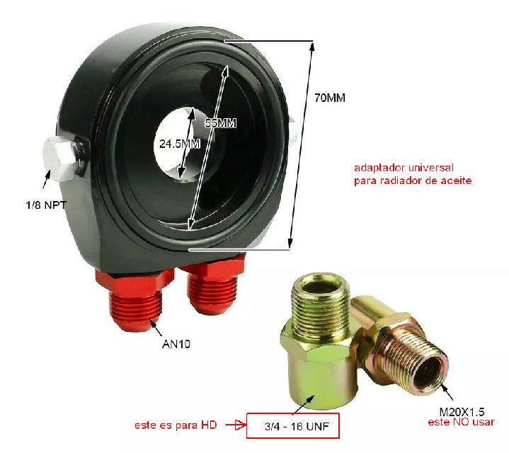
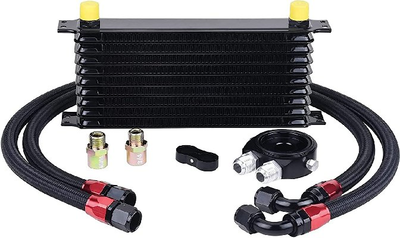
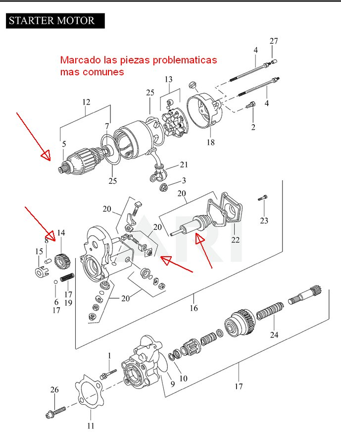
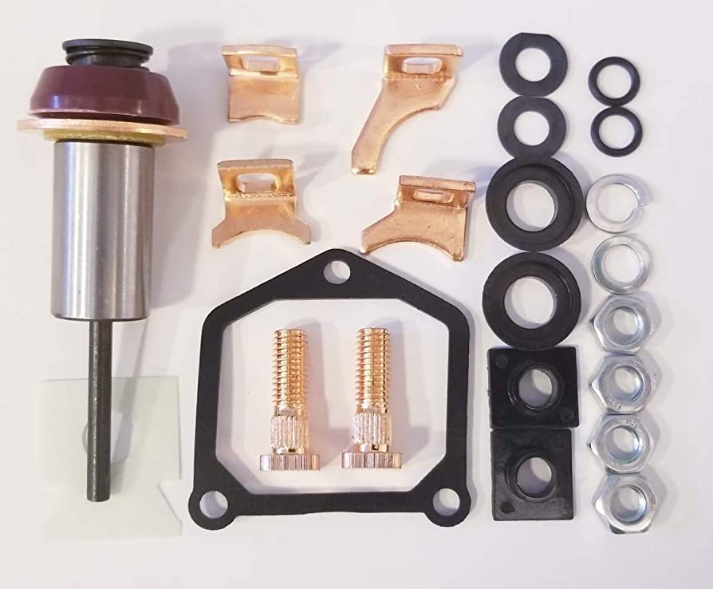
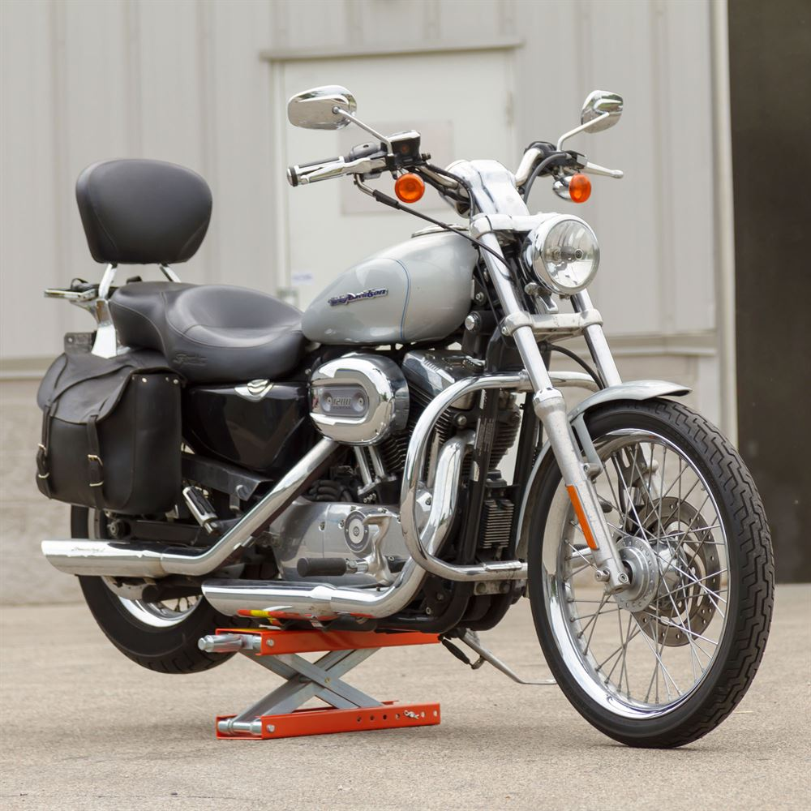
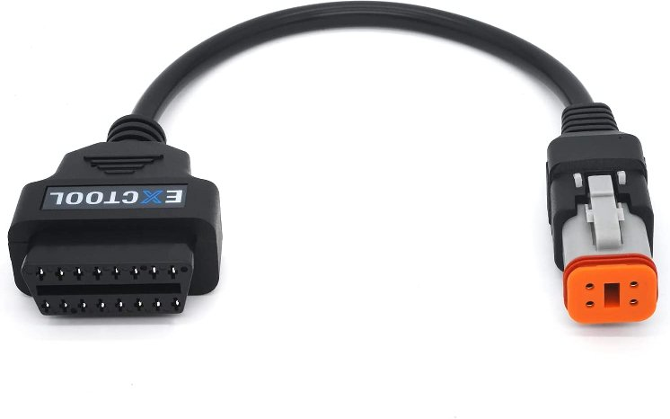
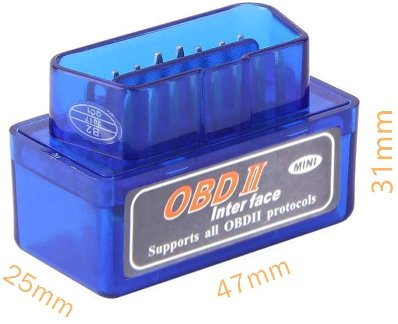

# Harley Davidson Sportster

## Alternativas de mantenimiento

### Apuntes del propietario

Este sitio web **NO** está asociado en manera alguna a Harley-Davidson Motor Company.

Harley-Davidson® y el logotipo Bar & Shield son marcas comerciales registradas de HD Michigan, Inc.

**Documento Actualizado 23/04/2023** , ±183000 km recorridos sin problemas.

## Tabla de contenidos

La tabla de contenidos se actualiza automáticamente, dar click en el icono sobre el margen izquierdo.

## Introducción

Estas notas nacieron para el mantenimiento de mis motos.

Me encanta la Sportster, tengo varias hace mas de 17 años, y la disfruto muchisimo.

El contenido esta en constante evolución: cada vez que encuentro nueva información o soluciones, las agrego.

**No se olviden de mirarlas a menudo, van creciendo día a día.**

Ademas en la carpeta de archivos de soporte, hay información recopilada que puede ser muy útil en el mantenimiento de la moto.

Espero que la información les sea de mucha utilidad.

Gracias por leer!

### Mis motos

Amo las Sportster!

Abril 2023, mis motos son:

- 2004 XL 883 - Mi primer amor!
- 2005 XL 883 L - La que compre rota!
- 2008 XL 1200 C - La que mas viaje!

## Alternativas de repuestos en Argentina

Lista de repuestos alternativos para Harley Davidson Sportster que se consiguen en Argentina. Puede servir también para otros paises, en un mundo globalizado todo es posible.

Dado la situación de Argentina, en permanente crisis, con constantes cepos a la importación y a la moneda extranjera, se hace difícil mantener funcionando una moto importada.

Es por eso que recopile, a lo largo de mas de 17 años, una lista de repuestos alternativos para mantener la Harley Davidson Sportster en funcionamiento en optimas condiciones.

Este proyecto inicia en 2004, cuando compre mi primer HD XL 883.

## Donaciones

Hacer este documento lleva mucho tiempo, esfuerzo e investigación.

**Donar** mediante Bitcoin a mi dirección, todo ayuda, pueden ser centavos, no importa!

**33Xh8YBQsMW8LGrnRR5wgEKXNzoaE5C95Q**

**Muchas gracias por tu donación!**

# ATENCIÓN

LA INFORMACIÓN SE PROPORCIONA "COMO ESTÁ", **SIN GARANTÍA DE NINGÚN TIPO**, EXPRESA O IMPLÍCITA, INCLUYENDO PERO NO LIMITADO A GARANTÍAS DE COMERCIALIZACIÓN, IDONEIDAD PARA UN PROPÓSITO PARTICULAR E INCUMPLIMIENTO.

EN NINGÚN CASO LOS AUTORES O PROPIETARIOS DE LOS DERECHOS DE AUTOR SERÁN RESPONSABLES DE NINGÚN RECLAMO, DAÑOS U OTRAS RESPONSABILIDADES, YA SEA EN UNA ACCIÓN DE CONTRATO, AGRAVIO O CUALQUIER OTRO MOTIVO, DERIVADAS DE, FUERA DE, O EN CONEXIÓN CON LA INFORMACIÓN O SU USO U OTRO TIPO DE ACCIONES CON LA INFORMACIÓN PRESENTADA.

Modelos más nuevos / mas viejos **TIENEN DIFERENCIAS** en algunas cosas, especialmente eléctricamente. Esta información es orientativa solamente!

La HARLEY DAVIDSON SPORTSTER se fabrica desde 1957, las variantes de diseño y modelos son grandes! Es importante investigar a que generación pertenece nuestra moto.

La información de este documento sirve principalmente para modelos 2004 y mas nuevos. Algunas cosas pueden servir para modelos mas viejos.

**SOLO SE PERMITE EL USO NO COMERCIAL DE ESTA INFORMACIÓN.**

# No soy mecánico!

Solo soy un enamorado de las motos, y principalmente de mi Sportster.

Mi primera moto la tuve a los 13 años, una Daelim Liberty 50cc, hace mas de 25 años atrás...

Mi profesión es Licenciado en Informática.

Estos apuntes surgen dado que toda pasión lleva a conocer mas el objeto de adoración.

[_"No detenga su motor, e investigue su interior"_](https://www.youtube.com/watch?v=FAyTabHw-Gk)

# Mecánicos

Cuando nos encontramos con un problema que supera nuestra habilidad, lo mejor es ir a un mecánico calificado, o al concesionario oficial [Harley Davidson](https://www.harley-davidson.com.ar/).

Por suerte en Argentina tenemos excelentes mecanicos, honestos y profesionales, que pueden atender nuestras motos. No voy a recomendar ninguno en particular ya que todos los que estan establecidos son buenos. Comento que fui a varios y todos me atendieron excelentemente.

Simplemente me quedan demasiado lejos de mi casa, y es mas divertido hacer las cosas uno mismo.

Pero repito, si el problema supera nuestra habilidad, **lo mejor es consultar a los profesionales**.

# Manuales

**La primer referencia que debemos consultar siempre es el manual del propietario, y sobre todo el manual de taller.**

## Sportster 1957-2021. RIP

Harley discontinuó la Sportster en 2021, y lanzó otro modelo, llamado Sportster S, con el mismo nombre, pero codigo _RH1250S Sportster_.

Estos apuntes **NO** hablan del nuevo modelo RH1250S Sportster.

Igualmente, para no dejar totalmente sin ayuda a los nuevos propietarios de la Sportster S, +2021 en adelante, les dejo links al manual del usuario y el manual de despiece de la nueva (2021) moto.

## Sportster S RH1250S, 2021 en adelante

Estos manuales NO son para las Sportster modelos con motor refrigerado por aire de la serie "vieja" codigo XL, son para la **nueva** Sportster S, codigo RH

- Manual de usuario : https://serviceinfo.harley-davidson.com/sip/content/document/view?id=1547687173511687457

- Catalogo de partes: https://serviceinfo.harley-davidson.com/sip/content/document/view?id=1547686249569650976

> Owner's Manual:
> Shipped with Harley SYN-BLEND 15w-50 motor oil.
> Spark Plug change interval is 10,000 miles
> (XL Sportsters had been 30,000 miles or two years)
> Engine oil and filter every 5,000 miles
> (same as XL except it also includes the primary/trans fluid since they share same oil sump)
> Replace coolant every 30,000 miles.

> Parts catalog- (from just a quick compare to the Pan American)
> The Cams and pistons are different from the Pan American.
> The Sportster S is 12:1 compression, the Pan American is 13:1.
> The rings are the same part number.
> The Cam phasers are the same part numbers as the Pan American.

## Sportster modelos XL 2021 y anteriores

De estos modelos se trata esta pagina.

Harley tiene un portal de informacion tecnica aca: https://serviceinfo.harley-davidson.com/sip/index

El manual del _propietario_ se puede leer en la pagina oficial de Harley con nuestro **VIN** (numero de identificacion del vehiculo, esta en el cuadro y/o en la documentacion de la moto)

https://serviceinfo.harley-davidson.com/sip/vehicle/lookupForm

Las hojas de _servicio_ de piezas de:

https://serviceinfo.harley-davidson.com/sip/isheet/lookupForm

NOTA: Si no tenemos VIN a mano, les dejo algunos genericos que pueden usar y ejemplo de los manuales que se obtienen con esos VIN:

1. Para noventosas 199x: _1HD1CAP14SY219269_ (1995)

- Manual del propietario 1995 : https://serviceinfo.harley-davidson.com/sip/content/document/view?id=6335&groupId=16
- Catalogo de partes 1995 : https://serviceinfo.harley-davidson.com/sip/content/document/view?id=273239&groupId=14

2. Para carburadas 2004 a 2006: _5HD1CGP1X6K468728_ (2006)

- catalogo de partes 2006 : https://serviceinfo.harley-davidson.com/sip/content/document/view?id=273005&groupId=14
- manual de propietario 2006 : https://serviceinfo.harley-davidson.com/sip/content/document/view?id=1545139912053563680&groupId=16

3. Para EFI, 2007 en adelante: _1HD1CT311CC442353_ (2012) , _1HD4LE218LB434556_ (2020)

- manual del propietario 2012 : https://serviceinfo.harley-davidson.com/sip/content/document/view?id=1545140320163801375&groupId=16
- catalogo de partes 2012 : https://serviceinfo.harley-davidson.com/sip/content/document/view?id=273148&groupId=14

## Manual de taller

El manual de **taller**, conocido como "workshop manual" , se COMPRA, es bastante caro, y normalmente **son tres**: el manual de taller, el diagnostico electrico, y el catalogo de partes. A veces se puede conseguir online (eBay o pirata).

Manuales para descargar:

Notar que a veces se puede usar el mismo manual para varios modelos, por ejemplo:

- 1986 a 2003 son bastante similares
- 2004 a 2006 son los modelos similares con motor montado sobre goma y carburados
- 2007 a 2012 son los modelos inyeccion EFI, con motor montado sobre goma
- 2013 a 2021 son los modelos inyeccion EFI, con motor montado sobre goma, y cambios en la electronica, ABS, etc

Si la informacion no la encontramos en un pack de manuales, podemos buscar en los de modelos de años proximos. Por ejemplo si tengo una 2005, me puedo fijar en la 2006 o la 2004...

- [Manual de taller 2018](https://github.com/alvarogonzalezferrer/harley_alternativas_argentina/raw/master/archivos_soporte/manuales/XL_2018.7z)

- [Manual de taller 2015](https://github.com/alvarogonzalezferrer/harley_alternativas_argentina/raw/master/archivos_soporte/manuales/XL_2015.7z)

- [Manual de taller 2013](https://github.com/alvarogonzalezferrer/harley_alternativas_argentina/raw/master/archivos_soporte/manuales/XL_2013.7z)

- [Manual de taller 2011](https://github.com/alvarogonzalezferrer/harley_alternativas_argentina/raw/master/archivos_soporte/manuales/XL_2011.7z)

- [Manual de taller 2010](https://github.com/alvarogonzalezferrer/harley_alternativas_argentina/raw/master/archivos_soporte/manuales/XL_2010.7z)

- [Manual de taller 2009](https://github.com/alvarogonzalezferrer/harley_alternativas_argentina/raw/master/archivos_soporte/manuales/XL_2009.7z)

- [Manual de taller 2008](https://github.com/alvarogonzalezferrer/harley_alternativas_argentina/raw/master/archivos_soporte/manuales/XL_2008.7z)

- [Manual de taller 2006](https://github.com/alvarogonzalezferrer/harley_alternativas_argentina/raw/master/archivos_soporte/manuales/XL_2006.7z)

- [Manual de taller 2004 a 2006](https://github.com/alvarogonzalezferrer/harley_alternativas_argentina/raw/master/archivos_soporte/manuales/Sportster_04-06_Repair_Manual_JADE_NO_OFICIAL_MUY_BUENO.compressed.pdf)

- [Manual de taller 2005](https://github.com/alvarogonzalezferrer/harley_alternativas_argentina/raw/master/archivos_soporte/manuales/XL_2005.7z)

- [Manual de taller 2004](https://github.com/alvarogonzalezferrer/harley_alternativas_argentina/raw/master/archivos_soporte/manuales/XL_2004.7z)

- [Manual de taller 2003](https://github.com/alvarogonzalezferrer/harley_alternativas_argentina/raw/master/archivos_soporte/manuales/XL_2003.7z)

- [Manual de taller 2002](https://github.com/alvarogonzalezferrer/harley_alternativas_argentina/raw/master/archivos_soporte/manuales/XL_2002.7z)

- [Manual de taller 1986 a 2003](https://github.com/alvarogonzalezferrer/harley_alternativas_argentina/raw/master/archivos_soporte/manuales/Harley-Davidson-Sportster-1986-2003-Service-Manual.compressed.pdf)

- [Manual de problemas comunes 1986 a 2003](https://github.com/alvarogonzalezferrer/harley_alternativas_argentina/raw/master/archivos_soporte/manuales/Sportster_troubleshooting_manual_CYCLETECH_1986_2003.compressed.pdf)

- [Manual de problemas comunes hasta 2003, otro](https://github.com/alvarogonzalezferrer/harley_alternativas_argentina/raw/master/archivos_soporte/manuales/XL_troubleshooting_manual.compressed.pdf)

- [Manual de taller 1970 a 1978](https://github.com/alvarogonzalezferrer/harley_alternativas_argentina/raw/master/archivos_soporte/manuales/1970_78_XL_XLH_XLCH_XLT_1000_Service_Manual.compressed.pdf)

_Algunos manuales son en PDF o estan comprimidos, precisas software para abrirlos_

- 7-Zip para archivos comprimidos : https://www.7-zip.org/
- Sumatra PDF para ver PDFs : https://www.sumatrapdfreader.org/free-pdf-reader

## Buscar mas manuales

- Comprar manuales online: https://motorcycle-manual-download.com/

- Pagina con varios manuales: https://www.carlsalter.com/harley-service-manuals.asp

- Foro con manuales **en español**: https://harleyexpert.com/resources/

Podemos buscar online usando los buscadores (probar todos los enlaces, cuesta encontrar pero están las cosas):

- https://www.google.com/search?q=sportster+service+manual+filetype:pdf

- https://www.google.com/search?q=sportster+manual+taller+filetype:pdf

- https://www.duckduckgo.com/?q=sportster+service+manual+filetype:pdf

- https://www.duckduckgo.com/?q=sportster+manual+taller+filetype:pdf

## Despieces y microfichas:

- https://www.thunderbike.com/parts/thunderbike-h-d-partsfinder/
- http://www.shopronniesharleydavidson.com/
- http://partsfinder.onlinemicrofiche.com/ronnies/partsfinder.htm
- https://shop.suburbanharley.com/oem-parts
- https://www.jerseyh-d.com/original-harley-davidson-parts/

- Un foro con manuales: https://foroharley.com/forums/manuales-y-documentos.33/

- Enciclopedia de la Sportster online : http://sportsterpedia.com/doku.php/start

- Foro Sportster : http://xlforum.net

- Generaciones de Sportster: ver https://www.autoevolution.com/moto/harley-davidson/sportster-1/

# Mantenimiento

El buen mantenimiento es sinónimo de una motocicleta segura. Se debe inspeccionar frecuentemente la motocicleta entre los intervalos regulares de servicio para establecer si es necesario un mantenimiento adicional.

Aceite de motor se cambia cada 8000 km o un año, lo que ocurra primero. _En clima frio, y si la moto se usa en intervalos cortos sin dejar calentar apropiadamente el motor, se debe cambiar mas frecuentemente por la condensacion de agua en el aceite._

Aceite de primaria se cambia cada 16000 km.

Revise los siguientes elementos:

1. Neumáticos, para comprobar la presión correcta y que no tengan abrasiones ni cortes.

2. Correa y cadena primaria, para comprobar que tienen la tensión correcta y detectar desgaste o daño.

3. Frenos, dirección y acelerador para establecer su respuesta y libres de atascamiento.

4. Nivel y estado del líquido de frenos. Líneas hidráulicas y dispositivos de conexión para detectar fugas. También compruebe el desgaste de las pastillas y discos de freno.

5. Cables, para detectar desgaste o deshilache y que operen libremente.

6. Niveles de aceite de motor y del guardacadena primario/transmisión.

7. Funcionamiento correcto del faro delantero, la luz trasera, la luz de parada y de las señales de giro.

# Archivos extra

En la carpeta ["archivos_soporte"](/../../tree/master/archivos_soporte) voy colocando archivos, diagramas, documentos, manuales, etc que pueden ser útiles. Revisarla también, ya que mucho de ese material todavía no fue incorporado a este documento, y contiene información valiosa e inédita.

# Evolucion de la Sportster

La Sportster es una línea de motocicletas producidas continuamente desde 1957 por la compañía Harley-Davidson. Los modelos Sportster se designan con el código de producto comenzando con "XL" haciendo referencia al que en su día fue un modelo eXperimental Ligero (eXperimental Light).

En 1952 se introdujo al mercado los predecesores del Sportster, el Modelo K Sport, y Sport Solo.

Estos modelos K, KH, y KHK de 1952-1956 no son siempre considerados Sportsters, pero son definitivamente inspiración y precursores de la línea. Básicamente para competir con las marcas europeas de motocicletas, principalmente las británicas.

Las Sportster son potenciadas por verdaderos motores V-twin de 45 grados, donde ambos cilindros comparten un mismo eje.

Las Sportsters tienen la transmisión enlazada al motor con una cadena de transmisión primaria, y un embrague húmedo hidráulico de discos múltiples.

Este modelo en 1958 incorpora el "peanut tank" característico hasta la fecha del mismo, aunque su capacidad ha variado ligeramente a través de los años.

Los modelos de los 60´s incorporan los escapes "shorty dual" que se continuaron con muy ligeras modificaciones. En 1967 se incluyó el arranque eléctrico y en 1969 se ponen silenciadores en los escapes por la contaminación acústica (ruido).

Para los años 70´s los modelos HD sportster inician su batalla con las motos japonesas, para ello en 1972 se sube a 1,000 cc la cilindrada del motor.

En 1983 se relanza al mercado el modelo "XL" que había desaparecido en 1959. En 1986 se equipan con motores "evolution" conocido comúnmente como EVO.

Los modelos de 1991 en adelante tienen cinco velocidades, 1990 y anteriores tienen cuatro.

Desde 2004, se rediseña completamente el modelo, iniciando con un cambio radical en el cuadro que permitió montar el motor sobre tacos de goma, reduciendo la vibración transmitida al motociclista. Se oculta el comunicador de los escapes bajo los mismos, y se modifica el ancho de la rueda trasera de 130 a 150 mm.

A partir del 2007, y en plena celebración del 50th aniversario de la línea iniciada en 1957, los modelos Sportster reemplazan su carburador por un sistema de inyección de combustible electrónico EFI.

Y a partir de 2014 se incorporaron nuevos frenos con rotores agrandados de 292mm a 300mm, ABS opcional, Sistema eléctrico integrado, con velocímetro análogo y tacometro digital con indicador de RPM, y marchas. Rediseño de nuevos controles manuales. Sistema de seguridad inteligente y manos libres. Nuevo sistema de escape, sensor de O2 calefaccionado, todo para reducir las emisiones contaminantes. Programa de personalización de fábrica H-D1 que permite solicitar pinturas, llantas, y demás detalles especiales desde la fábrica. Nuevos colores y emblemas de tanque.

Septiembre 2020 trajo noticias tristes de la mano de los culo roto de la Unión Europea: Harley-Davidson dejará de ofrecer sus modelos Sportster y Street en Europa, gracias a las normas de emisiones Euro 5 que entrarán en vigor a finales de año 2020. Los modelos Sportsters y Street seguirán vendiéndose en Norteamérica y otros mercados que no están sujetos a Euro 5 o estándares equivalentes, pero para Europa, Harley-Davidson descontinuará sus modelos más pequeños y asequibles. La noticia llega días después de que Harley-Davidson anunciara el fin de sus operaciones en India.

No es ningún secreto que la línea Sportster, tal como la conocemos, está en su etapa final. Harley-Davidson ya confirmó que los Sportsters no se actualizarán para cumplir con Euro 5 y se descontinuarán efectivamente en Europa.

A partir de 2022, la Sportster no se vende mas. Fue reemplazada por una moto totalmente nueva, la Sportster S, que solo comparte el nombre con nuestra moto. Fin de una era.

_Mas info_ :

https://haynes.com/en-us/tips-tutorials/harley-davidson-sportster-history-1970-2013

https://www.hdforums.com/forum/sportster-models/1304092-six-decades-of-the-sportster-is-coming-to-a-close.html

https://ultimatemotorcycling.com/2014/09/16/harley-davidson-sportster-history-reaching-every-niche/

https://www.lowbrowcustoms.com/blogs/events-features/history-harley-davidson-sportster-blowing-away-big-twins-since-1957

# Cambios de aceite

Lo mas importante es que **NO LE FALTE ACEITE**. Siempre verificar el nivel antes de arrancar el motor.

Variantes sugeridas para el cambio de aceite. **Hay muchas combinaciones posibles**, lo importante es elegir una que nos convenga y mantenerla en el tiempo, no mezclar indiscriminadamente aceites de diferentes marcas y viscosidades.

El motor lleva **3 US quarts**, que son **2.83 litros** de aceite de moto, mineral o sintético, 20w50, especificación JASO MA2.
La primaria lleva **1 US quart**, que es **0,946 litros** de aceite de moto, mineral o sintético, 20w50, especificación JASO MA2.

Ver la especificación API del aceite también, conviene que sea API SJ, SL, SM o SN (la mas moderna), además de JASO MA2.

Se hace un cambio cada **8000 km motor y filtro**, cada **16000 km la primaria**.

Si no se alcanzan los kilómetros en el año, **es recomendable cambiarlo una vez al año**.

**Ver manual para mas información.**

## Resumen cambio de aceite

| Item            | Reemplazo                                                                                                      | Periodo             |
| --------------- | -------------------------------------------------------------------------------------------------------------- | ------------------- |
| Filtro aceite   | Mahle, Hi Flo, Harley, etc, diámetro Ø exterior 75 mm, rosca 3/4"-16, altura ±86 mm, válvula alivio max 12 PSI | 8000 km ó un año    |
| Motor aceite    | Aceite de moto 20w50 mineral o sintético, spec JASO MA2, API SJ, SL, SM o SN                                   | 8000 km ó un año    |
| Primaria aceite | Aceite de moto 20w50 **mineral**, spec JASO MA2, API SJ, SL, SM o SN                                           | 16000 km ó dos años |

## Clima frio y aceite

Lubricación a baja temperatura: Cambie el aceite del motor con frecuencia en climas más fríos. Si la motocicleta se conduce con frecuencia por menos de 24 km (15 mi), en temperaturas ambiente por debajo de 16° C (60,8 °F), reduzca los intervalos de cambio de aceite a 5000 km.

**NOTA**

Las temperaturas ambiente más bajas requieren cambios de aceite **más frecuentes**.

El vapor de agua es un subproducto normal de la combustión. Durante la operación en clima frío, algo de vapor de agua se condensa en forma líquida en las superficies frías dentro del motor. En climas helados, esta agua se convierte en lodo o hielo. Si el motor no se calienta a la temperatura de funcionamiento, la nieve acumulada o el hielo bloquea las líneas de aceite y daña el motor. Con el tiempo, el agua se acumulará, se mezclará con el aceite del motor y formará un lodo que es dañino para el motor.

Si se permite que el motor se caliente a la temperatura normal de funcionamiento, la mayor parte del agua se evapora y sale por el respiradero del cárter.

## Kits oficiales de aceite

_Yo creo que no tiene mucho sentido usar el kit oficial, a menos que la moto sea 0 km, y como se discontinuo, va a ser muy dificil que tengas una moto 0 km en garantía a menos que seas Marty McFly..._

Ver este enlace: https://www.harley-davidson.com/us/en/shop/c/motorcycle-oil-change-kits

### Oficial mineral

- Filtro : Harley original, viene negro y cromado
- Motor : H-D 360 motorcycle oil
- Primaria : H-D 360 motorcycle oil (Formula+ estaba siendo discontinuado pero parece que sigue existiendo)
- Total aproximado : 55 USD

### Oficial sintético

- Filtro : Harley original, viene negro y cromado
- Motor : H-D SYN3 motorcycle oil
- Primaria : H-D SYN3 motorcycle oil
- Total aproximado : 80 USD

## No oficiales

Hay muchas combinaciones de aceites que podemos usar, lo importante es usar uno que nos convenga donde vivimos, y ser consistente, no mezclar aceites diferentes en cada cambio...

**Nota importante**
En caso de recurrir a aceite de auto, que esta permitido para emergencias según el manual:

- **NO USAR NUNCA** ACEITE QUE SEAN PARA AUTOS NAFTEROS
- NUNCA USAR LOS QUE SEAN PARA NAFTEROS Y DIGAN APTOS DIESEL.
- Y TENER EN CUENTA QUE EL ACEITE PARA DIESEL TIENE QUE SER PARA **SERVICIO PESADO**.

### Económico

Esta combinación es casi omnipresente en toda Latinoamérica, el filtro **3614** y el aceite Castrol 20w50 **de moto** se encuentran fácilmente en cualquier pais, y sirve.

- Filtro : FRAM PH3614 (Hilux, Neon, PT Cruiser, etc), FRAM PH6022 (8 USD), Mahle OC1021 (10 USD), HiFlo negro HF170B (10 USD) o HiFlo HF170C cromado (15 USD)
- Motor : Castrol Actevo 20w50 o Motul 3000 de moto; ó si estas **MUY** desesperado, Castrol Viscus 25w60 motores DIESEL, 20 USD
- Primaria : Castro Actevo o Motul 3000 20w50, 1 litro, 7 USD
- Total aproximado de servicio básico : 37 USD a 50 USD

### Sintético

En 2021 se consigue el aceite Mannol V-Twin 20w50 que dice ser sintético en su envase.

Tambien vi Putoline Genuine V-twin 20w50, y algunos Valvoline SynPower en 15w50.

Ipone recomienda el Full Power Katana 15w50.

**NOTA IMPORTANTE**: si tenemos embrague no original, SOLO USAR ACEITE MINERAL O EL QUE RECOMIENDE EL FABRICANTE (Barnett, Energy One, etc)

### Semi sintético

- Filtro : HiFlo cromado HF170C
- Motor: Castrol Power 1 4T 15w50 / Castrol Actevo X-Tra 20W50 / Motul 5100 15w50 / Ipone Road Twin 15w50 / Ipone R4000 RS 20W50 **recomendado** / Valvoline Durablend Moto 15w50 / Valvoline Durablend 4T moto 20w50 **preferido**
- Primaria: alguno mineral 20w50 de primera calidad

### Mineral

_Nota: es fácil conseguir reemplazos para esta opción, hay Motul tambien, IPone, Silkolene, etc_

- Filtro: Mahle o HiFlo
- Motor & Primaria: Castrol Actevo 20W50 / Silkolene V-twin 20w50 / Motul 3000 20w50 / Ipone R4000 RS 20W50 (semi syn) / etc

# Aceite de motor

## Análisis largo

Este es un tema polémico, hay fundamentalistas del aceite. Lo mas importante es que **NO** LE FALTE ACEITE. Siempre verificar el nivel antes de arrancar el motor.

Hay varias opciones, idealmente aceite para moto, en emergencia se puede usar aceite para motores de auto DIESEL (ver boletin informativo oficial mas abajo).

Se puede usar aceite mineral, o sintético (lo importante es **NO MEZCLAR**, y no andar alternando a cada rato de aceites y marcas). Por muchos años Harley recomendó aceite mineral, pero en los últimos años se paso a recomendar aceite sintético, y a dejar de recomendar el mineral (e incluso discontinuar el Formula+).

Vida útil : un aceite almacenado, **SELLADO** en su envase original, puede durar hasta **5 años**. Podemos tener aceites, y filtros, almacenados para sobrevivir épocas _"nacionales y populares"_ donde se prohíbe la importación.

Observar lo siguiente de aceite:

- Viscosidad : lo indica la norma **SAE**, por ejemplo **20w50**.

- Certificación del **API** (Instituto Americano de Petróleo), aditivos modernos: SJ (+2001), **SL (+2004), SM (+2010), SN,SP (+2020)** ; SA a SH inclusive son con aditivos **obsoletos** (motores de 1930 a 1996, evitarlos!)

- Certificado **JASO** : al menos MA, idealmente **MA2**.

El JASO es una norma diseñada por la asociación japonesa de ingenieros de automoción. Se ideó a causa del problema que presentaban los embragues húmedos (bañados en aceite) presentes en las motocicletas japonesas.

Mas info del certificado API :

- https://www.api.org/products-and-services/es/eolcs-oil-categories#tab-gasoline
- https://www.api.org/~/media/Files/Certification/Engine-Oil-Diesel/Publications/Motor%20Oil%20Guide%202020.pdf
- https://www.widman.biz/Seleccion/certificacion.html

Mas info de la Viscosidad SAE :

- https://www.widman.biz/Seleccion/viscosidad.html

## Recomendaciones de fabricantes

_nota_ mas info en la Sportsterpedia : http://sportsterpedia.com/doku.php/techtalk:ref:oil01

### Harley Davidson

Harley recomienda el **Screaming Eagle SYN3** sintético tanto para motor como primaria (el **mismo** aceite en ambos compartimientos) , y dice que dura 16 000 km (10 mil millas).

Harley ofrece en sintético el **SYN3**, y en mineral el **H-D 360** motorcycle oil - **SAE 20w50**.

El **Formula+** mineral estaba siendo discontinuado en USA, era el aceite que se usaba en primaria, cada vez cuesta mas conseguirlo.

El boletín de servicio de Harley especifica:

https://serviceinfo.harley-davidson.com/sip/service/procedure/1332041847506356430/BLAISE/1137435/en_US?nid=5728

> Las motocicletas se envían de fábrica con LUBRICANTE SINTÉTICO COMPLETO SCREAMIN 'EAGLE SYN3 20W50.
>
> Si SYN3 no está disponible y se requiere agregar aceite de motor, la primera opción sería agregar ACEITE DE MOTOCICLETA GENUINO HARLEY-DAVIDSON H-D 360 20W50 al SYN3 para lubricar el motor.
>
> Aunque H-D 360 es compatible con SYN3, sugerimos cambiar la mezcla de fluidos lo antes posible.
>
> Para cambiar el lubricante a H-D 360, drene completamente el SYN3 antes de llenarlo con H-D 360. Quedará una cantidad residual de líquido. No es necesario eliminar el fluido residual.
>
> Si SYN3 o H-D 360 no está disponible, la tercera opción sería agregar un aceite de motor diesel aceptable. Sugerimos nuevamente cambiar la mezcla de fluidos lo antes posible. NO agregue aceite de motor diesel a la cadena primaria o la transmisión.
>
> Las designaciones de aceite de motor diesel aceptables incluyen: SH, CH-4, CI-4 y CJ-4. Las viscosidades preferidas para los aceites de motor diesel en orden descendente son: 20W50, 15W40 y 10W40.
>
> En la primera oportunidad, consulte a un distribuidor autorizado para volver a cambiar al 100% de aceite Harley-Davidson.
>
> No cambie las marcas de lubricantes indiscriminadamente porque algunos lubricantes interactúan químicamente cuando se mezclan. El uso de lubricantes inferiores puede dañar el motor. (00184a)

### Otras marcas:

**Valvoline Moto 20w50** -- especificación API vieja y obsoleta, SG de 1988, lo evitaria...

**Valvoline Durablend 4T 20w50 - Semisintetico** -- motor y primaria, es API SL, JASO MA2, preferido al común Valvoline,

**Bel-Ray** recomienda aceite sintetico 10w50 : https://www.belray.com/lubrication-myth-chaps-my-hide/ <- articulo INTERESANTE!

**Bel-Ray V-twin 20W50 (preferido)** tiene toda la gama para Sportster, pero no la importan parece o cuesta conseguirlo: http://www.lubelray.com.ar/

**Bel-Ray V-Twin Synthetic Motor Oil 10W-50** (ver abajo, es full sintetico, similar al Harley SYN3)

**Bel-Ray Full Synthetic Ester** es el recomendado, se consigue de marca IPone sintético con formula similar en Argentina.

**Motorex** recomienda **Legend 20w50** tanto para motor como primaria. A vece se consigue. https://www.motorex.com/en-us/sales-consulting/oil-finder/

**Motul** recomienda **Motul 3000 20w50** para primaria y **7100 20w50** en motor.

Da varias opciones mas, Motul 7100 10w40, 7100 20w50, y Motul 5100 10w40 segun el clima de trabajo.

Uno bueno semi sintetico que se consigue en Argentina: Aceite **Motul 5100 4t 15w50**

En sintético se consigue: **Motul 300V 15w50**, o **Motul 300V 20w60**, o **Motul 7100 10w60** (no lo probe, no lo puedo recomendar)

https://www.motul.com/es/es/lubricants

El Motul 3000 es mineral, el 5100 es semi sintetico, y el 7100 es sintético, y el 300V es sintetico con esteres (seria el de mejor calidad).

**Castrol** recomienda para Sportster, motor Y primaria:

- Castrol Power 1 Racing 4T 10W-50
- Castrol Power 1 4T 20W-50
- **Castrol Actevo 20W50** - este se consigue facil, sirve para motor y primaria, y muchos lo usan con éxito
- **Castrol Actevo X-Tra 20w50** - semi synthetic -- preferido y facil de conseguir en Argentina
- **Castrol Power 1 V-Twin 4T 20W-50** - preferido, no lo vi nunca en Argentina

**Silkolene** recomienda (motor y caja) **Silkolene V-Twin 20w50**, existe en Cordoba, Argentina: https://www.silkolene.com/motorcycle/4-stroke-engine-oils/v-twin-20w-50/

https://www.fuchs.com/ar/es/marcas/s-z/silkolene/

**Ipone** tambien vende uno formulado para Vtwin, para motor y primaria, se llama Road Twin

**Ipone** recomienda Ipone R4000 RS 20W50 o Full Power Katana 15w50

**IPone ROAD TWIN 4T 15W50** - semi sintetico

Aceite Semisintético Moto Ipone R4000 Rs 4t 20w50 Ipone , recomendado por el selector de aceite de IPONE : https://www.ipone.com/es/encuentra-el-mejor-aceite-para-tu-moto

http://www.ipone.com.ar/

**Mannol Sintetico 20w50** : http://www.mannol.com.ar/ -- formulado para Harley Davidson, Mannol Harley Davidson 20w50

**AMSOIL** recomienda **20w50** para motor y primaria (no lo consegui en Argentina)
http://superoil.com/original/html/harley-davidson.htm

https://www.amsoil.com/shop/by-product/motor-oil/motorcycle/20w-50-advanced-synthetic-motorcycle-oil/?zo=537451

**Putoline Genuine V Twin 20w50** -- a veces se consigue en Mercado Libre.

Los españoles recomiendan **Gulf 20w50**, mineral (una porquería).

**Shell** recomienda Shell Advance AX7 Semi Sintetico Moto 15w50 : API SM y JASO MA2.

En caso de usar aceite de **automóvil** (yo lo evitaria a toda costa), recomiendan:

**Castrol VISCUS 25W60** de **gasolero / diesel** (sirve para motor, es barato y hace que el motor ande mas frio, muchos lo usan con éxito, en clima cálido no suda el motor, aunque yo use la moto en el Caribe con 42 C y tampoco me "sudo" el motor usando Castrol de moto 20w50, asi que eso de "sudar" me suena mas a juntas de motor jodidas...)

## Filtros de aceite

El filtro tiene que tener Rosca central de 3/4" de pulgada por 16 hilos. Y pocos PSI de retorno de valvula **NO MAS de 12 PSI**. Esto lo dice cada fabricante de Filtro, hay muchos que le calzan.

Características

- Altura : 86 mm -- esto puede variar _un poco_, algunos filtros son mas largos o mas cortos
- Diámetro Ø exterior : 75 mm
- Rosca : 3/4"-16
- Alivio : 12 PSI max

**Mahle OC1021** es filtro para Harley y se consigue barato. Color negro. - Codigo **OC 21**

**HIFlo HF170C** es cromado (o negro HF170B) y específico para Harley, se consigue en Mercado Libre barato. **Es mejor en calidad que el original de Harley**. http://www.hiflofiltro.com/catalogue/filter/hf170
Tambien hay un modelo "high performance" con un elemento filtrante mejorado, el HF170RC, pero no lo vi en venta en Argentina. Ver http://www.hiflofiltro.com/catalogue/filter/HF170RC

**CHAMPION** CHAMPION COF071C, lo vi en venta en ML en Mayo 2021

**PUROLATOR** hace filtros de mejor calidad que FRAM (metal en lugar de carton en las tapas, etc, ver filtros cortados en internet) ; _investigar que modelo le sirve.._

**FRAM** lista un filtro especifico para Harley Sportster en su sitio web, pero parece que no lo venden en Argentina, es para mercado USA :

- FRAM PH6065B - cromado, válvula alivio a 7-9 PSI, parece que no se consigue en Argentina...

http://www.fram.com/parts-search/PH6065B

- FRAM PH6022 - negro, válvula a 12 PSI, mas restrictivo. A veces aparece en Mercado Libre

http://www.fram.com/parts-search/PH6022

**OJO NO USAR CUALQUIER FILTRO DE AUTO (ALGUNOS SIRVEN) POR QUE PUEDEN RESTRINGIR EL FLUJO CON SU VALVULA DE RETORNO Y MATAR EL MOTOR**, prestar atencion a los PSI de la valvula de alivio/bypass, y las dimensiones del filtro!….

Otras opciones de auto :

**FRAM PH3614** es realmente un filtro casi omnipresente, le va a muchísimos modelos de autos, y esta disponible en casi todos los paises de América. Es el del Neon, Stratus, Hilux, y muchos mas. Tiene PSI 12 : https://catalogo.fram.com.ar/filtros/ficha/PH3614

Otros alternativos que se publican en internet, y que pueden reemplazar el original de Harley:

- FRAM PH3614 (es prácticamente el mismo que el PH6022)
- Purolator PL14476
- Mobil1 M1-102
- Bosch 3330
- Hastings LF410
- WIX 51394
- WEGA JFO-0050
- FRAM PH 6022
- MAHLE OC1021
- TECFIL PSL637

Tu repuestero amigo te va a saber recomendar alguno con las mismas características, tomando como referencia el FRAM que es el más conocido en el pais.

Con respecto a la pinta: hay algunos de estos que vienen cromados (FRAM tiene una versión cromada), otros vienen negros, y otros en colores como naranja o blanco.

# Aceite de primaria

Harley-Davidson recomienda un 100% sintético **Screaming Eagle SYN3** para la primaria, o el **H-D 360 motorcycle oil** (mineral), _dejando de lado el antiguo Formula+ en 2020_.-

Embragues Barnett recomiendan un aceite **mineral** especifico para moto, con especificaciones JASO MA, o MA2 y viscosidad 20w50. Nunca usar aceite para automóviles.

Embragues Energy One recomiendan aceite mineral de moto, o ATF (caja automatica), NO SINTETICO.

En resumen: se puede usar el mismo aceite que en el motor siempre que sea un aceite de **moto** con especificación JASO MA (MA2 mejor) al menos y un API que no sea obsoleto (SJ, SL, SM, SN son actuales, el resto están obsoletos). Y convendria que sea mineral, si no sabemos que discos de embrague tiene la moto (puede no tener HD)

## Análisis largo

Este es un tema casi "místico" en el mundillo Harley, hay quienes juran que si uno no pone el aceite original Harley Formula+, la moto explotará en una bola de fuego matando a todos los que lo rodean... en fin, **no hay nada mágico en el aceite Harley para primaria... pero es bueno investigar mas a fondo el asunto...**

El **HD Formula+** de primaria era el equivalente a un semi sintético de caja **80w90**, ó equivalente a uno de motor **20w50**.

_Nota: Harley discontinuó en 2020 al Formula+, sugiriendo que se use el SYN3 o HD 360._

Un aceite **100% sintético 20W50 en primaria de primer nivel**, como el AMSOIL o el CASTROL POWER 1 RACING es un buen reemplazo.

El libro _"How to build a Harley Davidson Torque Monster"_ recomienda usar un sintético: **75w90** de caja, o de moto **15w50** o **20w50**.

**Ver que el aceite sea para moto y cumpla la norma JASO MA o MA2** , y un API que no sea obsoleto (SJ, SL, SM, SN son actuales, el resto están obsoletos). <- esto es MUY importante!

La etiqueta **JASO MA ó MA2**, garantizan que el lubricante no causará ningún tipo de problema a nuestros embragues bañados en aceite.

**Bel-Ray Sport Trans** es 85W y es bueno, pero no se consigue fácil en Argentina

Fácil de conseguir en Argentina:

El sitio de Motul recomienda **Motul 3000 20w50** o **7100 20w50** para la primaria de la Sportster.

Motorex recomienda **Motorex Legend 20w50**, se conseguia en Mercado Libre en 2019, en 2020 ya no lo veo listado.

**Silkolene** recomienda su V Twin 20w50 (motor y caja), existe en Cordoba, Argentina: https://www.silkolene.com/motorcycle/4-stroke-engine-oils/v-twin-20w-50/

https://www.fuchs.com/ar/es/marcas/s-z/silkolene/

Castrol recomienda varias opciones:
**Castrol Power 1 Racing 4T 10W-50**
**Castrol Power 1 4T 20W-50**
**Castrol Power 1 4T 15w50**

Ipone recomienda Ipone RS 4000 20w50

Mobil 1 recomienda para primaria (nunca los consegui en Argentina)

- Mobil 1 Racing™ 4T 10W-40, but it is also okay to use Mobil 1™ V-Twin 20W-50.
- **Mobil 1 15w50 full syn** (coincide con la recomendacion del libro)
- Mobil 1 75w90 gear oil

De auto -- NO RECOMENDABLE, solo para desesperados:
**Valvoline SynPower 75W-90 GL5** sirve y se consigue fácil.

No daña los metales amarillos. Que diga “slip differential”o similar para el embrague del diferencial

**Valvoline High Perf 80w90 GL5** también (mineral, más barato)

También sirve un **75w90** o similar, pero certificado para usar en primarias con embrague húmedo y **GL4**.

**Ipone**
Tiene **Trans4 80w90** para cajas de cambio de moto separadas, deberia servir, **no lo investigue lo suficiente**
**IPone ROAD TWIN 4T 15W50** - semi sintetico

_Mas informacion sobre aceite GL5 75w90:_

GL5 Gear Oil - Is It Safe To Use In the Sporty? - ANSWERED - Harley Davidson Forums

https://www.hdforums.com/forum/sportster-models/804458-gl5-gear-oil-is-it-safe-to-use-in-the-sporty-answered.html

**Red Line** - no se consigue en Argentina, pero dio información valiosa:

https://www.redlineoil.com/find-products-for-my-vehicle
https://www.redlineoil.com/20w50-motorcycle-oil - motor
https://www.redlineoil.com/75w90-gl-5-gear-oil - primaria

> Thank you for contacting Red Line Oil, in the shared Sportster primary/transmission the 75W90 is recommended, a product that has been used extensively and performs well.
> The 75W90 is the product we have have used for a number of years with very good results in Sportster/Buell transmissions, matching the viscosity and type fluid called for.
> The 80W Motorcycle Gear Oil is a lower viscosity than called for, the ShockProof gear oils can due to their unique characteristics could cause sticking of the Harley clutches. The 75W90 would be preferred and recommended over 80W Motorcycle Gear Oil in these applications.
> There can be issues with some GL-5 gear oils in certain applications. Some can be corrosive to brass, bronze or copper, not an issue with our GL-5 gear oils, they don’t cause corrosion, pitting or metal removal. In a synchro equipped transmission the friction modifiers contained in many gear oils can make them too slippery, though not the case in a motorcycle transmission with dog rings.

_Traducción_

> Gracias por ponerse en contacto con Red Line Oil, en la transmisión + primaria Sportster se recomienda el 75W90, un producto que se ha utilizado mucho y que funciona bien.
> El 75W90 es el producto que hemos utilizado durante varios años con muy buenos resultados en transmisiones Sportster / Buell, igualando la viscosidad y el tipo de fluido requerido. El aceite para engranajes de motocicleta de 80W tiene una viscosidad más baja que la requerida, los aceites para engranajes a prueba de golpes pueden, debido a sus características únicas, causar atascos de los embragues de Harley. El 75W90 sería el preferido y recomendado sobre el aceite para engranajes de motocicleta de 80W en estas aplicaciones.
> Puede haber problemas con algunos aceites para engranajes GL-5 en determinadas aplicaciones. Algunos pueden ser corrosivos para el latón, bronce o cobre, no es un problema con nuestros aceites para engranajes GL-5, no causan corrosión, picaduras o remoción de metal. En una transmisión equipada con sincronización, los modificadores de fricción contenidos en muchos aceites para engranajes pueden hacerlos demasiado resbaladizos, aunque no es el caso de una transmisión de motocicleta con anillos de perro.

# Temperatura del aceite

Condiciones normales: aceite dentro del tanque entre **220 F a 250 F**, con picos de **300 F** en ralenti, verano, o velocidad de crucero.

Se puede medir usando un tapón de aceite con termómetro, HD y otras marcas venden diferentes.

Ver este enlace:

- https://www.google.com/search?q=sportster+oil+dipstick+temperature+gauge

- https://www.ebay.com/sch/i.html?_nkw=sportster+oil+dipstick

Este tapón también se puede _fabricar_ usando un termómetro de horno y modificando el original, o torneando uno.

_Temperatura óptima del aceite según lo citado por Harley-Davidson en la edición de febrero de 2010 de la revista American Rider, página 49._

> Pregunta: "¿Cuáles son las temperaturas óptimas de funcionamiento del aceite para los motores XL y Twin Cam? Además, ¿cuál es la temperatura máxima segura para cada uno?"
>
> Respuesta: "La temperatura de funcionamiento óptima del aceite para ambos motores es en realidad un rango de temperatura que depende de la temperatura ambiente y el tipo de conducción. Idealmente, el aceite a granel (el aceite en el tanque de aceite) debe estar entre 220 y 250 grados F. Esto asegura que cualquier vapor de agua que ingrese al aceite del proceso de combustión sea vaporizado y pueda ser purgado del sistema por los respiraderos. Para temperaturas ambientales elevadas, el aceite a granel puede operar de manera segura a temperaturas de hasta 300 grados F durante en ralentí o en crucero interestatal de alta velocidad. El aceite de motor de Harley-Davidson ha sido especialmente formulado con un paquete antioxidante mejorado para minimizar los problemas de oxidación del aceite por encima de los 250 grados F.La alcalinidad de reserva de nuestras formulaciones también se ha aumentado para minimizar cualquier formación de ácido que podría ocurrir con temperaturas elevadas del aceite ".
>
> H-D no hizo una distinción entre sus aceites sintéticos y a base de petróleo, mientras que parece que solo están hablando de sus propios aceites que han sido formulados para estas temperaturas. El editor de la revista continúa recomendando el aceite sintético como la lubricación de elección en nuestros motores, en parte debido a su intervalo de cambio extendido, entre otras diferencias.
> Tengo que preguntarme por un momento si las recomendaciones de temperaturas más altas (hasta 300 grados en aceite mineral HD) son toleradas por HD como legítimas por necesidad, simplemente debido al hecho de que las motos EFI tienden a funcionar más finas de nafta, y en consecuencia, más calientes que las motos carburadas. En cualquier caso, esto debería hacer que la mayoría de nosotros nos sintamos cómodos cuando la temperatura del aceite llega hasta los 200 sin usar un enfriador de aceite, y quizás otros cuestionen su necesidad del enfriador de aceite que han estado usando.

# Radiador de aceite

\*\*Primero fíjate si re-calienta (usando el tapón que mide temperatura de aceite, pasa de 300 F?), si no es necesario NO lo compres.

En climas fríos no es necesario, en climas tropicales o con veranos tórridos puede ser necesario, sobre todo en el 1200cc.

También se puede fabricar, o adaptar un radiador de aceite de otra moto, u otras aplicaciones. Hay muchas opciones.

Kit que vende Harley oficial:

Asi queda instalado:

Por ahora podes empezar leyendo la información siguiente:

http://sportsterpedia.com/doku.php/techtalk:ref:oil14

https://www.google.com/search?q=sportster+oil+cooler

https://jagg.com/collections/harley-davidson-sportster

https://www.jpcycles.com/motorcycle-oil-cooler-kits

https://www.dragspecialties.com/search;q=oil%20cooler

https://serviceinfo.harley-davidson.com/sip/service/document/239678

## Adaptar

Básicamente precisas un radiador de **aceite** de otra moto o auto, dos líneas de aceite, y enchufarlo eligiendo dos maneras posibles: a la linea de aceite del lado derecho inferior del motor, ó usando un adaptador al filtro de aceite.

### Kit universal

El kit básico casero seria:

1. Adaptador para el filtro , podes buscar adaptador universal en ML, la "torta", que tenga la rosca adecuada (3/4"-16 UNF)

2. Lineas de aceite, AN10 para la torta y el radiador, esto se puede fabricar, venden el kit de lineas y terminales para cortar a medida.

3. Radiador pequeño de 6 , 8 o 10 lineas

### De otras motos o autos

La mayor complicación es conseguir las lineas de aceite para los radiadores especificos, podemos ir a una casa de hidráulica para que las fabriquen. Y conseguir los terminales o "racord" (los bulones perforados que permiten el paso de aceite en cada punta de manguera).

https://motos.mercadolibre.com.ar/repuestos-cuatriciclos/radiador-aceite

Radiadores de las siguientes motos tienen dimensiones adecuadas

- Zanella RZ 25
- Gilera VC 200R
- Mondial HD 254
- YBR 250
- etc

Automovil: en el pasado se adaptaba el del Citroën 3CV pero es grande y feo. Hay otros radiadores de direcciones hidraulicas o cajas de cambio que podrian servir, pero no lo investigue.

Algunas casas de hidraulica en Argentina:

- http://www.todoflex.com.ar/ <- esta tiene todo, las mangueras y los acoples necesarios
- http://mangueraflexarg.com.ar/ <- catalogo muy completo
- https://conman.com.ar/ <- tienen racords adecuados en catalogo
- http://manguerashidraulicas.com/
- https://www.hidraulicagomar.com.ar/
- http://www.hidraulicasanfco.com.ar/

# Motor de arranque / arrancador / burro / starter

Para encender el motor, necesitamos que gire el "burro", es decir el motor de arranque.

\*_seccion en desarrollo_

Kit para reparar arranque, se suele dañar el solenoide.

Si la batería esta buena, pero al darle arranque hace un solo click (no click click click), es muy probable que sea el solenoide sucio, gastado, o trabado. Se puede reparar sin sacar el burro de la moto, si tenemos mucha paciencia y algunas herramientas como el codo flexible, ya que uno de los tornillos esta en una posición medio incomoda. Es mejor bajar el arranque de la moto, pero eso implica drenar el aceite de la primaria y abrir la primaria para solar el burro. Queda a gusto de uno decidir que hacer, yo logre reparar el solenoide sin sacar el arranque de la moto, pero fue una tarea bastante tediosa.

Nota: en la foto hay mas piezas de las necesarias, por que es un kit universal para big twin tambien. Realmente solo se necesitan las partes de bronce, y solo dos contactos, no cuatro como la foto.

Se puede usar automotriz, parece ser compatible con Hilux, Stratus y otros, llevar muestra al repuestero.

El kit de Reparacion De Solenoide Toyota Hilux Modelo Nippondenso es muy parecido, todavía no tuve oportunidad de compararlo en mano, pero se ve muy compatible en las fotos. Y tambien el Embolo/ Automatico Impulsor Arranque de Hilux. El embolo de Toyota Corolla/Celica tambien parece ir, pero deberia medirlo bien.

# Arranque a patada - kickstarter

Bueno, los modelos modernos de Sportster **NO** traen arranque a patada (kickstarter), pero existe un kit para convertirlas.

Es costoso, y complicado de poner, sobre todo en los modelos 2004 y mas modernas, donde hay que separar los carters del motor para poder hacerlo.

Segun el año, es el kit, los hace V-Twin Manufacturing, hay para 1991 a 2003, 2004 a 2006, y 2007 en adelante.

Se puede comprar en eBay, o aca

https://california-motorcycles.com/products/kit-pata-arranque-para-harley-davidson-sportster-kick-starter-conversion-kit

https://www2.vtwinmfg.com/kick-starter-conversion-kit-chrome-3.html

https://www2.vtwinmfg.com/catalogsearch/result/?q=kick+starter+conversion

etc

En cuanto a esto, **yo NO lo compraria.**

¿Cuánto desea REALMENTE desarmar y luego volver a armar su motor? Para poner un accesorio decorativo, casi inútil (los sistemas de arranque Evo Sporty son excelentes y fáciles de trabajar, no hay excusa para que uno no sea confiable) ? Si es absolutamente necesario tenerlo, consideraría mecanizar el extremo del eje principal original para que coincida con la pieza de Taiwán. No es mucho trabajo de torno (taladro central, taladro, rosca) y sabría que el resto del eje engrana correctamente con el resto de su caja de cambios.

# Cubiertas / Gomas / Cauchos / Llantas / Neumaticos

Hay muchas opciones, segun el pais.

**Metzeler** ME880 se vende en 16", 19" y 21": todas las medidas correctas, con o sin banda blanca.

**Dunlop**, **Michelin** y **Pirelli** también se consiguen en las medidas necesarias. También hay algunas marcas chinas de dudosa efectividad, tienen un caucho muy duro con poco grip, NO SON RECOMENDABLES.

Harley vendió motos con cubiertas Dunlop, ó Michelin, en diferentes medidas según modelo y año.

Metzeler tiene mejor grip, es mas blando el caucho, pero duran menos. Las prefiero sobre las Dunlop, que son mas duras y en lluvia no se agarran bien. Michelin no probé todavía...

## Presión de inflado

Las presion de inflado en frío debe ser de 36 psi delante, y 40 psi detrás con la moto cargada (2 pasajeros, equipaje), o 30 psi / 36 psi con solo el conductor. Podemos ajustar estos valores de acuerdo a la carga de la moto, ver el manual del propietario para mas información. Yo uso 30 psi adelante, 36 psi atras normalmente.

## Desgaste

Verifique el desgaste desigual de la banda de rodamiento, y cualquier deterioro en las paredes laterales y en la propia banda de rodamiento. Esto generalmente se mostrará como pequeñas grietas. Si sus gomas se ven afectadas, debe considerar reemplazarlas lo antes posible. Además los fabricantes colocan un "testigo" de desgaste en los neumaticos, donde podemos verificar si necesita ser reemplazado.

## Medidas

Harley proporciona una guia de tamaños de ruedas aqui :

- https://www.harley-davidson.com/app-content/eStore/OE_and_Recommended_Replacement_Tires.pdf
- Copia: https://raw.githubusercontent.com/alvarogonzalezferrer/harley_alternativas_argentina/master/archivos_soporte/gomas/Harley_OE_and_Recommended_Replacement_Tires.pdf

Esta guia puede estar incompleta, **VERIFICAR** antes de comprar que correspondan a tu modelo!!

### Delantera

| Modelos                                         | Medida                 |
| ----------------------------------------------- | ---------------------- |
| 1983 a 2003 XL883 / 1200 / XR1000               | 100 90 19 / 2.15 x 19" |
| 2004+ XL                                        | 100 90 19 / 2.15 x 19" |
| XL883C / XL1200C / XL1200V                      | 90 90 21 - 2.15 x 21"  |
| +2010 XL1200X, +2018 XL1200XS                   | MT90B16 - 3.00 x 16"   |
| 2008-2013 XR1200/X / 2017-2020 XL1200T Superlow | 120 70 18 - 3.5 x 18"  |
| +2016 XL1200CX                                  | 120 70 19 / 3.00 x 19" |

### Trasera

| Modelos                         | Medida                 |
| ------------------------------- | ---------------------- |
| 1981 a 2003                     | 130 90 16 / 3.00 x 16" |
| XL 2004+ y variantes            | 150 80 16 / 3.00 x 16" |
| 2016+ XL1200CX                  | 150 70 18 /4.25 x 18"  |
| 2008-2013 XR1200/X              | 180 55 17 / 5.50 x 17" |
| 2011+ XL883L / XL1200T Superlow | 150 60 17 / 4.50 x 17" |
| 2014 a 2017 XL1200T             | 150 70 17 / 4.50 x 17" |

### Tamaños máximos

Se puede poner una 130 en las 2003 y anteriores. Medir bien antes de comprar la goma!

Se puede poner una goma 160 en las +2004 sin modificar mucho.

http://xlforum.net/forums/showthread.php?t=10170

Para poner ruedas mas anchas, hay que modificar de poco a mucho, segun el ancho, desde poner transmision a cadena hasta cambiar toda la parte trasera.

Estos son los tamaños máximos de cubiertas SIN modificar guardabarros stock, polea, etc.

(Ver archivo adjunto para la tabla) - _TO-DO: sin hacer_

Nota: Para ponerle diente de perro a una bobber, la 650 R16 o 6.5 R16 sirve, p/ej la Fate Gaucha, o la Pirelli, son baratas y tienen diente de perro (son agrícolas).

### Ensanchar rueda trasera

Se puede poner rueda trasera mas ancha, fabricando algo, o comprando el kit.

Kit : http://www.chopper-kit-usa.com/fat_tire_kit_harley_sportster.htm

Hay otros: https://www.google.com/search?q=sportster+wide+tire+kit

Fabrica: https://www.mpmotosport.com/ } fabrican ruedas de moto a medida, tambien rayos, aros, etc

Para hacerlo fabricado, se usa la rueda del V-Rod, se corta y ensancha el horquillon trasero.

Tambien hay que ponerle un espaciador a la polea delantera, y al eje de rueda. No es sencillo pero se puede hacer, te queda con una goma 240/40R-18 trasera si usas una rueda de V-Rod, que es 18" x 5.5"

Tambien algunos le ponen una 180, por ejemplo con el aro de la Deuce. http://xlforum.net/forums/showthread.php?t=66830

Como es algo personalizado, las opciones son infinitas, es cuestion de ver que podemos hacer y pagar, es bastante costoso en terminos monetarios.

## Off-road / trail / dual purpose

En caso que queramos usar nuestra Sportster en caminos de ripio, lodo, etc, por ejemplo en viajes por la Ruta 40, o la Panamericana, conviene poner ruedas de doble proposito. Se recomienda un neumático diseñado como un neumático de uso deportivo doble 60/40 trail - aventura (60% en carretera y 40% fuera de ella).

Tambien se recomienda ponerle una defensa al motor, y suspensiones altas de 13 pulgadas (recordar poner la pata larga tambien).

Ver

- https://www.youtube.com/watch?v=LKuYt_5O_6k
- https://www.youtube.com/watch?v=tm7g6PjSVQg

### Goma Delantera Off Road

Tanto en 19", como 21" hay muchas opciones de ruedas off road, solo debemos verificar que soporten el peso de la moto segun sus caracteristicas.

Shinko tiene el modelo E804 que tiene todas las medidas delanteras adecuadas para Sportster.

### Goma Trasera Off Road

Si tenemos modelo con la rueda trasera **17" o 18"**, nuestras opciones son amplias, podemos usar cualquiera de las gomas que usan las BMW, Honda, etc en sus modelos trail.

En el caso de la **rueda 16"**, encontre pocos modelos que vienen con dibujo de trail. Otra idea es cambiar por un aro trasero 18" para tener mas opciones:

- **Duro HF904 Median Dual-Sport Bias-Ply Rear Tire 130/90-16**, que es mas angosta que la 150 80 16 de los nuevos modelos (+2004 pero **igual sirve**. En modelos 2003 y anteriores que usan rueda de 130 de ancho queda perfecta.

- **Shinko E805 Rear 150/80/16** esta perfecta para modelos +2004. Nunca la vi en Argentina, deberia ser una importacion especial.

- **Moto 150/80-16 Pirelli Mt60 Enduro** : la vi en venta en Uruguay.

## Gomerias

Para comprar o cambiar la goma , en **Buenos Aires, Argentina**

- Moto Vivac
- 2TBoxes
- Cyclegom
- Gomeria Floresta
- Todo moto 935

Si saben alguna mas, me avisan!!

# Levantar la moto

Para hacer diferentes reparaciones, o cambiar un neumático pinchado, vamos a necesitar levantar la moto.

Ver aca varios metodos en este enlace : http://sportsterpedia.com/doku.php/techtalk:ref:tools110

La moto siempre tiene que estar apoyada en tres puntos para que no se caiga, pueden ser las dos ruedas y la pata (la manera normal de siempre), y cuando sacamos una rueda sera la otra rueda, la pata y el gato / elevador / criquet / soporte que usemos...

La mayoría de la gente que tiene auto lo usó alguna vez. El criquet, también conocido como “gato”, es un elemento indispensable a la hora de cambiar alguna rueda pinchada.

Hay diferentes maneras de levantar la moto, la mas profesional es usar un elevador de motos, son bastante caros.

La mas **barata** es hacer un elevador con una **viga de madera** de 4x8" x 1 metro (10 x 20 cm), con esta guia : http://www.nightrider.com/biketech/bikelift.htm

Como fabricar este elevador en video : https://www.youtube.com/watch?v=U10ZQbfK6bI

Otra idea de elevador de madera : https://www.youtube.com/watch?v=eRIyCkiNV9k

¿Y que pasa si nos ocurre una **emergencia** en algun viaje (pinchar neumatico, por ejemplo), seguramente no tendremos un elevador de motos o nuestro elevador casero de madera, entonces?

En una emergencia, podemos usar un **gato tijera** o hidraulico, de automovil, de al menos **una tonelada**, hay que ubicarlo con un taco de madera o felpa apoyado cuidadosamente en el cuadro de la moto, y elevar despacio la parte delantera o trasera que nos interese, siempre cuidando que la rueda que no esta en el aire este bien apoyada, en una superficie nivelada, y con la pata tambien bien apoyada.

**ESTA ES LA MANERA MAS PELIGROSA DE LEVANTAR LA MOTO**

Ver este video primero : https://www.youtube.com/watch?v=aKX6fuGW_a8

Y otro video : https://www.youtube.com/watch?v=qDD82jzgvJo

# Acabados de motor

El motor puede venir en tres terminaciones diferentes, según el modelo: negro, pulido o cromado.

## Aluminio pulido

Algunos modelos vinieron con el motor en aluminio pulido brillante.

Esta terminación es bastante fácil que se arruine si no se mantiene **siempre bien pulido y limpio**.

El pulido parece que tiene una capa de laca, si se opaca, hay que quitar esa capa de laca antes de pulir.

Para volver a pulir nuestro aluminio, podemos usar discos de pulido y pastas de pulir, ver los siguientes videos

https://www.youtube.com/watch?v=c1mbRoaGs3s

https://www.youtube.com/watch?v=p6W-snSeCtg

https://www.youtube.com/watch?v=Qj2aFJeFdA0

Las pastas de pulir son bastante económicas, y los discos los podemos comprar o hacer caseros.

Si no conseguimos pasta de pulir, se puede hacer casera:

Para la pasta de pulir.

Aceite vegetal, girasol, colza, soja, etc.
Harina de maíz, o Maizena
y Bicarbonato Sódico,

Recuerda que lo que realmente pule es el bicarbonato sódico, si tiene poco será poco efectiva.

## Negro

Algunos modelos vienen con el motor negro de fabrica.

Si queremos pintar nuestro motor negro, podemos seguir este tutorial : https://www.hdforums.com/how-tos/a/harley-davidson-sportster-how-to-black-out-engine-casing-412785

TO-DO explicar como limpiarlo.

## Cromado

Los modelos custom vienen con el motor cromado de fabrica.

Para cromar un motor no cromado podemos de dos maneras diferentes, una es desarmar y mandar todo a cromar. Quitar las tapas laterales NO es fácil, sobre todo lateral derecho.

La opción mas fácil es comprar un kit de embellecimiento, que son unas tapas cromadas que se colocan sobre las tapas originales.

Ver : https://www.google.com/search?q=chrome+dress+up+kit+sportster

### Cromados en general

Hay buenas casas de cromado en Argentina, donde pueden cromar y restaurar nuestras piezas metalicas.

- Saavedra Cromados - http://cromadossaavedra.com.ar/ - EXCELENTE, aca hice cromar unas cosas con gran calidad. Aceptan(siguen?) cromar escapes.

Av. García del Río 4522, Buenos Aires, Argentina

https://www.facebook.com/Est-Galvanotecnico-Saavedra-Cromados-875530772483854/

Hacen reparaciones, cromados, niquelados, platil, cobreados, pulidos, bi niquel, niquel block, plateados, baño de oro, florentino, zincados, cobre viejo etc etc.

- Cromados Albacrom - https://cromadosalbacrom.com/

- Cromados Peduto - excelente calidad, precio acorde, no acepta cromar escapes, al menos cuando yo los llame, preguntar igual por las dudas...

y muchos más...

# Tornillería original

A veces los tornillos se redondean, podemos comprar en una bulonera o ferreteria los reemplazos. Yo compre varios tornillos para una moto que compre usada y tenia todos todos los tornillos "masticados" por el dueño anterior. Siempre tenemos que usar la herramienta correcta para cada tornillo, y si no la tenemos, NO tocar!

## Como medir e identificar tornillos

Un tornillo tiene varias medias dependiendo el tipo. Principalmente necesitamos tres medidas: **diámetro, largo y tipo de rosca**.

La primera medida será el diámetro y la segunda será el largo, entendiendo que un tornillo de 1/2" x 2" se refiere a que el diámetro del tornillo es de 1/2" (media pulgada) y el largo es de 2" (dos pulgadas). Luego roscas pueden ser rosca gruesa, rosca fina, o rosca metrica, hay varios tipos de rosca y hay que prestar MUCHA atencion para no barrer una rosca incorrecta.

El diámetro se refiere al diámetro de la rosca y/o vástago, que puede ser milimétrico o fraccional (pulgadas). Para medirlo podemos usar desde un calibrador vernier hasta una regla. En la siguiente imagen podemos ver la manera correcta de medir el diámetro del tornillo.

https://www.torec.mx/pages/como-medir

https://www.fastenersuperstore.com/fastener-guides/measuring-screws-bolts

https://www.fastenersuperstore.com/fastener-guides

https://www.demaquinasyherramientas.com/herramientas-manuales/medicion-identificacion-roscas-pernos-tornillos

## Donde ver tamaño de tornillos de la moto

Encontré un catalogo online acá, ojo que algunas medidas están mal, **comparar con el tornillo original fisico siempre** antes de pedir!

- https://www.thunderbike.com/parts/thunderbike-h-d-partsfinder/

- http://sportsterpedia.com/doku.php/techtalk:ref:tools804

## Tornillos de HD mas comunes

Aca hay una lista enorme, ver esto primero: http://sportsterpedia.com/doku.php/techtalk:ref:tools804

Algunos tornillos comunes que siempre veo redondeados:

- Filtro de aire tipo "lata de jamon" +2004: los dos tornillos externos son ALLEN PLANO 5/16 X 1/2 UNC

- Tornillo soporte batería +2004: HEXAGONAL 1/4 - 3/4 UNC -- SCREW 1/4-20 X 3/4 FLANGE

- Tornillo soporte tambor de la llave +2004: ALLEN BOTON INOXIDABLE 3/16 - 1/2 - UNC } EL MAS PROXIMO AL #10 -- SCREW NO. 10-24 X 1/2 SOCKET BUTTON HD

- Tornillos tapa de inspección cadena primaria: 41191-74A } **ESTE NO ESTOY SEGURO, LLEVAR LA MUESTRA, EL MANUAL TIENE MAL EL TAMAÑO! segun el manual son 1/4" de diametro, si pedis ese diametro te llegan unos tornillos gigantes, obviamente** **DEBUG, MEDIR Y CORREGIR**

# Filtro de aire

El filtro de aire original es **lavable**.

Ver el manual del propietario. Se lava segun el procedimiento del manual, y se vuelve a poner.

En caso de tener que cambiarlo, K&N tiene todos los reemplazos: https://www.knfiltros.com/

Hay filtros de "alto flujo" o "personalizados" de todo tipo, es cuestion de mirar los catalogos y elegir uno que nos guste.

## Limpieza del filtro de aire

_NOTA: PROCEDIMIENTO SOLO APLICA PARA MODELOS 2004 Y MAS MODERNOS CON EL FILTRO ORIGINAL!_
_NOTA: Puede servir para otros filtros, aparentemente los modelos noventosos también tienen filtro lavable, confirmar con el manual del año correspondiente!_

_ATENCION_: Instale el filtro de aire **antes** de encender el motor. De lo contrario, puede entrar suciedad al motor y causar daño al motor.

A intervalos regulares, inspeccione el elemento del filtro de aire. Inspeccione más a menudo cuando las condiciones sean polvorientas.

1. Extraiga el (los) tornillo(s) de la cubierta, la decoración (excepto el XL 1200V) y la cubierta del depurador de aire.
2. Inspeccione el elemento del filtro.
3. Si es necesario, quite y limpie el elemento del filtro de aire.

_ATENCION_: **No utilice gasolina ni solventes para limpiar el elemento del filtro. Los agentes limpiadores inflamables pueden provocar un incendio en el sistema de admisión de aire.**

_NOTA_: No golpee el filtro contra una superficie dura para aflojar la suciedad. Reemplace el elemento del filtro si está dañado o si el elemento no se puede limpiar.

1. Lave el filtro en agua jabonosa tibia.
2. Sostenga el filtro delante de una luz. El filtro está limpio si se puede ver la luz a través del mismo.
3. Seque al sol, o soplando el filtro desde adentro con aire a presión baja.
4. Reinstale el filtro de la misma manera que lo sacó, pero al revés. Recuerde colocar trabaroscas (Loctite) en las roscas.

# Aceite Horquilla

Se consigue el **Motul Fork Oil 20W** que es el que recomienda Motul para Harley

**Castrol Fork Oil 15W** / ver cual recomienda Castrol

Ver en el manual de desarme cuantos cc lleva y a que intervalo se cambia

# Frenos

## Bomba de freno

_informacion preliminar_

Los modelos mas nuevos traen ABS.

La bomba se puede **reconstruir** (preferido), o cambiar. Para reconstruir buscar _"Master Cylinder Rebuild Kit"_ , REAR o FRONT, depende si es trasero o frontal.

Para cambiar podemos poner original, marcas alternativas, o incluso chinas. Sobre todo la bomba de freno trasera de los modelos pre-ABS que es bastente generica.

Una muy parecida es la de la moto **AKT CR5 LONCIN** , que depende del mercado tiene diferentes nombres: Argentina se vende como Guerrero Gr5 230, Mexico como Italika 250Z, etc... una bomba muy economica y que sirve (teoricamente) para reemplazar la bomba de freno trasero.

## Pastillas

Se pueden reconstruir / reempastar las pastillas con **ferodo** nuevo. Hay casas que lo hacen. Si conocen alguna cerca de Capital Federal me avisan. Lo mejor es cambiarlas por NUEVAS de primera marca, pero dada la pauperrima situacion del pais, esto es lo que queda...

Testimonio de alguien que reempasto pastillas: _"les hice pegar los ferodos en Tosso frenos, es en Jesús María, pero a nivel país debe haber mucha gente que lo hace"_

Nota: los ferodos deben ser de 8.5 mm de espesor (_TO-DO dato a confirmar con calibre en pastillas nuevas_)

**EBC** van 10 puntos en seco y mojado, sino ver de reempastar las que ya tenes; en mi experiencia frenan mejor que las originales de Harley, sobre todo con lluvia.

Website: https://ebcbrakes.com/

Cartilla: https://ebcbrakes.com/brakes-selector-chart/

Pastillas para Sportster : https://ebcbrakesdirect.com/motorcycle/harley-davidson-sportster

Resumen EBC de pastillas de freno:
**VERIFICAR ANTES DE COMPRAR, NO TENGO TODOS LOS AÑOS DE MOTOS!**

_Nota_: si tiene doble caliper, precisa dos juegos delanteros. Por ejemplo la XL883R.

_Nota_: hay varios compuestos mas blandos o duros, la HH es sinterizado, es la que me gusta a mi, frena mucho mas pero desgasta mas rapido los discos de freno; poner el compuesto que les guste a ustedes. Hay organico (suave, pero frena menos) y semi sinterizado también.

**NOTA** : la XR1200R lleva pastillas especiales, ver la tabla!

| Modelo             | Delantera    | Trasera   |
| ------------------ | ------------ | --------- |
| 1979 a 1981        | FA071        | FA072     |
| 1982 a 1983        | FA071        | FA078     |
| 1984 a inicio 1987 | FA094        | FA078     |
| 1987 a 1999        | FA094        | FA200     |
| 2000-2003          | FA400        | FA400     |
| 2004 a 2013        | FA381HH      | FA387HH   |
| 2014 a 2020        | FA640HH      | FA254HH   |
| XR1200 / XR1200X   | FA296HH (2u) | EPFA387HH |

## Discos de freno

Necesito investigar mas... hay reemplazos pero importados.

Los discos se pueden rectificar si estan rayados.

**EBC** vende discos de freno EXCELENTES para Sportster.-

## Liquido de frenos

Los modelos 2006 y anteriores llevan DOT 5.

Los modelos 2007 y posteriores llevan DOT 4.

Por las dudas, **verificar** en la tapa del deposito de liquido de frenos, y el manual del año de la moto, antes de ponerle liquido!!

**DOT 5 y DOT 4 NO SE PUEDEN MEZCLAR**

Ojo que **DOT 5 NO es lo mismo que DOT 5.1**! DOT 5 es siliconado, y los demas NO lo son.

Para DOT 4, Wagner Lockheed se fabrica en Argentina.

Para DOT 5, esta complicado, Bel Ray tiene liquido DOT 5; **todavia no consegui un lugar en Argentina donde tengan siempre. Espero sugerencias.**

Notas sobre **DOT 5**: es un fluido no higroscópico compuesto de silicona (polidemil siloxanos). No se puede utilizar en vehículos cuyo líquido de frenos tenga una base sintética. Absorbe gran cantidad de aire (tres veces más que los de tipo DOT 3 y DOT 4), sobre todo en alturas elevadas. Esto dificulta el proceso de purga, ya que el aire atrapado se expande al aumentar la temperatura. **No se debe mezclar con ningún otro tipo de líquido de frenos**. Su punto de ebullición es de 260ºC.

# Bujias

Para sacarlas es muy fácil, estan en el lateral izquierdo de la moto. Se necesita una **llave sacabujia de 5/8" o 16mm**

Se pueden limpiar con un cepillito de bronce o un cepillo viejo dental.

Ojo al colocarlas, **ajustar NO es reventar**! Ajustarlas sin reventar la rosca!

Si bien Harley solo recomienda el uso de bujías de marca Harley original, las otras marcas a menudo exceden las especificaciones originales, y a menudo es más conveniente usar bujías que podemos conseguir cerca de nuestro hogar.

Las bujias marca Harley Davidson **6R12** tienen derivados en platinum, gold, etc y "Screaming Eagle".

**NOTA**: esto solo aplica a **Sportster 883/1200**! - Otros modelos (XR1000, XL1100, y otras antiguas NO llevan esta bujia!)

Las características son:

- Diametro de rosca: 12mm
- Largo de rosca: 19mm
- Llave: 5/8" ó 16mm

**Champion RA8HC** : las tengo puestas en la 883 desde 2018, andan bien, son las mismas de Harley pero sin el logo impreso, se consiguen facil y barato en Argentina, las usan los motores Mercury 40/50/60 fuera de borda, buscar en casas de nautica.

**NGK DCPR7E** : excelentes y se consiguen en Argentina, son las mismas que usa el Fiat 500 Sport motor 16v multiair y algunos Alfa Romeo.

**NGK DCPR8E** : son brasileras y un poco mas frias que las 7E, se consiguen barato en Argentina, tambien las usan los Fiat y otros autos.

**NGK DCPR7EIX**
NGK DCPR8EIX

Son las "iridium (IX), ¿se consiguen en Argentina? Son japonesas. Intenté comprarlas en Mercado Garca, me cobraron una fortuna y me mandaron las comunes brasileras...

NGK DR7EA -- son el equivalente de las Champion RA8HC, pero de marca NGK } **NO las recomiendo, llevan una llave de 18mm aunque su rosca y largo son identicas**

Luz 0,8 mm - _TO-DO verificar con manual_

Aca hay lista de alternativas:

http://www.harley-performance.com/harley-spark-plug.html

http://www.nightrider.com/biketech/hdsparkplugs01.htm

Referencia cruzada de bujias y equivalencias:

https://www.sparkplug-crossreference.com/convert/hd/6R12

https://www.sparkplug-crossreference.com/convert/CHAMP_PN/RA8HC

# Bateria

Lo mejor es mantener la batería siempre con battery tender (cargador flotante, mantenedor) para que esté fresca, asi dura unos 5 años a veces hasta 7 años.

Algo importante es verificar los **CCA** de la bateria _ANTES_ de comprarla; al menos revisar sus dimensiones, la posicion del polo positivo, y sus CCA.

Este dato es fundamental conocerlo cuando vamos a utilizar nuestra baterías en aplicaciones donde exista una demanda de corriente alta o también conocido cómo pico de arranque. Cuanto más altos sean los CCA, mejor encenderá con el motor frío.

En las motos con inyección electronica (2007 y años superiores) tener una bateria que tenga CCA alto es fundamental, o nos va a costar arrancar (dado que tiene mas componentes electronicos que necesitan energia al momento del arranque).

Mas informacion de los CCA de la bateria : https://es.wikipedia.org/wiki/Corriente_de_arranque_en_fr%C3%ADo

## Equivalencias Yuasa

Lo mejor es buscar una batería según su equivalente en Yuasa, ya que son tomadas como referencia mundial por los demás fabricantes.

Aqui un resumen, más abajo doy detalles. En negrita los años de moto más comunes en Argentina.

| Año(s)          | Equivalencia Yuasa           |
| --------------- | ---------------------------- |
| pre 1979        | no tengo información todavía |
| 1979 a 1985     | YB16-B-CX, GYZ20H, YTX20H-BS |
| 1986 a 1996     | YTX20H-BS                    |
| **1997 a 2003** | YTX20HL-BS                   |
| **2004 a 2020** | YTX14L-BS                    |

_TO-DO : poner links a Mercado Libre etc para poder comprar_

## Modelos 1979 a 1985

Varios compatibles: YUASA YB16-B-CX, GYZ20H, YTX20H-BS.

## Modelos 1986 a 1996

Modelo de Yuasa **YTX20H-BS** y compatibles.

Notar que tiene el borne (+) izquierdo vista de frente.

https://www.yuasabatteries.com/battery/ytx20h-bs/

## Modelos 1997-2003

Modelo de Yuasa **YTX20HL-BS** y compatibles.

Notar que tiene el borne (+) derecho vista de frente.

https://www.yuasabatteries.com/battery/ytx20hl-bs

Dimensiones 175mm x 87mm x 155mm

Buscando en Mercado Libre : **20HL BS** salen varios modelos teóricamente compatibles

## Modelos 2004 a 2020

La que lleva de Yuasa es **YTX14L-BS** (la YTX14-BS tiene los bornes al **revés**, _se puede poner orientando los bornes hacia atrás de la moto, y alargando los cables o usando barras de cobre. - TO-DO explicar mejor este procedimiento de emergencia / los cables que precisamos se hacen en talleres de auto-stereo_)

Características para buscar compatibles:

| Dato        | Detalle                    |
| ----------- | -------------------------- |
| Dimensiones | 150mm x 87mm x 145mm       |
| CCA minimo  | 200 (si tiene mas, mejor!) |
| Voltaje     | 12 v                       |

Yuasa hace dos modelos que sirven: **GYZ16HL** (alta performance) / **YTX14L-BS** (comun)

https://www.yuasabatteries.com/battery/gyz16hl/

https://www.yuasabatteries.com/battery/ytx14l-bs/

Lamentablemente Yuasa Argentina **no** queria importar (2020) ninguna de las dos... son unos cabeza dura que no quieren importarla, contacte al importador y no me dieron bola. En 2022 vi una sola publicada en Mercado Libre por FAS motos, a precio delirante.

Buscando en Mercado Libre : **YTX14L** salen varios modelos teóricamente compatibles

Estos modelos traen bornes que sirven, la puse en 883 y 1200 con buen resultado:

**SLA Max BTX14HL** - va perfecto, testeada agosto 2019, mejor que la Motobatt, tiene mas CCA y por lo tanto arranca mas facil el motor. Esta es la que yo prefiero, por calidad y precio es la mejor. _Lamentablemente en 2020 esta dificil conseguirla en Argentina_

https://www.facebook.com/bsbatteryargentina/

https://bs-battery.com/btx14hl-sla-max/

**Motobatt Gel MBTX12U** - Esta la vengo usando hace años y anda bien, no es maravilla, pero sirve (la Motobatt). A partir de 2018 / 2019 cuesta mas conseguirla… están importando de otras marcas. _Nota: En Octubre 2020 no habia ni una en venta en Argentina, ¿que paso, alguien sabe?_

**Motobatt MBYZ16HD** - Motobatt tiene un modelo especifico para Harley (color negro con letras naranjas), que sirve y entrega los CCA correctos. La de color amarillo se queda un poco corta en CCA con las motos EFI, mientras que la especifica para Harley es correcta en su potencia.

https://www.motobatt.com/quadflex-batteries.html

_Nota Octubre 2020: Motobatt esta vendiendo una version de litio para la Sportster a un precio delirante, superior a la bateria original de Harley, veremos que pasa luego de la pandemia..._

**Poweroad YG14L-BS** - Re chinas, baratas, nunca las probé pero me comentaron que sirven incluso en motos con EFI... en caso de estar desesperado la usaré. Se consiguen facil.

TAMBIEN HAY BATERIAS DE **LITIO** COMPATIBLES, son carisimas, pero entregan muchisimos CCA y son livianas:
Sirve la **WEX6L21-MF** -> http://www.wstandard-energy.com/en/statistics/w-products-en/07-w-standard-wex6l21-mf-21ah

_Ideas a explorar: ¿Reconstituir una bateria usada de harley? nuevas salen +200 USD_

## Cables de batería

Se pueden hacer en cualquier casa de audio para autos.

2004 - 2009

- 70295-04A Battery To Starter Cable (with #70578-89 Rubber Boot)
- 70296-04A Battery To Ground Cable

2010 - 2013

- 70295-10\_ Battery To Starter Cable (with #70578-89 Rubber Boot)
- 70296-04A Battery To Ground Cable

2014 - present

- 66000035 Battery Negative To Ground Cable
- 66000036 Battery Positive To Starter Cable (with # 66000037 Rubber Boot)

As per the J&P catalog.....

1997-2003 XL

- Positive OEM 70076-97 (9 3/4" length)
- Negative OEM 70097-97 (12 1/2" length)

# Luces

Se consiguen todas en Argentina, son comunes.

**MODELOS MAS NUEVOS LLEVAN LUCES LED, verificar ANTES de comprar**

## Luz delantera

La luz delantera de filamento es **H4**

Luz delantera LED: hay H4 de led, pero los comentarios son que no ilumina bien ya que no coincide con el lente original. Es mejor reemplazar todo el conjunto por uno de led; para eso hay modelos Harley oficiales y también copias.

Reemplazo para luz delantera en LED : **Harley DayMaker** y modelos similares.

El modelo es de 5-3/4" (5.75", 14,6 cm) de diámetro, existen otras versiones en Amazon, Mercado Libre, y Ebay mucho mas baratas y que cumplen la misma función.

## Trasera

Trasera (freno y posición): OSRAM P27-7W 12V **3157** ; en modelos modernos es de LED.

## Giros

Giros : 2013 y anteriores son luces de filamento. En modelos 2014 y superiores son de LED. _falta confirmarlo_

En modelos para mercado USA, las luces de giro delanteras sirven de luz de posición también, tienen doble filamento. En modelo latino son de filamento simple.

Bulbo 1157 (US) frente, 1156 o 1141 P21W trasero (y delantero latino).

Se puede modernizar con luces LED los modelos mas antiguos, viene un kit.

También se puede cambiar solo el bulbo por uno LED, para no cambiar todo.

# Embrague

Barnett tiene reemplazos listos para colocar para todas las generaciones de Sportster: https://www.barnettclutches.com/

**Energy One** Clutches tambien tiene reemplazos para colocar en Sportster : https://www.energyoneclutches.com

## Problema común del embrague

El embrague tiene un problema crónico de diseño, a veces fallan unos remaches en un disco, y "explota" el disco resorte del embrague. Se puede solucionar cambiando ese disco por uno mejor (en lugar de volver a poner lo mismo).

Como se mencionó anteriormente, la placa de resorte se encuentra en el medio del paquete de embrague. Consiste en dos placas de acero separadas, unidas con resortes planos remachados, móviles, intercalados entre las dos placas de acero. Hay una placa de fricción a cada lado de la placa de resorte. La idea es absorber parte de la fuerza instantánea del acoplamiento del embrague y liberarla durante unos pocos microsegundos de transferencia de energía del resorte.

Si bien el objetivo funcional es una buena idea, esta placa de resorte ha causado innumerables dolores de cabeza a muchos motociclistas. Cuando los remaches fallan, quedan atrapados entre las placas de fricción y de acero, lo que hace que el embrague funcione mal y dañe las placas y la canasta del embrague.

### Síntomas

Es mejor abordar este problema antes de que suceda. Da varios sintomas de que esta por explotar: el embrague puede estar "raro", endurecido, puede costar poner neutro. Se puede ver pedacitos de viruta de bronce en el aceite de primaria (los remaches), o incluso pedazos grandes de remache. El embrague patina, o parece aflojarse, cuesta pasar los cambios.

### Solución

La opción preferida es eliminar la placa de resorte por completo instalando **dos placas de acero adicionales y una placa de fricción adicional**. Esto funciona para embragues de **1991** en adelante.

**Barnett vende el reemplazo listo para colocar:** https://www.barnettclutches.com/

**Energy One tiene un reemplazo tambien:** https://www.energyoneclutches.com

NOTA: yo puse en mi XL883L 2005 el Energy One BTX-11, eliminando la placa remachada, y la verdad es super super bueno.

Si bien es posible hacerlo en los modelos 1991 y anteriores con placas stock, una implementación más típica para los modelos 1986 y superiores es utilizar un kit completo de recambio con nuevas placas de acero y de fricción. Hay varios proveedores de estos kits, como Energy One, Barnett, Alto, etc, en varios materiales diferentes.

Esta solución hace que el acoplamiento del embrague sea un poco más "agarre" y, a veces, hay un "chirrido" asociado. Pero la mayoría de los usuarios prefieren la tranquilidad de eliminar el Spring Plate a pesar de estos "inconvenientes".

Algunos usuarios aprovechan esta oportunidad para reemplazar el resorte de diafragma original por uno más fuerte.

Si tiene una falla de la placa de resorte, con remaches faltantes esparcidos alrededor de primaria, asegúrese de verificar todos los lugares donde puedan haberse ido. La canasta del embrague puede haber sido marcada por la falla, lo que requerirá un limado cuidadoso para eliminar las rebabas o, si es lo suficientemente grave, puede requerir el reemplazo de la canasta del embrague. Si no se repara adecuadamente, las nuevas placas no se moverán suavemente para liberar el embrague.

Además, las placas de embrague existentes pueden haberse deformado durante la falla. Si la placa de resorte se desintegró, es mejor reemplazar todo para evitar dañar las piezas nuevas. También debe verificar cuidadosamente que la placa de presión y la placa de liberación no se hayan dañado, ni ningún otro componente principal (cadena, piñones, etc.).

Puesto a cambiar, es mejor poner **partes mejores** que las originales, por ejemplo:

- Energy One, kevlar: https://www.energyoneclutches.com/
- Barnett, kevlar: https://www.barnettclutches.com/ -- **"Extra Plate Clutch Kit- Kevlar"** o fibra de carbono, a eleccion.
- Embrague Screamig Eagle P/N 38002-04 : https://www.harley-davidson.com/us/en/shop/screamin-eagle-performance-clutch-kit/p/38002-04
- Alto Products, tiene uno con remaches de acero inoxidable: https://www.altousa.com/

**Leer mas en:**

- http://sportsterpedia.com/doku.php/techtalk:evo:priclutch01
- https://duckduckgo.com/?q=sportster+grenade+plate
- https://www.cyclepedia.com/sportster-spring-plate/

## Sacar y poner embrague

### Resumen embrague

1. Necesitamos esta herramienta: https://www.youtube.com/watch?v=0dHhb4fs96A

2. Asi se cambia: https://www.youtube.com/watch?v=oQcbgr2arsw

### Explicacion embrague

Para sacar el embrague precisamos comprimirlo con una herramienta especial.

Podemos comprar la herramienta (USD +70), o fabricarla muy barato con un tubo de PVC de 3" y una planchuela perforada.

Herramienta casera para comprimir:

https://www.youtube.com/watch?v=zQnlt8twX3k

https://www.youtube.com/watch?v=0dHhb4fs96A

Video detallado de Hammer Performance: https://www.youtube.com/watch?v=g8BMUy-pTBs <-- **este video es el mas completo**

En 20 minutos saca el embrague: https://www.youtube.com/watch?v=m26np1MntQA

En español: https://www.youtube.com/watch?v=OK02f5lHrPo

Poner el kit de embrague sin remaches: https://www.youtube.com/watch?v=6XimJ2aX848

Otro video de como poner el embrague: https://www.youtube.com/watch?v=oQcbgr2arsw

### Instrucciones en PDF

- [Instalar embrague, instrucciones de Harley](https://github.com/alvarogonzalezferrer/harley_alternativas_argentina/raw/master/archivos_soporte/embrague/embrague_screaming_eagle_instalacion.pdf)

- [Instrucciones con fotos](https://github.com/alvarogonzalezferrer/harley_alternativas_argentina/raw/master/archivos_soporte/embrague/embrague_instalar_con_fotos.pdf)

## Discos de embrague

**Energy One tiene un reemplazo tambien:** https://www.energyoneclutches.com

**Barnett vende el reemplazo listo para colocar:** https://www.barnettclutches.com/

Se pueden reconstruir los viejos en **Tosso frenos**, es en Jesús María, pero a nivel país debe haber mucha gente que lo hace. (_info Octubre 2020_)

Otro posible para reconstruir frenos y discos de embrague: FRAS-LE https://www.fras-le.com/

**Info vieja**, parece que **Suberplastic se fundió en 2015**, investigar si continúa como cooperativa

_Se pueden reconstruir los viejos, preguntar aca: http://www.suberplastic.com.ar/ (INFO OBSOLETA)_

### Embrague centrifugo automatico

Se puede reemplazar el embrague manual por uno centrifugo **automatico**, ideal para condiciones de trafico pesado, o personas que por alguna razon no pueden usar la mano izquierda (por ejemplo alguna lesion o amputacion). Es bastante caro, unos 900 dolares en EEUU, pero se instala sin modificar nada extra.

Ver **Rekluse Core EXP 3.0** : https://rekluse.com/product/core-exp-3-0-clutch/?pd=1

# Cables de embrague, acelerador, etc

Para saber el largo de los cables de embrague, acelerador, etc

- https://www.motionpro.com/

- https://magnumshielding.com

- https://catalog.zodiac.nl/en/15-control-cables-hydraulic-lines-27863

# Juntas para el motor y otras partes

Juntas economicas y buenas, **Cyco Gasket** : https://cycogasket.com/

La marca **Cometic** son MUY superiores a las originales de Harley; website : https://www.cometic.com/

Mirar el catalogo de Cometic que hay para todo el motor, primaria, etc kits completos

Otra buena alternativa, mas económica es **James Gasket**, https://www.jamesgaskets.com/

# Rayos de la rueda

Rayos 33

https://www.facebook.com/RayosyNiples33/

http://www.chiuchich.com.ar

https://www.mpmotosport.com/ } fabrican ruedas de moto a medida, tambien rayos, aros, etc

# Correa de transmision

## Tension

La correa lleva una tension que se mide con un aparato especial que se puede comprar en eBay. El procedimiento de medicion esta explicado en el manual del usuario. Para que la correa dure muchos km es vital la correcta tension y limpieza de la misma.

## Reemplazos de correa de transmision

Fábricas de correas en Argentina : no reemplace ninguna todavia, no se si hacen al por menor.

http://www.ges.com.ar/

http://www.alestel.com.ar/

http://www.correasrincon.com.ar/

# Pintura

## Codigos de color

Conseguir los códigos de color de Harley siempre fue un misterio bastante bien guardado, pero tengo algunos recursos.

Dos recursos que yo recopile:

[Una lista de códigos de pintura PPG en este archivo de texto.](archivos_soporte/pintura/codigos_pintura_harley_PPG.txt)

[Una base de datos de códigos de pintura recopilada en esta base de datos. Tocar "download", descomprimir el archivo en una carpeta, e ingresar en el archivo "index.html" con el navegador para ver los codigos. ](archivos_soporte/pintura/harley_color_database.zip)

Y varios enlaces mas :

- https://paintref.com/cgi-bin/colorcodedisplay.cgi?make=Harley%20Davidson

- https://hdpaintcode.com/complete-harley-color-code-database/

- https://hdpaintcode.com/harley-davidson-paint-code-crossover/

## En Argentina

Tienen pintura de retoque en los colores de Harley:

> PINTURERIAS VICTORICA
>
> Pinturería
>
> Dirección: Av. Victorica 951, B1744BWJ Gran Buenos Aires, Buenos Aires
>
> Teléfono:0237 462-2242

# Carburador CV40 (2006 y anteriores)

La moto viene con un Keihin CV 40mm Carb (**1988-2006**). El carburador original tiene estampado el logo de Harley Davidson en ambos lados, si no lo tiene es una copia (hay copias chinas que son idénticas prácticamente).

Velocidad constante (CV), alimentación por gravedad: tiene una válvula de entrada operada por flotador y un Venturi variable operado por vacío (corredera móvil).

Keihin fabrica los carburadores CV40 y CVK en Japón. Pero solo el CV es específico de una Harley y tiene la barra y el escudo y el nombre HD en el lateral.

CVK es para Kawasaki y varias otras marcas que contrataron a Keihin para ese carburador.

No hay garantía de que cualquier pieza (original o CVP) se ajuste a esos carburadores de imitación.

Si su carburador CV no tiene el nombre Harley Davidson sobre el recipiente a cada lado, es una imitación.

Para otros modelos, o mas información, consultar : http://sportsterpedia.com/doku.php/techtalk:evo:carb01

Ponerle un estabilizador de combustible si se deja parada mucho tiempo (meses). También un limpia carburadores STP cada tanto...

En caso de quedar muchísimo tiempo parado, es conveniente limpiar los gliceur / chicler / boquilla / jet (diferentes nombres segun pais) cuidadosamente. Ver el manual de desarme.

## Carburador tapado / reconstrucción

Si dejamos la moto parada demasiado tiempo, por ejemplo por COVID-19, podría taparse el carburador o ponerse fea las gomas internas o el diafragma.

Podemos **limpiarlo** según manual de desarme, y en caso de tener las gomas rotas (fuelles, diafragma, etc) necesitaríamos comprar un "CV40 rebuild kit". Es un kit que trae las gomitas y cosas que se gastan para reconstruir nuestro carburador a nuevo, se consigue en Amazon, JP Cycles, eBay etc.

Video de como **LIMPIAR** el carburador : https://www.youtube.com/watch?v=Pp4l-zbQcy0

Tutorial para reconstruir el carburador CV40:

- parte 1 http://sportsterpedia.com/doku.php/techtalk:evo:carb01a

- parte 2 http://sportsterpedia.com/doku.php/techtalk:evo:carb02

Identificar el carburador: http://sportsterpedia.com/doku.php/techtalk:evo:carb01b

Reparar el "choke" / cebador : http://sportsterpedia.com/doku.php/techtalk:evo:carb01f

Kit de reconstruccion:

Aparentemente, el diafragma de la **Kawasaki Vulcan VN 800** es igual, ya que usan casi el mismo carburador (sin bomba de pique en la VN800)

Se puede comprar el kit de reconstruccion aca: https://www.ebay.com/sch/i.html?_nkw=sportster+cv+rebuild+kit

Diagrama del carburador CV40:

Para cambiar la goma del **diafragma** ver este video : https://www.youtube.com/watch?v=H0GOExal_VA

## Limpiar el filtro de nafta

En los modelos carburados 2004 y adelante, el filtro de nafta esta en la valvula de paso de combustible.

El filtro se LIMPIA, solo se reemplaza si esta perforado o roto.

Como limpiar el **filtro de nafta**: https://www.youtube.com/watch?v=8Xs6ZjrAD6o

Ver figuras:

Para extraer la valvula, consultar el manual de taller.

_NOTA_ El filtro de fábrica parece insuficiente, quizás conviene poner un filtro externo de combustible generico.

_NOTA_ Si el filtro estuviera perforado, debe ser cambiado, se busca como "petcock screen" ó "Late Style Petcock Replacement Screen"

-

# Inyección EFI (2007 en adelante)

Del 2007 inclusive en adelante, Harley dejó de poner carburador en sus Sporster, y empezó a poner inyección electrónica de combustible en sus motos.

Una decisión lamentable, pero que responde mas que nada a las normas de contaminación y ruido de la Union Europea y la EPA americana... Incluso a partir de 2021 se deja de vender la Sportster en Europa, por las nuevas normas de contaminación y ruido. El mundo va en una dirección horrible, y todos de cabeza metidos en el hippie progresismo liberal :(

Después de décadas de ventas, a fines de 2020 Harley-Davidson ha confirmado que la venerable gama Sportster hará una salida silenciosa de Europa debido a la próxima normativa de emisiones Euro5.

Dejando a un lado las pequeñas actualizaciones, la arquitectura fundamental del motor de dos válvulas refrigerado por aire se ha mantenido igual desde mediados de la década de 1980, y actualizarlo para Euro5 habría sido una tarea hercúlea.

## Componentes alternativos

Hay muchos componentes automotrices que valen mucho menos que los originales Harley y van perfecto. Tambien hay "aftermarket"

Ver: https://www.jpcycles.com/motorcycle-fuel-injection-components

_Los inyectores 2007-2017 son Deplhi_ <- nota para mi, buscar un reemplazo automotriz

Mucha información sobre la EFI:

http://sportsterpedia.com/doku.php/techtalk:evo:engctl03

http://www.nightrider.com/biketech/motorcycle_efi_basics.htm

## Modo diagnostico

La central ECM tiene un modo de diagnostico incorporado, para saber los códigos de error.

Es bastante fácil de usar.

Basta con mantener presionado el botón de reset del cuentakilómetros mientras se pone la llave de encendido en “on”. La aguja del instrumento se moverá en todo su recorrido y todos los testigos se iluminarán, tras lo cual aparecerá en el display digital el menú de códigos de fallo:

Ver este video: https://www.youtube.com/watch?v=j3JiSOjkuZ0

Y mas información: https://california-motorcycles.com/blogs/mecanicaharley/como-ver-y-borrar-los-codigos-de-error-efi-de-harley-davidson

_NOTA_ Otra manera de diagnostico es usar un scanner ODB2, como el económico **ELM327**, en la carpeta "archivos_soporte/EFI/diagnostico" puse la manera. Es mas fácil usar el diagnostico que trae la moto igualmente.

### Diagnostico mediante cable ODB2

Si por alguna razón no podemos usar el diagnostico integrado, (por ejemplo un velocimetro de otra marca), podemos usar un cable, con un lector ODB2 y una app.

La manera mas sencilla es combinar lo siguiente :

- Cable J1850 de 4 pines a ODB2 (2001-2014), convierte la conexión OBD2 de 4 pines a 16 pines para su uso con tus escáneres o lectores OBD2 capaces de J1850, conectado a
- ELM327 bluetooth, conectado a

- Aplicaciones tipo [HarleyDroid](https://play.google.com/store/apps/details?id=org.harleydroid) o [RPMitUP](https://play.google.com/store/apps/details?id=com.motorcycle.dashboard)

Listo. Nota, el cable se puede comprar, o se puede hacer (en la carpeta EFI tengo los diagramas para hacerlo, aunque no vale la pena, mas barato comprarlo y ya).

Hay escáneres especializados pero son muy caros para uso hogareño.

También hay conectores de 6 y 10 pines, para otros años de Harley. El que yo menciono es el de 4 pines, años 2004 a 2013 inclusive.

## Limpiar los inyectores

La idea seria sacarlos y limpiarlos con ultrasonido, o usar algun aditivo...

Tercera opcion, sacarlos, activarlos con una bateria 9v mientras le mandas limpiador con una manguera.

https://www.youtube.com/watch?v=-eDcY0WhALI

## Diagnosticar inyectores

- https://www.youtube.com/watch?v=H4HYD69TyuE

## Cambiar el filtro de nafta

Lleva DOS filtros, un prefiltro que es tipo una bolsita porosa, y el filtro que es un cilindro.

El filtro de nafta en las motos **EFI** esta dentro del tanque de nafta, junto con su bomba.

Según el manual se reemplaza a las 100 mil millas, o sea 160 000 km, un poco optimista me parece...

El kit original Harley vale unos 110 dolares (en EEUU), mientras que el de Dennis Kirk unos 20 dolares.

- Ebay (mas barato) : https://www.ebay.com/sch/i.html?_nkw=sportster+fuel+filter+efi

- Dennis Kirk U$S 19 - P/N 1801082 : https://www.denniskirk.com/v-factor/oe-style-fuel-filter-kit-for-efi-models-75304-07a.p1801082.prd/1801082.sku

- Drag Specialties U$S 40 - P/N 0707-0014 : https://www.dragspecialties.com/search;q=07070014

- Harley ORIGINAL kit completo filtros US$ 110 - P/N 75304-07A

### Tutoriales para cambiar filto de nafta EFI

- http://xlforum.net/forums/showthread.php?t=2014282

- https://www.youtube.com/watch?v=EWng7GX_R44

- https://youtu.be/rGvAhi8XAGo

### Alternativas mas economicas filtro EFI

Reemplazo para el **pre-filtro** alternativo y barato: el pre filtro de la Honda Xre 300 tiene medidas similares y va bien, hay muchos.

_El pre filtro de nafta automotriz para bombas Bosch le va bien, aunque es mas gordito se puede poner. Ojo, es la "bolsita", no el filtro cilindrico. Ese no encontre reemplazo automotriz todavia. Si lo saben, me avisan!_

Notas para mi busqueda del filtro de reemplazo mas barato (el cilindrico, NO el prefiltro): -- TRABAJO EN PROGRESO

**Me falta medir el filtro de la Harley, diametro externo, interno y altura, para poder saber que filtro lo puede reemplazar.**

Ver si hay filtro de nafta alternativo que le sirva a la bomba.- _// dic 2020 - SI hay filtros aftermarket, hay que ver alguno automotriz que le sirva_

CandidatoS a filtro de reemplazo barato -- NO VERIFIQUE MEDIDAS TODAVIA:

- KTM - HF652, 5 USD en ML : http://www.hiflofiltro.com/catalogue/filter/hf652 -- VER SI COINCIDEN LAS MEDIDAS; el del KTM es de aceite, pero sirve para filtrar combustible!

- Otro filtro posible es el HU719/6X del VW Vento 2.5, VER MEDIDAS A VER SI COINCIDEN, este tiene 125 alto, 31 interior, 64 exterior mm.

**Si alguien conoce algun filtro similar de menor precio, que me informe por favor**

## Bomba de nafta EFI

Si la moto quedo parada muchisimo tiempo (por ejemplo en pandemia), la bomba podria estar arruinada o tapada.

Podemos como primer medida intentar limpiarla en batea de ultrasonido.

Sino, deberemos reemplazarla.

La bomba original vale en Harley Argentina unos 300 USD.

La bomba alternativa vale en USA unos 70 USD: https://www.jpcycles.com/harley-sportster-1200-fuel-pump-components

La bomba que la reemplaza automotriz es la **Bomba Nafta Tipo Bosch** de 3,5 a 4 Bar, que vale unos 15 USD, hay muchos automoviles en Argentina que la utilizan y se consigue facilmente en Mercado Libre o casas de repuestos.

Ver imagenes para referencia:

## Velocidad de ralenti / idle / regular

La velocidad de ralentí / idle en las motos de inyección electrónica _no se puede alterar_. Eso dice Harley, por que debe cumplir con las normas de contaminación y ruido.

La verdad es que **SI** se puede alterar la velocidad de ralentí, la moto de fábrica regula demasiado rapido para cumplir con los hippies de la Unión Europea, y sus normas de contaminación y ruido.

La **IAC**, el motor paso a paso es el que controla el aire del ralenti. **Se puede poner uno manual**.

Otra opción es reprogramar la computadora de la EFI con diferentes métodos, o reemplazarla, o una combinación de las anteriores.

No conviene bajar de **950 rpm** el ralentí, para mantener una correcta lubricación.

Los EFI Sportsters (2007 y posteriores) incluyen un control de aire en ralentí (IAC) para establecer la velocidad de ralentí del motor. El IAC está montado en el cuerpo del acelerador.

En funcionamiento normal, la apertura y el cierre de la placa del acelerador en el cuerpo del acelerador (a través de los cables del acelerador) determina la cantidad de flujo de aire hacia el colector de admisión. Pero en el sistema EFI, el ECM controla el IAC que abre y cierra una vía de aire alrededor de la placa del acelerador para suministrar aire al colector durante el ralentí del motor.

### IAC original vs manual

El IAC original tiene un pivote impulsado por un motor paso a paso (o pasador / eje / tapón) que permite que más (cuando se retrae) o menos (cuando se extiende) aire ingrese. El motor IAC está controlado por pulsos eléctricos para extender o retraer el pivote, cada pulso mueve el pivote una distancia determinada, es un "motor paso a paso". Sin embargo, dado que el IAC no tiene retroalimentación al ECM para indicar su posición actual, los cambios de posición se basan en que el ECM lleve un registro de dónde colocó por última vez el pivote.

Cuando se apaga el encendido, el ECM 'reinicia' el IAC enviando suficientes pulsos (definidos en la programación del ECM) para extender completamente el pivote y cerrar efectivamente el bypass de aire. Luego, antes de que se apague la energía, el IAC recibe una cantidad de pulsos calculados (pasos) para retraerlo a una posición de "estacionamiento". Esta posición de estacionamiento permite un mayor flujo de aire y velocidad de ralentí en preparación para la siguiente operación de arranque. A menudo será audible en el período de 10 segundos después de apagar la llave.

El IAC dejará de tener control cuando el voltaje del TPS exceda el 1% (el acelerador está abierto), la batería cae por debajo de 9v o el VSS se vuelve mayor que 0 (la moto se está moviendo).

Así es un IAC original eléctrico de Harley Sportster

El IAC manual es un invento que **puede tener muchas formas**, depende de quien lo fabrique, pero es mas o menos así:

El de la foto lo hice yo con un torno manual, es el que tengo instalado en mi XL1200C ( pintado de negro alta temperatura antes de instalar )

Este es otro, NO lo hice yo, esta mas desprolijo, pero también sirve:

### Planos IAC manual

Y así fue ensamblado:

[Los planos de CAD estan en los archivos de soporte, en la carpeta EFI](archivos_soporte/EFI/control_IAC)

Aca se ve el pasaje de aire que abre y cierra la IAC, esta es la admision (sin el filtro de aire para ver mejor)

## CANBUS EFI HDLAN

CANBUS es el sistema de comunicaciones de Harley-Davidson, el HDLAN. Esta nueva tecnología va a permitir que toda la gama H-D disponga de frenos ABS, menor cableado y la eliminación de la llave de contacto entre otras mejoras.

Internet dentro de tu moto: Una de las primeras preguntas que te puedes hacer al oír hablar del sistema de comunicaciones es ¿para qué necesita ésto una moto? La respuesta hay que buscarla en la evolución tecnológica a la que se han visto forzadas las marcas de automoción en los últimos años para poder reducir las emisiones y cumplir las cada vez más exigentes normativas y al mismo tiempo mejorar los estándares de seguridad y calidad de conducción.

Con la adopción de la inyección electrónica es necesario que los diferentes sensores y actuadores se comuniquen con la ECM o centralita del vehículo.

Esta comunicación se produce en lenguaje digital, es decir con “ceros y unos”, al igual que lo hacen nuestro ordenador personal o una tablet.

### HDLAN

Hasta el 2011 el protocolo de comunicaciones utilizaba 1 cable y se basaba en es estándar J1850. A partir de este año se empezó a utilizar en los modelos Softail y posteriormente en la familia Dyna un protocolo más rápido, con 2 cables de comunicaciones, el HDLAN, basado en el estándar de automoción CAN BUS.

Ver mas info en: https://california-motorcycles.com/blogs/mecanicaharley/el-sistema-de-comunicaciones-can-bus-de-harley-davidson-hdlan

_TO-DO_ **Pronto mas información.**

# Amortiguadores traseros

FAR es una fabrica nacional de amortiguadores, que tiene una linea completa para Harley Davidson de excelente calidad,y a un precio muy conveniente.

FAR - https://www.farmotopartes.com.ar/product-category/amortiguadores-far/amortiguadores-far-venta-amortig-linea-custom/

## Informacion sobre la suspension

En la siguiente pagina hay informacion detallada sobre los tipos de amortiguadores, sus detalles, y como cambiarlos:

https://www.hdforums.com/how-tos/a/harley-davidson-sportster-the-ultimate-shocks-guide-413022

http://sportsterpedia.com/doku.php/techtalk:evo:susp02

# Regulador de voltaje

Mucha info: http://sportsterpedia.com/doku.php/techtalk:evo:elec02?s[]=regulator

_seccion en desarrollo - DZE 10181?_

Es una pieza que se quema a menudo! - _TO-DO explicar por que_ http://xlforum.net/forums/archive/index.php/t-1648679.html

Revisar todo el circuito de carga! - _TO-DO explicar como_ http://xlforum.net/forums/showpost.php?p=2239332

**CUIDADO , SEGUN EL AÑO DE LA MOTO ES EL REGULADOR!!**

Los numeros de parte P/N son los que corresponden al catalogo Harley, para buscar sus equivalentes en otras marcas.

**1996 a 2003** lleva P/N 74523-94 o similares.

**2004 a 2006** es un regulador monofasico de 22 A, 12 v
Es mejor ponerle uno de mayor A si es posible, pero mismo voltaje y fase obviamente. P/N 74523-04

Del **2007 al 2008** llevan P/N # 74546-07A, no encontre reemplazo argentino. Quiza por que es de 32 A, aunque las fichas lucen igual.

Del **2009 al 2013** llevan P/N # 74711-08, no encontre reemplazo argentino, 32 A.

Las mas nuevas (EFI), **2014 en adelante**, llevan un regulador de estado solido, solo encontre reemplazos en EEUU. P/N # 74700012

**Reemplazo de fabrica argentina DZE**

Este modelo (DZE 10181) CREO, que es el correcto para reemplazar los anteriores.

Es posible que el regulador de DZE se pueda adaptar, pero NO lo probe, en los modelos EFI (2007 en adelante).

**Cuidado! Una mala adaptacion podria FREIR la bateria, o peor, la electronica!**

http://dzecatalogo.com.ar/es/producto/10181/Harley%20Davison

- Tension 12 V
- Corriente 35 A
- Tipo de entrada MONOFASICO

Hay que reutilizar las fichas del regulador de voltaje original, ya que el DZE trae las fichas peladas!! Prestar MUCHA atencion al cableado correcto.

Este otro modelo figura para Harley tambien pero no se a que año o modelo pertenece: http://dzecatalogo.com.ar/es/producto/2348/Harley%20Davison

**Pietcard tiene alguno?**

http://www.pietcard.com.ar/ -- no lo encontre

# Escapes

La elección del escape puede alterar el sonido, el look y la **performance** de nuestra moto.

Se puede cambiar todo el escape, o solo las colas, por ejemplo Cycle Shack slip-ons y similares.

Si bien los escapes para Harley se eligen principalmente por el look y el sonido, afectan dramaticamente la performance de la moto.

Tenemos que tener cuidado al elegir el escape que vaya para nuestro año de moto: 1986 a 2003 usan similar escape, 2004 a 2013 otro tipo (cuidado que 2007 en adelante tiene que tener para colocar las sondas lambda! si no lo tiene solo sirve para las carburadas 2004 a 2006), y 2014 en adelante otro tipo. Para anteriores 1986 tambien hay, pero es mas dificil de conseguir.

## Performance de escapes

Acá tenemos un análisis en dinamómetro de diferentes escapes: https://www.1250kits.com/ttxlexhaust.shtml

## Escapes importados

Supertrapp

Screaming Eagle

Bassani

Arlen Ness

Vance & Hines

Cycle Shack

Roland Sands

etc

## Escapes nacionales (Argentina)

_seccion en desarrollo_

http://giacconeescapes.com/ o https://es-la.facebook.com/Giaccone001/ } estos fabrican para Harley Davidson a medida

http://www.escapesfabian.com.ar/

http://www.tubosilescapes.com.ar/

http://dmescapes.com.ar/

https://www.mpmotosport.com/ } tambien hacen quillas y asientos

Lucky Custom hace escapes y monton de cosas: https://www.facebook.com/pages/category/Local-Business/Lucky-Custom-128082827250041/

## Modificar silenciadores originales

Se puede remover el núcleo del escape original para que haga mas ruido.

# Mejorar performance

Es posible obtener mucha mas performance que la que viene de fábrica en la moto.

¿Que tanta potencia podemos obtener? Depende de cuanto queremos gastar... hay una relación directamente proporcional entre $ invertido y hp conseguido.

Lo más barato, y común es hacer un Stage 1, y/o convertir una 883 a 1200 (_1250cc, 1275cc_)

En cuanto a las etapas, notar que hay que hacerlas escalonadas, es decir para hacer un Stage 3, primero hay que hacer el 2 y el 1.

## Stage 1

Agregar escape de alto flujo, filtro de aire de alto flujo, y remapear la EFI o recarburar.

En mi moto EFI tengo filtro Screamin' Eagle, escapes con un silenciador custom, y un Power Commander para el encendido.

En la carburada tengo un filtro redondo generico de alto flujo, un escape SE II (no se fabrica mas pero hay clones en venta), y un kit Dynojet para el carburador.

http://www.harley-performance.com/stage-1.html } info

Ideal para conductores que desean mejorar el rendimiento, el aspecto y el sonido de su motocicleta: esto proporciona la base perfecta para futuras actualizaciones.

La etapa 1 ofrece el paso más rentable para mejorar el rendimiento. Combine cualquier filtro de aire y escape de alto flujo, junto con la calibración de ECM adecuada para aumentar el flujo de aire dentro y fuera del motor y sentirá un aumento de hasta un 10% en el rendimiento en todo el rango de RPM.

_TO-DO : agregar informacion_

## Stage 2

Levas modificadas; pistones de alta compresión; y kits de alta cilindrada.

Elija una leva TORQUE CAM o POWER CAM según su estilo de conducción.

OPCIÓN 1: KIT DE TORQUE

Esta opción es perfecta si desea experimentar una respuesta del acelerador nítida y una aceleración que se pueda sentir a velocidades más lentas, ideal para adelantar vehículos lentos sin cambiar de marcha.

OPCIÓN 2: KIT DE POTENCIA

Ideal para llegar hasta la línea roja. Hasta un 25% de aumento en el rendimiento en el rango de RPM medio a alto.

## Stage 3

Aca todo vale, es cuanta plata queres gastar basicamente.

Las culatas de cilindros mejoradas con CNC de mayor flujo y el cuerpo del acelerador de mayor diámetro aumentan la velocidad y alimentan grandes volúmenes de aire y combustible al motor, lo que maximiza la potencia en un motor de mayor cilindrada. Además de combinar culatas de cilindros con puertos y un cuerpo de acelerador más grande en combinación con cilindros, pistones coincidentes y leva adecuada.

## Ver mas sobre las etapas 1,2,3

http://sportsterpedia.com/doku.php/techtalk:ref:perf01

https://suburbanharley.com/Performance-Kits-Sportster

https://www.laguna.co.uk/harley-davidson/performance-upgrades

http://www.hammerperf.com/techtips.shtml

http://nrhsperformance.com/tech.shtml

http://www.floheadworks.com/Departments/articles.htm

## Convertir 883 a 1200 / 1250 / 1275

Es posible convertir una 883 a 1200, incluso a más, 1275cc por ejemplo, de manera relativamente sencilla.

Depende de cuanto se desee gastar, podemos ir desde 70 HP hasta +120 HP de preparación.

Se cambian pistones, cilindros, refuerzo el embrague, **ajustar el encendido**, y el combustible y listo, para una preparación basica.

Si se hace trabajo de levas, válvulas, etc, podemos ganar todavía más potencia.

Hay muchos kits diferentes que se pueden elegir, yo opte por **Hammer Performance**, el cual considero el mejor.

También hay kits de V Twin Manufacturing, S&S y más.

Este es el kit que yo tengo, Hammer Performance, super buena atención.

http://hammerperf.com/883conversions.shtml

Conversion de bajo costo: http://rosysumenteinquieta.blogspot.com/2016/01/como-convertimos-una-sportster-de-883cc.html

Estos son los pistones mas baratos que encontre (por ahora): https://vtwin.parts/supplier/v-twin/sportster-1952-up/engine/piston/883-conversion-pistons/harley-davidson-indian-motorcycle-v-twin-883cc-conversion-piston-set-standard-3.498-11-0852?sort=p.price&order=ASC
Pistones VT No: 11-0852

### Procedimiento 883 a 1200

Se puede cambiar solo los pistones, rectificando los cilindros, **solo en modelos hasta el año 2007** (2008 en adelante NO) se puede rectificar los cilindros 883 para usar pistones 1200, a partir de ese año Harley puso camisas mas finas y ya no se puede rectificar un 883 a 1200, es necesario poner cilindros nuevos mas grandes. Ver boletín de servicio HD 1267 -> http://sportsterpedia.com/lib/exe/fetch.php/pdf-bulletin:tsb1267.pdf

Procedimiento de rectificado de cilindros: https://serviceinfo.harley-davidson.com/sip/service/document-pdf-print/1458190526785034497/J05101_528322_es_ES.xml

Lo mejor es cambiar pistones y cilindros (así viene la mayoría de los kits), y de paso ver el estado de las válvulas.

Depende de cuanto se desee gastar, podemos ir desde 70 HP hasta +120 HP de preparación.

**INSTRUCCIONES DE INSTALACION** https://www.1250kits.com/ttinstallkit.shtml

Es **IMPORTANTE ajustar el encendido**: La sincronización de encendido estándar en todos los modelos HD es demasiado agresiva para la mayor compresión que normalmente viene con un kit de motor de alto rendimiento. La compresión más alta, el avance de combustión y sincronización deben reducirse al instalar un kit 1275. El ajuste incorrecto de la sincronización del encendido es la causa número uno de los pistones raspados.

Para el encendido, ver https://www.1250kits.com/ttinstallkit.shtml#Tuning

En este documento, esta bien explicado, varia mucho segun el año : https://www.1250kits.com/883conversions.shtml

### Encendido programable para carburadas 2004 a 2006

**SOLO PARA MODELOS CARBURADOS 2004 A 2006**

El encendido original HD solo lo puede programar el dealer. Lo mejor es cambiar a un Daytona Twin Tec TC88, o a un Dynatek Dyna Performance

- Daytona TC88A: http://www.daytona-twintec.com/tc88atwincamignition.aspx

_Ojo con la version TC88A EX !! Es para que sea legal en California, por las pavadas de contaminacion, NO comprar esa version!_

- Dynatek Dyna Performance Digitial Ignition: https://www.dynaonline.com/dyna-performance-digitial-ignition-module-cdi-for-2004-2006-harley-davidson-sportsters-dspt-1/

_este modelo es mas barato pero tiene menos funcionalidad que el Daytona_

### Modelos EFI 2007 en adelante

_TO-DO me falta info_ , hay que reflashear o reprogramar el encendido, por ejemplo con un Dynojet Power Vision (no los que se adosan a la ECM como Fuel Pak, sino una repro real!!)

- Dynojet Power Vision : https://www.dynojet.com/power-vision/

- Vance&Hines FP3 : **NO anda bien para un kit 1250**, es mejor el Power Vision!

**SIEMPRE PROGRAMAR LA ECM ANTES DEL PRIMER ARRANQUE** con el kit 1250, O PODES DAÑAR EL MOTOR EN EL PRIMER ENCENDIDO!!

### Modelos 2003 y anteriores

Encendidos programables: http://www.daytona-twintec.com/carburetedignition.aspx

TO-DO falta info

# Otros accesorios

_Seccion en desarrollo_

Puños, pedales, respaldos, manillares, asientos, etc, se fabrican personalizados, ó se compran por eBay, Amazon, etc.

Ahora se venden también nacionales, los vi en Mercado Libre. (2020)

## Navegacion GPS, celular, toma 12V, y USB

### Toma 12V

Podemos tomarla directamente de la bateria, o poniendo un relay, recordar no exceder el consumo, y sobre todo, ponerle un fusible y alguna manera de cortar la corriente con un switch o similar. Aqui podriamos enchufar cosas como ropa calefaccionada, inflador, cargadores, elementos de camping, **pero siempre recordando no exceder el consumo maximo del circuito!**.-

### Cargador celular

Vienen cargadores USB para el manillar, que se adosan a los +12v y GND (tierra) de la moto. De donde tomar esos +12v es el asunto. Queremos que se apague cuando apagamos la moto, para que no nos descargue la bateria y tengamos problemas de arranque.

Estuve examinando el circuito y para consumos **bajos** como los del cargador de un celular, podemos tomar la electricidad de las luces del frente de la moto: en todos los modelos podemos usar la luz baja, en los modelos para mercado internacional podriamos tomarlo de la luz de posicion (que no es la baja sino el foquito pequeño que tienen los modelos cuyo VIN indica modelo HDI, normalmente velocimetro en km/h); y por ultimo para los modelos comerciados en el mercado de EEUU, que tienen luces de posicion en los giros frontales, podemos tomarla de ahi (velocimetro en millas normalmente, para rapida identificacion)

A continuacion un diagrama de donde podemos tomar el voltage, **recordar tomar consumo minimo, NO poner accesorios con gran consumo en este circuito, y poner FUSIBLE**.

### GPS

Normalmente se usa el celular dentro de una fundita impermeable que viene para eso.

Para viajes largos, o en ciudades que no conocemos, es util tener GPS para la navegacion.

Venden soportes impermeables para el celular, que se agarran del manillar, recordar bajarlos al estacionar la moto para que no nos roben.

#### Aplicaciones GPS para el celular

Celus Android:

- [Waze](https://play.google.com/store/apps/details?id=com.waze) -- el mejor, aunque a veces busca rutas muy rebuscadas o te manda por el medio de una villa, te marca camaras de velocidad, policia, retenes, etc
- [Maps.ME](https://play.google.com/store/apps/details?id=com.mapswithme.maps.pro) -- permite descargar los mapas al celular y funciona sin conexion a internet! hay que tenerlo siempre, recordar bajar los mapas ANTES de salir de viaje
- [Google Maps](https://play.google.com/store/apps/details?id=com.google.android.apps.maps) -- viene con el celular, marca las rutas mas tradicionales, no marca policia, camaras, ni nada, medio boton...

Sitios utiles para planear viajes :

- Open Street Map: https://www.openstreetmap.org/
- Google Maps y Street View: https://www.google.com/maps
- Wikimapia : https://wikimapia.org/
- Ruta 0 : https://www.ruta0.com/ (solo argentina)
- Waze Live Map : https://www.waze.com/es/live-map (ver trafico, policia, camaras, etc)

## Pedalines

Los pedalines se pueden comprar, o mandar a tornear, no tienen mucho secreto.

## Manillares

Original de 1" (una pulgada, 2,54 cm aprox)

Se puede modificar para pasar los cables electricos por dentro y darle un acabado mas prolijo. Asi lo tengo en mi moto, es un trabajo arduo hay que desarmar todas las fichas electricas para poder pasar los cables.

Hay manillares nacionales, e importados.

Tener en cuenta que si ponemos un manillar mas alto, por ejempo un cuelga monos, vamos a tener que reemplazar linea de freno delantero, embrague y cables electricos, y acelerador por su equivalente mas largo, lo cual añade costo y mano de obra.

Nacionales: https://houseofhandlebar.mercadoshops.com.ar/

### Puños

Hay de goma como los originales, que Lamentablemente luego de unos años se pudren y se ponen pegajosos, y tambien de metal "billet" cromado o negro. Yo prefiero los "billet" ya que no se pudren con el tiempo. Es una cuestión estetica mas que nada elegir el correcto.

### Calienta puños

TO-DO completar

Hay muchos modelos, algunos buenos, otros malisimos. Yo tengo los de **Kuryakyn Heat Demon**, andan bastante bien, son complicados de instalar.

También hay guantes calefactores con baterías.

## Controles de manillar

Los hay negros y cromados, estamos hablando de los botones del manillar como giros, encender, etc. Los de ciertos modelos de Keeway son compatibles, no lo investigue a fondo.

## Respaldos & sissy bar

TO-DO

Hay infinidad de modelos.

The House Of Handlebar en Argentina hace un sissy bar copiado del que vendia (no lo vi mas en catalogo?) Harley, que esta muy bueno.

https://facebook.com/pages/category/Local-Business/House-of-Handlebar-323402801569381/

https://houseofhandlebar.mercadoshops.com.ar/

## Asientos

**TO-DO - falta información**

Los asientos sirven según el año y modelo, no todos son lo mismo.

Se dividen en familias.

Hasta 2003 inclusive es un modelo.

2004 en adelante cambiaron la manera de anclar el asiento.

2007 a 2009 llevan la compu bajo el asiento, necesitan un asiento especial , o se puede re ubicar la compu, o se puede recortar un cuadradito bajo el asiento para que la compu entre bien (con un dremel o similar)

2004 a 2006 y 2010 a 2018? son compatibles

En 2004 y mas nuevas, los tanques custom mas anchos, necesitan un asiento mas corto, los tanques gota es mas largo el asiento. El asiento corto le va bien a las gota y custom, el problema esta en el frente del asiento, la parte de atras calza mas o menos igual en toda esa generacion, salvo en las que tienen la compu bajo el asiento.

En general los asientos un tapicero los puede adaptar, o uno mismo con un poco de ingenio... Tambien se pueden fabricar haciendo una base de fibra y tapizandola...

Aca hablan bastante del asunto, con fotos: https://www.hdforums.com/forum/sportster-models/975513-seat-fitment-guidelines-for-04-06-07-09-and-2010-with-pics-factory-saddles.html

## Alforjas

TO-DO

Barlitop hacia alforjas de cuero en Buenos Aires, buscarlo en Facebook, me hizo las mias hace años, quedaron muy bien, no se si sigue en el negocio, fue año 2010...

## Espejos

TO-DO

## Defensa o "mataperros"

La defensa es bastante util para proteger el motor en caidas a baja velocidad (por ejemplo se nos resbala la moto estacionando), y tambien para ponerle accesorios como faros buscahuellas, etc.

Harley vende un par de modelos, pero el envio a Argentina los hace extremadamente caro...

En https://houseofhandlebar.mercadoshops.com.ar/ hacen un clon de uno de los modelos.

## Portaequipajes

Hay parrillas o Portaequipajes para ponerles. Aca hacen un modelo : https://houseofhandlebar.mercadoshops.com.ar/

## Otros

_TO-DO : agregar link a LCM covers y Tapiceria GALCE para los asientos; y demas links a covers, puños, etc, Barlitop para las alforjas de cuero, y hay otros mas_

# Llaves

## Duplicar la llave

Necesitamos una llave en blanco (sitios de venta online) y un buen cerrajero.

Los modelos mas nuevos tienen un FOB de seguridad dificil de duplicar.

Con el numero de VIN + prueba de propietario el dealer puede darnos una llave en caso de extravio.

El manual del propietario dice: "Llaves de repuesto:
Encuentre el número de cuatro dígitos de la llave impreso en el dorso de la llave frente al logotipo H-D. Con ese número, el concesionario Harley-Davidson puede pedir un repuesto."

https://www.hdforums.com/forum/general-harley-davidson-chat/199881-how-to-get-a-replacement-key.html

## Programar el llavero con mando a distancia de seguridad

Esta función solo esta en modelos mas nuevos. Ver rl manual del propietario o este tutorial:

https://www.hdforums.com/how-tos/a/harley-davidson-sportster-how-to-reprogram-key-fob-412757

# Almacenar la moto

A veces nos vemos obligados a dejar la moto parada, ya sea por un viaje, una cuarentena, o lo que fuere.

Para asegurar que la moto funcione bien al momento de volver a usarla, seguir estos pasos:

1. **Lavarla** bien, secarla y encerarla con cera protectora. Aplicar WD40 en las partes bajas de la moto para desplazar la humedad.

2. Inflarle +5 psi cada **neumatico**, para evitar que se deformen (35 psi adelante, 40 psi atras). Dejarla sobre un caballete seria lo ideal para quitar peso de los neumaticos.

3. Rociar RAID anti **insectos** en las partes baja de la moto, un poquito, no esta de mas.

4. Es importante que el **sistema de combustible** no falle, ya que la nafta tiene a ponerse fea, y formar grumos/gelatinas y tapar conductos. Para esto tenemos que llenar el tanque de nafta premium, colocar **estabilizador de combustible** (segun las instrucciones del fabricante del producto que compremos), y, en caso de motos carburadas, seria util vaciar el carburador (cerrando la canilla de paso de nafta, y dejando funcionar la moto hasta que se apague).

5. **Bateria**: tenemos dos opciones, una es quitarla de la moto y ponerla con un **"mantenedor de bateria"**, otra es dejarla colocada, tambien con el "mantenedor de bateria". **Quitar el fusible principal MAXI** tambien. El "mantenedor de bateria" es un dispositivo que mantiene la carga de la bateria como si la estuvieramos usando, se usa en nautica, y equipos generadores tambien, es economico y prolonga la vida util de la costosa bateria (+200 USD vale la original aproximadamente...)

6. Opcional: cambiarle el **aceite** por aceite nuevo, esto sobre todo si vamos a dejar la moto mucho tiempo parada.

7. Spray WD-40 en partes bajas para evitar oxido, y tambien sacar las dos bujias, tirarle un poquito de WD-40 a los cilindros por el orificio de las bujias, y volver a colocar las bujias, esto para prevenir que se peguen los aros de los pistones.

En **resumen**: lavar la moto y encerarla,llenar tanque, ponerle estabilizador de combustible, ponerle mantenedor de bateria, inflar las cubiertas, tirarle poquito WD40 por los orificios de bujia.

Con esto, nos aseguramos que al volver del viaje, cuarentena, lo que sea, la moto va a funcionar bien.

Al regresar de un viaje de mas de tres meses, cambiarle la nafta vieja por nafta nueva.

Guardarla obviamente en un lugar **fresco y seco, tapada y bajo techo**, la humedad es un enemigo de las motos y todo lo que sea metales.

## Estabilizador de combustible

Los hidrocarburos del petróleo reaccionan con el oxígeno y el ozono dando como resultado la formación de polímeros que normalmente se denominan "barniz/goma" cuando aparecen en los sistemas de combustible. Estos polímeros no son muy solubles en gasolina y se depositan en el fondo de carburadores, y obstruyen los filtros e inyectores.

Los barnices y la nafta maloliente ya no son tan problemáticos como antes, con o sin estabilizadores añadidos. Las naftas actuales contienen una combinación de detergentes y antioxidantes, y son mucho más estables con el tiempo que antes. Se podría argumentar que en gran parte del mundo ya no es necesario añadir un estabilizador a la gasolina. El etanol es un gran problema, ya que se pone rancio rapidamente.

Video interesante donde prueban varios: https://www.youtube.com/watch?v=chsGBhB5g7o

Este componente es vital para almacenar la moto, y es dificil de conseguir en todos lados, y bastante costoso. Hay varias marcas, Stabil, Honda (de Stabil un spin off), Sea Foam, Liqui Moly, Ipone, Yamalube, Patriot Power, etc... yo solo use el de Honda con excelentes resultados.

Muy importante, ya que la nafta con **etanol/bio alcohol** tiende a ponerse fea despues de unos tres meses, con este aditivo dura mas de un año, yo llegue a dejar la moto tres años parada con esto en un viaje durante la pandemia, y arranco sin problemas.

La dosis de 25 ml para cada 20 litros de combustible, es la comun, aunque tambien una onza por galon, depende del fabricante, ver bien la etiqueta. Stabil dice 60 ml por cada 9,5 litros en su website.

- Formula que uso siempre, la botellita de Honda,de estabilizador de combustible, le pongo dos onzas por tanque lleno. Se consigue en casas de nautica y motos.

- Formula **casera** no probada:

  - 4:2:1 proporcion
  - 4 partes de diesel o aceite muy fino
  - 2 partes de bencina o kerosen
  - 1 partes de alcohol **isopropilico** (NO cualquier alcohol)
  - Mezclar todo bien, poner dos onzas al tanque lleno de combustible fresco premium.

  Una prueba real sería un conjunto de contenedores ventilados con varios estabilizadores de combustible agregados a la gasolina y dejados reposar durante un año. Una vez transcurrido el año, huélelos y viértelos a través de un filtro de papel para ver cuánto o qué poco barniz se forma.

# Catalogos online / comprar repuestos

## Como comprar

Traer cosas del exterior a Argentina es siempre un dolor de cabeza, gracias a las estupidas politicas proteccionistas. Pero hay maneras...

Podes pedir tus repuestos a EEUU con descuento usando los siguientes links:

- Tienda Mia: https://tiendamia.com/ar/invite/70506fb664fc94d

- Grabr: https://grabr.io/invitation/alvaro-gonzalezd2

- Valija de un amigo que viaje al exterior... ojo que la aduana esta picante...

- correo argentino y rezar mucho que llegue

- etc, debo investigar mas...

{a desarrollar}

## Donde comprar

Sitios donde podemos comprar cosas para nuestra moto(s):

Algunos son de USA, otros de Argentina _TO-DO falta ordenarlos_

_lista muy preliminar, mas info pronto_

https://www.dragspecialties.com/

https://www.denniskirk.com/

https://www.jpcycles.com

https://houseofharley.com/

Amazon

Ebay

Mercadolibre

Biltwell

Custom Chrome

Arlen Ness

Revzilla

Sportsterspecialty

Hammer Performance

Luckyspeedshop

Lowbrow Customs

Bike Bandit

Max Speed Shop

Mazza Performance

En La Sangre

https://www.facebook.com/ridefreess/

https://www.ridefree.com.ar/productos

Y Muchos Mas

# Choppers

["Its a chopper, baby"](https://www.youtube.com/watch?v=2ue996GQMC8)

_seccion en desarrollo_

## Como armar una chopper

Montón de información útil sobre como armar un chopper.

https://chopperbuildershandbook.com/

https://www.custom-choppers-guide.com/

http://www.hondachopper.com/gallery_misc/chopper_bible/index.html

http://www.chopcult.com/default.php

## Cuadro rigido

Varias opciones, podemos cambiar el cuadro (papeles?), armar un "hard tail", o ponerle struts.

Eso si, olvidate de pasar la verificación tecnica anual...

https://www.google.com/search?q=hard+tail+sportster

https://www.google.com/search?q=struts+sportster

https://www.google.com/search?q=hardtail+frame+sportster

## Springers

Horquillas springer

https://www.google.com/search?q=springer+fork+sportster

## Asientos de resortes

https://www.google.com/search?q=spring+seat+sportster

## Rueda trasera ancha

https://www.google.com/search?q=wide+tire+kit+sportster

https://www.mpmotosport.com/ } fabrican ruedas de moto a medida

# Equipo para andar en moto

_Nueva seccion , en desarrollo! - DEBUG TODO_

Equipamiento para viajar y andar en moto

## Cascos

_SIN HACER_

## Guantes

_SIN HACER_

## Botas

_SIN HACER_

## Camperas

## Chalecos

## Pantalones

## Traje de lluvia

Yo tengo Givi y LS2, ambos son buenos.

Como doblar el traje de lluvia: https://www.youtube.com/watch?v=U0s4NPuX7ww

## Equipo calefaccionado para invierno

Existe equipo calefaccionado para el invierno

https://sraggioweb.com.ar/

https://www.wanderwarm.com.ar/

y otros

tambien se le puede poner PUÑOS CALEFACCIONADOS A LA MOTO, hay varias marcas y modelos

## Alforjas

_SIN HACER_

## Infladores / selladores

Existen infladores a 12 V portatiles, y tambien auto contenidos con su propia bateria.

En viajes largos yo tengo uno marca SPARCO que anda muy bien, ademas sirve de linterna y bateria USB.

Xiaomi hace uno tambien muy popular : https://www.mi.com/global/product/xiaomi-portable-electric-air-compressor-1s/

_SIN TERMINAR - TO DO_

## Herramientas

_SIN HACER_

## Mochilas

_SIN HACER_

## Defensa personal

La mejor defensa es evitar zonas peligrosas, evitar el conflicto, salir relajado a la calle.

Igualmente siempre hay gente de mierda que intentara atacarte o tomar lo que no es suyo.

Kit basico: Baston plegable + spray pimienta.

En paises que es legal portar

- [Taurus Judge, 2 in](https://www.taurususa.com/revolvers/taurus-judge/judge-public-defender-r-45-colt-410-ga-matte-black-oxide-2-in)

- [Ruger LCP II](https://ruger.com/products/lcpII/models.html)

- [S&W 642 Airweight](https://www.smith-wesson.com/product/j-frame-163810)

_SIN TERMINAR_

# Anexo: Reparar roscas

Fuente : https://noticias.coches.com/consejos/helicoil-como-se-usa/342900

Estás a punto de terminar el trabajo. Tan solo te queda un tornillo por apretar y… ¡Cáspita! No se queda fijado en su sitio. Lo más probable es que los hilos que conforman el orificio donde quieres apretar el tornillo estén pelados, lo que comúnmente llamamos un “pasada de rosca”. Si eres de los que le gusta meterle mano al coche (en el buen sentido), seguramente te haya pasado alguna que otra vez. Y es en este punto cuando utilizar un Helicoil es realmente útil.

## ¿Qué es un Helicoil?

Como su nombre indica, un **Helicoil** es un alambre de acero inoxidable o bronce fosforado helicoidal que tiene una sección transversal en forma de diamante. Dicha sección permite que la parte externa del alambre se fije en un orificio roscado para formar una espiral interna donde se acoplará un tornillo o espárrago. Las bobinas del inserto se comprimen durante la instalación, ya que el inserto se enrosca el orificio.

Como un resorte en espiral, los devanados comprimidos del inserto instalado intentan expandirse contra las paredes de la carcasa roscada. La tensión resultante entre el inserto y las paredes ayuda a retener el tornillo y asegurar su correcta fijación. Un Helicoil proporciona un medio conveniente para reparar roscas estropeadas, aunque también se utiliza para para fortalecer la fijación en materiales blandos como aluminio, fundición de zinc, madera o magnesio.

Las aplicaciones más tendentes del Helicoil en el mundo automotriz incluyen la reparación de la culata del motor después de un exceso de fuerza involuntario o el roscado cruzado de las bujías de encendido. Piensa que un profesional puede hacerte una rectificación, pero te saldrá mucho más caro. La mejor forma para ahorrarse unas pelas y aprender es hacerlo tú mismo, y solo necesitas algo de maña y paciencia.

Ten en cuenta una cosa: si los hilos del propio tornillo están dañados, el Helicoil no nos va a solucionar el problema. Si ponemos el inserto helicoidal en el hueco dañado e intentamos encajar un tornillo en mal estado, tendremos que comprar otro tornillo y otro Helicoil. Fíjate bien antes de hacer la instalación. Y hablando de esto último, el kit incluye los insertos, el macho, la broca para el taladro y una herramienta de compresión.

## ¿Cómo se usa un Helicoil?

La instalación de un inserto Helicoil requiere perforar el orificio original con sumo cuidado para que la espiral se ajuste bien. Usando una broca del tamaño adecuado, hay que taladrar el orificio. Asegúrate de llegar hasta el final del agujero, pero no profundices más de lo necesario. El macho que viene con el kit de montaje no tiene una rosca estándar de 60 grados, son todas iguales pero con un diámetro un poco más grande para proporcionar mayor agarre al inserto.

Has de tener presente que si no taladras con el mismo ángulo del orificio, no habrá Helicoil que te salve del error. Es muy importante hacer estos dos pasos con muchísima cautela, por lo que vale la pena tomarte tu tiempo en hacer las cosas bien. Dado que el grosor del macho es levemente superior al del agujero, se puede engrasar un poco para facilitar su introducción.

Siguiente paso: insertar el Helicoil en el orificio. La pieza de alambre está provista de una lengüeta en uno de sus extremos. Una vez localizada, la herramienta de compresión tiene una muesca que encajará con ese lengüeta. Con el mismo cuidado y delicadeza con la que has perforado previamente el agujero, enrosca el Helicoil. Una vez hecho esto, elimina la espiga que sobresale, bien mediante un golpe seco con un punzón o cortándola con unos alicates.

Los insertos Helicoil no requieren selladores para que queden retenidos. Una vez instalados, son elementos muy confiables y duraderos cuyo rendimiento puede soportar condiciones de alta tensión en la mayoría de situaciones.

## Ventajas de usar un Helicoil

- Resistencia a la corrosión y a la temperatura. Los materiales en los que se fabrican los insertos Helicoil (acero inoxidable, bronce fosforoso, titanio o aleaciones de Inconel) hacen que sean robustos y fiables incuso en condiciones de elevadas temperaturas y humedad.

- Durabilidad. Su calidad de construcción garantiza una elevada resistencia al desgaste. Se pueden enroscar y desenroscar muchos tornillos antes de que se estropee. Además, distribuyen de forma uniforme de cargas y tensiones.

- Gran sujeción. No es necesario ningún tipo de arandela o pasador para fijar un tornillo usando un Helicoil.

- Menos fricción sobre la rosca. La fuerza que se ejerce sobre el tornillo se puede ajustar de forma más precisa, aprovechando más eficientemente su elasticidad.

# Anexo: Costa Rica

Información de como mantener una Sportster en Costa Rica

La agencia Harley oficial se fue de Costa Rica, sin embargo es más facil conseguir repuestos que en Argentina!

## Lugares útiles en CR

- Motochopper
- Harley Point
- Harleywood Motorcycles
- Planet Speed Costa Rica
- H-D Motors S.A -- https://www.facebook.com/hdmotorscr/ - Cel 7109-0690 - Tel 2101-0095 - Tienen grua y son servicio tecnico ex-oficial Harley Davidson
- Garaje 33
- Moto Bike CR
- Ragnarok -- https://www.facebook.com/ragnarokmotorcycles/
- Motohouse
- Locos Por Las Motos
- etc

## Torneria y rectificacion

- Precisión Barquero : https://www.facebook.com/tallerdeprecisionbarquero

## Insumos

- AMSoil
- Castrol
- Amazon
- eBay
- Aeropost } traer de USA

- Moto Llantas Virtual - tiene gomas, neumáticos, cubiertas - https://www.facebook.com/Motollantasvirtual/

## Aceites

- Walmart tiene el Castrol Actevo 20w50 mas barato.
- Todas las demás también venden aceites buenos. Se consigue el Motul 7100 20w50 por ejemplo.

## Herramientas

- Capris
- EPA
- El Lagar
- Walmart
- Universal de Tornillos y Herramientas

## Tornilleria

- Universal de Tornillos y Herramientas
- La Casa Del Tornillo

## Traer repuestos de EEUU

- Jetbox
- Aeropost
- AirboxCR : https://airboxcr.com/
- Correos de Costa Rica
- eBay
- Amazon

# Próximamente más información

No te olvides de **revisar frecuentemente** esta página, se actualiza con información nueva a menudo!

Saludos y buenas rutas!
