# Harley Davidson Sportster — Apuntes del Propietario

🔧🔧🔧🔧

---

## 🌐 Sitio Web

**¡Este contenido también está disponible en formato web, más cómodo para consultar en el celular o en el taller!**

[👉 Accedé aquí a toda la información en formato web](https://alvarogonzalezferrer.github.io/harley_alternativas_argentina)

¡No olvides compartirlo con tus amigos motociclistas!

---

> **Este sitio NO está asociado en manera alguna a Harley-Davidson Motor Company.**
> Harley-Davidson® y el logotipo Bar & Shield son marcas registradas de HD Michigan, Inc.

**Última actualización: 30/06/2024** — ±184.000 km recorridos sin problemas.

---

## Introducción

Estas notas nacieron del mantenimiento de mis propias motos. Llevo más de 20 años con Sportsters y las disfruto muchísimo. El contenido está en constante evolución: cada vez que encuentro nueva información o soluciones, las agrego. En la carpeta de [archivos de soporte](https://github.com/alvarogonzalezferrer/harley_alternativas_argentina/tree/master/archivos_soporte) hay diagramas, documentos, manuales, apps y mucho más.

**No olvides revisarlas seguido, crecen día a día. ¡Gracias por leer!**

### Mis motos

- **2004 XL 883** — ¡Mi primer amor!
- **2005 XL 883 L** — La que compré rota.
- **2008 XL 1200 C** — La que más viajé.

---

## Alternativas de repuestos en Argentina

Lista de repuestos alternativos para Harley Davidson Sportster conseguibles en Argentina. Puede servir también para otros países. Dado la situación argentina — permanentes cepos e importaciones complicadas — se hace difícil mantener una moto importada. Por eso recopilé, a lo largo de más de 20 años, esta lista de repuestos alternativos para mantener la Sportster en condiciones óptimas.

---

## Donaciones

Hacer este documento lleva mucho tiempo, esfuerzo e investigación.

**Donar** mediante Bitcoin; todo ayuda, pueden ser centavos:

**33Xh8YBQsMW8LGrnRR5wgEKXNzoaE5C95Q**

---

## ⚠️ ATENCIÓN — Aviso legal

LA INFORMACIÓN SE PROPORCIONA "COMO ESTÁ", **SIN GARANTÍA DE NINGÚN TIPO**. EN NINGÚN CASO LOS AUTORES SERÁN RESPONSABLES DE RECLAMOS, DAÑOS U OTRAS RESPONSABILIDADES DERIVADAS DEL USO DE ESTA INFORMACIÓN.

- Modelos más nuevos o más viejos **TIENEN DIFERENCIAS**, especialmente eléctricas. Esta información es orientativa.
- La Sportster se fabrica desde 1957; las variantes son enormes. Investigar a qué generación pertenece tu moto.
- Este documento sirve principalmente para **modelos 2004 en adelante**.
- **SOLO SE PERMITE EL USO NO COMERCIAL DE ESTA INFORMACIÓN.**

---

## No soy mecánico

Solo soy un enamorado de las motos, principalmente de mi Sportster. Mi primera moto fue una Daelim Liberty 50cc, hace más de 25 años. Soy Licenciado en Informática.

[_"No detenga su motor, e investigue su interior"_](https://www.youtube.com/watch?v=FAyTabHw-Gk)

### Mecánicos

Cuando un problema supera nuestra habilidad, lo mejor es ir a un mecánico calificado o al concesionario oficial [Harley Davidson Argentina](https://www.harley-davidson.com.ar/). En Argentina hay excelentes mecánicos. **Si el problema supera nuestra habilidad, consultar a los profesionales.**

---

# Manuales

**La primera referencia que debemos consultar siempre es el manual del propietario, y sobre todo el manual de taller.**

## Sportster 1957–2021 — RIP

Harley discontinuó la Sportster XL en 2021, reemplazándola con la **Sportster S (RH1250S)**, que solo comparte el nombre. Estos apuntes **NO** hablan del RH1250S.

## Sportster S RH1250S (2021 en adelante)

VIN de referencia: `5HD1ZC43XPB312865`

- Manual de usuario: https://serviceinfo.harley-davidson.com/sip/content/document/view?id=1922009926143166862&groupId=2518 — **⚠️ ROTO** _(Harley lo dio de baja en 2024.)_
- ~~Catálogo de partes: https://serviceinfo.harley-davidson.com/sip/content/document/view?id=1547686249569650976~~ — **⚠️ ROTO**

> Datos de referencia: aceite SYN-BLEND 15w-50; bujías cada 10.000 mi (XL era 30.000); aceite+filtro cada 5.000 mi; refrigerante cada 30.000 mi.

## Sportster XL 2021 y anteriores

- Portal técnico Harley: https://serviceinfo.harley-davidson.com/sip/index
- Manual del propietario (requiere VIN): https://serviceinfo.harley-davidson.com/sip/vehicle/lookupForm
- Hojas de servicio: https://serviceinfo.harley-davidson.com/sip/isheet/lookupForm

### VINs genéricos de referencia

**1. 1995 — VIN: `1HD1CAP14SY219269`**
- [Manual propietario 1995](https://serviceinfo.harley-davidson.com/sip/content/document/view?id=6335&groupId=16)
- [Catálogo partes 1995](https://serviceinfo.harley-davidson.com/sip/content/document/view?id=273239&groupId=14)

**2. 2006 (carburadas) — VIN: `5HD1CGP1X6K468728`**
- [Catálogo partes 2006](https://serviceinfo.harley-davidson.com/sip/content/document/view?id=273005&groupId=14)
- [Manual propietario 2006](https://serviceinfo.harley-davidson.com/sip/content/document/view?id=1545139912053563680&groupId=16)

**3. 2012 (EFI) — VIN: `1HD1CT311CC442353`**
- [Manual propietario 2012](https://serviceinfo.harley-davidson.com/sip/content/document/view?id=1545140320163801375)
- [Catálogo partes 2012](https://serviceinfo.harley-davidson.com/sip/content/document/view?id=273148&groupId=14)
- [Manual propietario 2022](https://serviceinfo.harley-davidson.com/sip/content/document/view?id=1807548144722844022)

## Manual de taller

El manual de taller se **compra** (normalmente son tres tomos). A veces se consigue online.

**Compatibilidades:** 1959–1969 / 1986–2003 / 2004–2006 (carburado) / 2007–2012 (EFI) / 2013–2021 (EFI+ABS). Si no encontrás info para tu año, buscá en años cercanos.

### Manuales para descargar

_Los archivos están en el repositorio GitHub. Si alguno no descarga, verificar que el archivo exista en `archivos_soporte/manuales`._

- [Manual de taller 2021](https://github.com/alvarogonzalezferrer/harley_alternativas_argentina/raw/master/archivos_soporte/manuales/XL_2021.7z)
- [Manual de taller 2018](https://github.com/alvarogonzalezferrer/harley_alternativas_argentina/raw/master/archivos_soporte/manuales/XL_2018.7z)
- [Manual de taller 2015](https://github.com/alvarogonzalezferrer/harley_alternativas_argentina/raw/master/archivos_soporte/manuales/XL_2015.7z)
- [Manual de taller 2013](https://github.com/alvarogonzalezferrer/harley_alternativas_argentina/raw/master/archivos_soporte/manuales/XL_2013.7z)
- [Manual de taller 2011](https://github.com/alvarogonzalezferrer/harley_alternativas_argentina/raw/master/archivos_soporte/manuales/XL_2011.7z)
- [Manual de taller 2010 — español](https://github.com/alvarogonzalezferrer/harley_alternativas_argentina/raw/master/archivos_soporte/manuales/XL_2010.7z)
- [Manual de taller 2010 — inglés](https://github.com/alvarogonzalezferrer/harley_alternativas_argentina/raw/master/archivos_soporte/manuales/XL_2010_v2.7z)
- [Manual de taller 2009 — español](https://github.com/alvarogonzalezferrer/harley_alternativas_argentina/raw/master/archivos_soporte/manuales/XL_2009_ES.7z)
- [Manual de taller 2009 — inglés](https://github.com/alvarogonzalezferrer/harley_alternativas_argentina/raw/master/archivos_soporte/manuales/XL_2009.7z)
- [Manual de taller 2008](https://github.com/alvarogonzalezferrer/harley_alternativas_argentina/raw/master/archivos_soporte/manuales/XL_2008.7z)
- [Manual de taller 2006](https://github.com/alvarogonzalezferrer/harley_alternativas_argentina/raw/master/archivos_soporte/manuales/XL_2006.7z)
- [Manual de taller 2004–2006 — no oficial, muy bueno](https://github.com/alvarogonzalezferrer/harley_alternativas_argentina/raw/master/archivos_soporte/manuales/Sportster_04-06_Repair_Manual_JADE_NO_OFICIAL_MUY_BUENO.compressed.pdf)
- [Manual de taller 2005 v2](https://github.com/alvarogonzalezferrer/harley_alternativas_argentina/raw/master/archivos_soporte/manuales/XL_2005_v2.7z)
- [Manual de taller 2005 v1](https://github.com/alvarogonzalezferrer/harley_alternativas_argentina/raw/master/archivos_soporte/manuales/XL_2005.7z)
- [Manual de taller 2004](https://github.com/alvarogonzalezferrer/harley_alternativas_argentina/raw/master/archivos_soporte/manuales/XL_2004.7z)
- [Manual de taller 2003](https://github.com/alvarogonzalezferrer/harley_alternativas_argentina/raw/master/archivos_soporte/manuales/XL_2003.7z)
- [Manual de taller 2002](https://github.com/alvarogonzalezferrer/harley_alternativas_argentina/raw/master/archivos_soporte/manuales/XL_2002.7z)
- [Manual de taller 1986–2003](https://github.com/alvarogonzalezferrer/harley_alternativas_argentina/raw/master/archivos_soporte/manuales/Harley-Davidson-Sportster-1986-2003-Service-Manual.compressed.pdf)
- [Manual de problemas comunes 1986–2003 (Cycletech)](https://github.com/alvarogonzalezferrer/harley_alternativas_argentina/raw/master/archivos_soporte/manuales/Sportster_troubleshooting_manual_CYCLETECH_1986_2003.compressed.pdf)
- [Manual de problemas comunes hasta 2003](https://github.com/alvarogonzalezferrer/harley_alternativas_argentina/raw/master/archivos_soporte/manuales/XL_troubleshooting_manual.compressed.pdf)
- [Manual de taller 1970–1978](https://github.com/alvarogonzalezferrer/harley_alternativas_argentina/raw/master/archivos_soporte/manuales/1970_78_XL_XLH_XLCH_XLT_1000_Service_Manual.compressed.pdf)
- [Manual de taller 1959–1969](https://github.com/alvarogonzalezferrer/harley_alternativas_argentina/raw/master/archivos_soporte/manuales/XL_1959_1969.7z)

Software para abrir archivos: [7-Zip](https://www.7-zip.org/) / [Sumatra PDF](https://www.sumatrapdfreader.org/free-pdf-reader)

### Buscar más manuales

- https://motorcycle-manual-download.com/
- https://www.carlsalter.com/harley-service-manuals.asp
- https://www.lowbrowcustoms.com/blogs/events-features/harley-davidson-motorcycle-manuals-trouble-shooting-guides-parts-books-free-download
- Foro manuales **en español**: https://harleyexpert.com/resources/
- Google: https://www.google.com/search?q=sportster+service+manual+filetype:pdf
- DuckDuckGo: https://www.duckduckgo.com/?q=sportster+service+manual+filetype:pdf

### Despieces y microfichas

- https://www.harley-davidson.com/us/en/shop/c/motorcycle-service-parts
- https://www.thunderbike.com/parts/thunderbike-h-d-partsfinder/
- https://partsfinder.onlinemicrofiche.com/ronnies/showmodel.asp?make=hdmc
- https://shop.suburbanharley.com/oem-parts
- https://www.jerseyh-d.com/original-harley-davidson-parts/
- Foro con manuales: https://foroharley.com/forums/manuales-y-documentos.33/

### Recursos adicionales

- **Sportsterpedia**: http://sportsterpedia.com/doku.php/start
- **XL Forum**: https://www.xlforum.net/
- Generaciones: https://www.autoevolution.com/moto/harley-davidson/sportster-1/

---

# Evolución de la Sportster

Producida desde **1957**, código "XL" (eXperimental Ligero). Predecesores: Modelos K, KH y KHK (1952–1956).

**Hitos clave:**
- **1958** — Peanut tank caracteristico.
- **1967/1969** — Arranque eléctrico / silenciadores.
- **1972** — 1.000 cc para competir con japonesas.
- **1983/1986** — Relanzamiento XL / Motores EVO.
- **1991** — Cinco velocidades (antes cuatro).
- **2004** — Motor sobre goma, rueda trasera 150mm.
- **2007** — Inyección electrónica EFI.
- **2014** — Frenos 300mm, ABS, CANBUS.
- **2022** — Fin de la producción XL. Fin de una era.

Más info:
- https://haynes.com/en-us/tips-tutorials/harley-davidson-sportster-history-1970-2013
- https://www.hdforums.com/forum/sportster-models/1304092-six-decades-of-the-sportster-is-coming-to-a-close.html
- https://ultimatemotorcycling.com/2014/09/16/harley-davidson-sportster-history-reaching-every-niche/
- https://www.lowbrowcustoms.com/blogs/events-features/history-harley-davidson-sportster-blowing-away-big-twins-since-1957

---

# Mantenimiento

Intervalos básicos:
- **Aceite motor y filtro**: cada 8.000 km o un año.
- **Aceite primaria**: cada 16.000 km.
- En clima frío o trayectos cortos: reducir a 5.000 km.

Checklist: neumáticos, correa/cadena primaria, frenos/dirección/acelerador, líquido de frenos, cables, niveles de aceite, luces.

---

# Aceite de motor

## Lo fundamental

- **Viscosidad**: 20w50 (o 15w50 según clima).
- **API**: mínimo SJ. Actuales: SL (2004+), SM (2010+), SN/SP (2020+). SA–SH: **obsoletos, evitarlos**.
- **JASO MA o MA2**: garantiza compatibilidad con embragues húmedos. MA2 es el ideal.
- **NO mezclar** aceites de diferentes marcas/viscosidades.
- Aceite sellado en envase original dura hasta **5 años** — útil para stockear en épocas de restricción.

### Clima frío

Bajo 16°C o trayectos frecuentes de menos de 24 km: reducir intervalo a **5.000 km**. El vapor de agua de la combustión puede acumularse en el aceite si el motor no alcanza temperatura normal, formando lodo dañino. Si el motor se calienta apropiadamente, el agua se evapora por los respiraderos del cárter.

## Kits oficiales Harley

- Kit mineral **H-D 360** 20w50: ~55 USD.
- Kit sintético **H-D SYN3** 20w50: ~80 USD.

Ver: https://www.harley-davidson.com/us/en/shop/c/motorcycle-oil-change-kits

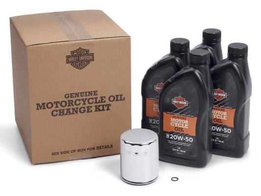
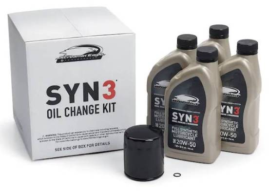

### Recomendación oficial Harley

Boletín: https://serviceinfo.harley-davidson.com/sip/service/procedure/1332041847506356430/BLAISE/1137435/en_US?nid=5728

Orden de preferencia: 1°) SYN3 — 2°) H-D 360 — 3°) Aceite diesel de emergencia (SH, CH-4, CI-4, CJ-4; solo en motor, **nunca en primaria ni transmisión**).

## Opciones alternativas

**⚠️ Si usás aceite de auto en emergencia: NUNCA aceite para nafteros/gasolina. Solo diesel de servicio pesado, y solo en el motor.**

**Económica** (omnipresente en Latinoamérica):
- Castrol Actevo 20w50 o Motul 3000 20w50 — costo estimado servicio completo: 37–50 USD.

**Semi sintético:**
- Castrol Actevo X-Tra 20w50 / Motul 5100 15w50 / Ipone R4000 RS 20w50 / Valvoline Durablend 4T 20w50 (API SL, JASO MA2).

**Sintético:**
- Mannol V-Twin 20w50 / Motul 7100 20w50 / Bel-Ray V-Twin 10w50 / AMSOIL 20w50 / Ipone Full Power Katana 15w50.

**Mineral:**
- Castrol Actevo 20w50 / Silkolene V-Twin 20w50 / Motul 3000 20w50.

| Marca | Recomendación motor |
|-------|---------------------|
| **Harley** | SYN3 o H-D 360 20w50 |
| **Castrol** | Actevo 20w50 / Power 1 V-Twin 20w50 |
| **Motul** | 7100 20w50 (o 5100 15w50 semi-sint.) |
| **Motorex** | Legend 20w50 |
| **Bel-Ray** | V-Twin 20w50 o 10w50 |
| **Silkolene** | V-Twin 20w50 |
| **Ipone** | R4000 RS 20w50 o Full Power Katana 15w50 |
| **AMSOIL** | 20w50 |
| **Mannol** | Harley Davidson 20w50 |

_Más info:_ http://sportsterpedia.com/doku.php/techtalk:ref:oil01

## Temperatura del aceite

Normal: **220°F–250°F** en el tanque. Picos hasta **300°F** en ralentí prolongado o verano.

Tapón termómetro para medir: https://www.ebay.com/sch/i.html?_nkw=sportster+oil+dipstick

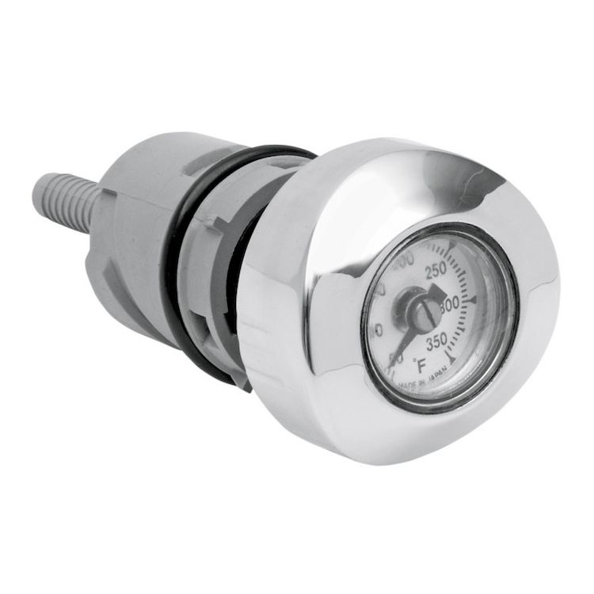

---

# Aceite de primaria — El gran misterio del Formula+

## La controversia

El aceite de la primaria es quizás el tema más "místico" en el mundillo Harley. Hay quienes juran que si uno no pone el aceite original Harley Formula+, la moto explotará en una bola de fuego... En fin: **no hay nada mágico en el aceite Harley para primaria**, pero la respuesta correcta depende de qué embrague tiene tu moto.

## ¿Qué es el Formula+ y el misterio de su reemplazo?

El **HD Formula+** de primaria era equivalente a un **semi sintético de caja 80w90**, o en viscosidad de motor: **20w50**. En la práctica, un aceite de moto 20w50 con especificación JASO MA/MA2 hace exactamente el mismo trabajo.

Harley lo discontinuó en 2020, sugiriendo reemplazarlo con SYN3 o HD 360. Después lo volvió a vender... la $ manda, parece. Todo ese misterio alrededor del Formula+, y al final es básicamente aceite de moto 20w50.

## La regla de oro

**Que el aceite sea para moto y cumpla la norma JASO MA o MA2**, y un API no obsoleto (SJ, SL, SM, SN son actuales). Esto es MUY importante: la etiqueta **JASO MA ó MA2** garantiza que el lubricante no causará problemas al embrague húmedo (bañado en aceite).

## ¿Qué aceite usar? — Depende del embrague

Aca esta la clave que mucha gente ignora: **el aceite correcto depende del embrague instalado**:

- **Embrague original Harley**: se puede usar sintético 20w50 de primera calidad (AMSOIL, Castrol Power 1 Racing) con JASO MA2.
- **Embrague Barnett**: recomiendan aceite **mineral** específico para moto con JASO MA o MA2. Nunca sintético.
- **Embrague Energy One**: recomiendan aceite **mineral** de moto o ATF (caja automática). **NO SINTÉTICO**.
- **Si no sabés qué embrague tiene la moto**: usá **mineral** por las dudas.

## Opciones concretas para la primaria

**Los mismos aceites de motor 20w50 JASO MA2 sirven para el embrague original:**
- Castrol Actevo 20w50 / Motul 3000 20w50 (mineral) / Motul 7100 20w50 (sintético)
- Motorex Legend 20w50 / Silkolene V-Twin 20w50 / Ipone RS 4000 20w50
- Castrol Power 1 Racing 4T 10w-50 / Power 1 4T 20w-50

**Aceites tipo caja (equivalentes al Formula+):**

El **75w90 GL5** es equivalente en viscosidad al Formula+. Valvoline SynPower 75W-90 GL5 funciona y se consigue fácil en Argentina. Que diga "slip differential" o "limited slip" para garantizar que no dañe metales amarillos.

Red Line recomienda específicamente el **75W90** para la primaria Sportster:

> _"El 75W90 es el producto que hemos utilizado durante varios años con muy buenos resultados en transmisiones Sportster/Buell, igualando la viscosidad y tipo de fluido requerido. El 75W90 sería el preferido y recomendado."_ — Red Line Oil

- https://www.hdforums.com/forum/sportster-models/804458-gl5-gear-oil-is-it-safe-to-use-in-the-sporty-answered.html

**Bel-Ray** Sport Trans 85w es bueno pero difícil de conseguir. En ML se consigue **Bel Ray Thumper Gear Saver 80w-85w** (verificado febrero 2025).

El libro "How to build a Harley Davidson Torque Monster" recomienda sintético **75w90 de caja**, o de moto **15w50** o **20w50**.

**Mobil 1** recomienda (difícil de conseguir en Argentina): 20w50 V-Twin, 15w50 full syn, o 75w90 gear oil.

**En resumen**: se puede usar el mismo aceite que en el motor (moto, JASO MA/MA2, API no obsoleto). Si no sabés qué embrague tiene la moto: **mineral**.

---

# Filtros de aceite

Características del filtro correcto: Altura ±86 mm / Ø exterior 75 mm / Rosca **3/4"-16 UNF** / Válvula alivio **máx. 12 PSI**.

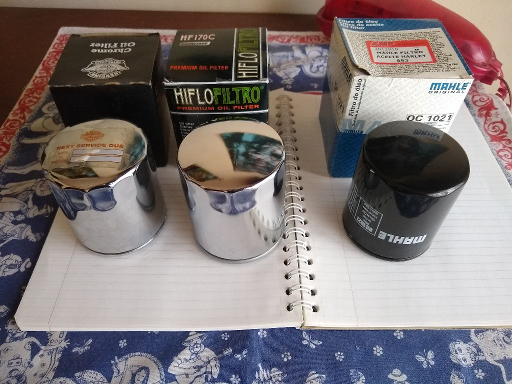

**⚠️ NO usar cualquier filtro de auto. La válvula de retorno de alto PSI puede matar el motor.**

**Filtros recomendados:**
- **Mahle OC1021** — negro, económico, específico para Harley.
- **HiFlo HF170C** (cromado) / **HF170B** (negro) — mejor calidad que el original: http://www.hiflofiltro.com/catalogue/filter/hf170
- **HiFlo HF170RC** — high performance: http://www.hiflofiltro.com/catalogue/filter/HF170RC
- **CHAMPION COF071C** — visto en ML (mayo 2021).

**Filtros de auto compatibles:**
- FRAM PH3614 (Neon, Stratus, Hilux) — PSI 12 — omnipresente. https://catalogo.fram.com.ar/filtros/ficha/PH3614
- Mahle OC988 / FRAM PH6022 — http://www.fram.com/parts-search/PH6022
- FRAM PH6065B (cromado, PSI 7-9): http://www.fram.com/parts-search/PH6065B

**Lista completa (Ø 78mm, H 78mm, rosca 3/4x16):**

| Marca | Códigos |
|-------|---------|
| FRAM | PH 3614 |
| MAHLE | OC216 / OC988 |
| MANNFILTER | W71180 / W71283 |
| BOSCH | 0451103322 / 451103271 |
| PUROLATOR | L1063 |
| BALDWIN | BT223 |
| DONALDSON | P550335 |
| TECFIL | PSL134 / PSL146 |
| TECNECO | OL449 / OL479 |
| CHRYSLER | 04105409AC |
| TOYOTA | 9091520003 / 90915YZZA1 |
| SUBARU | 15208AA020 |
| SUZUKI | 1651060B01 |
| WEGA | JFO211 |

Vehículos de referencia: Alfa Romeo 166, Chery Fulwin/Face, Chrysler PT Cruiser/Neon/Stratus/Caravan, Ford Bronco, Jeep Wrangler (07), Toyota Hilux/SW4/Supra/Camry/RAV4.

---

## Radiador de aceite

**Primero verificar si realmente recalienta** (¿pasa de 300°F?). En climas fríos generalmente no hace falta.

**Kit oficial Harley (P/N 62700082):**

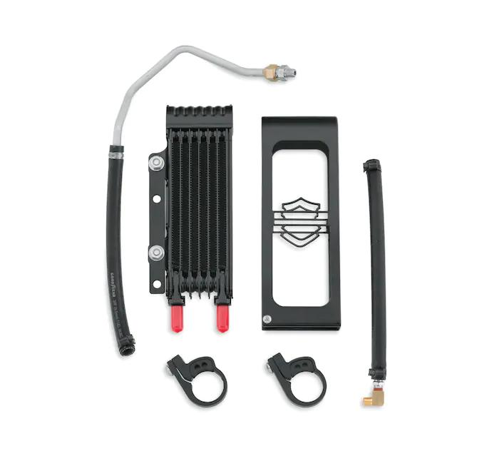
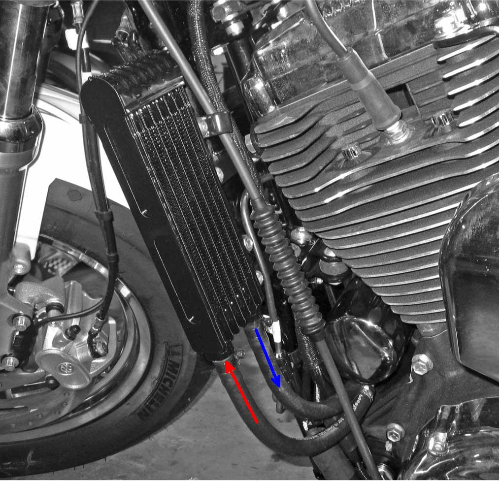

Más info: http://sportsterpedia.com/doku.php/techtalk:ref:oil14 | https://jagg.com/collections/harley-davidson-sportster | https://www.jpcycles.com/motorcycle-oil-cooler-kits

### Kit universal casero

1. Adaptador ("torta") para el filtro — rosca 3/4"-16 UNF.
2. Líneas de aceite AN10 — fabricar en casa de hidráulica.
3. Radiador pequeño de 6, 8 o 10 líneas.

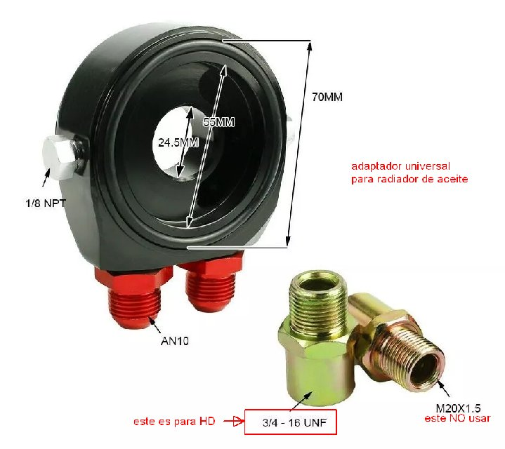
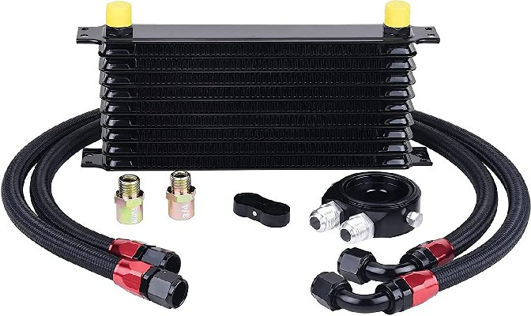

**Radiadores de otras motos:** Zanella RZ 25, Gilera VC 200R, Mondial HD 254, YBR 250.

**Casas de hidráulica en Argentina:**
- http://www.todoflex.com.ar/
- http://mangueraflexarg.com.ar/
- https://conman.com.ar/
- https://www.hidraulicagomar.com.ar/

---

# Motor de arranque (burro / starter)

Si la batería está buena pero hace **un solo clic** (no varios), muy probable que sea el **solenoide** sucio o trabado. Se puede reparar sin bajar el burro (codo flexible), aunque es más cómodo bajarlo.

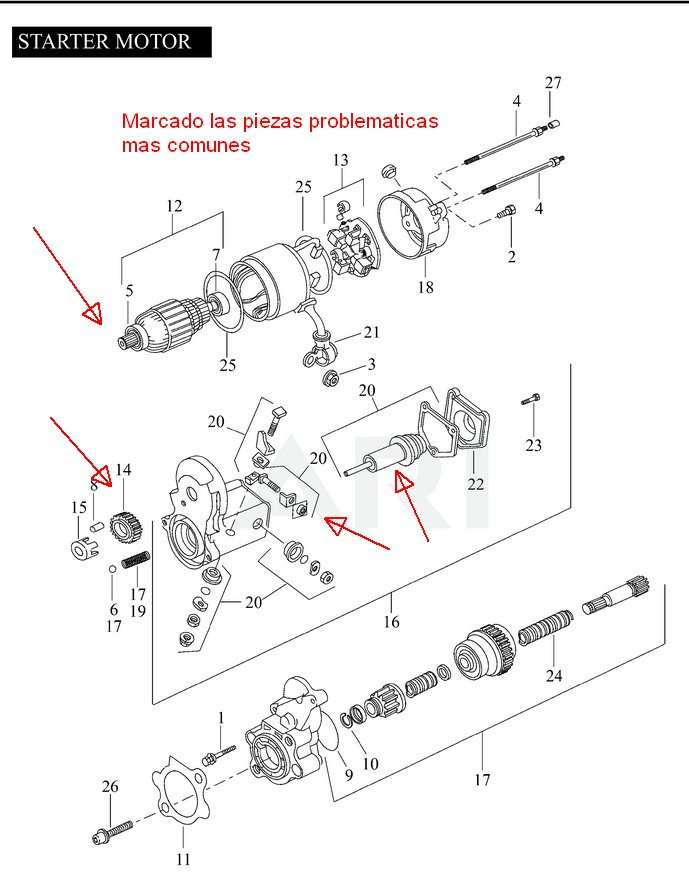
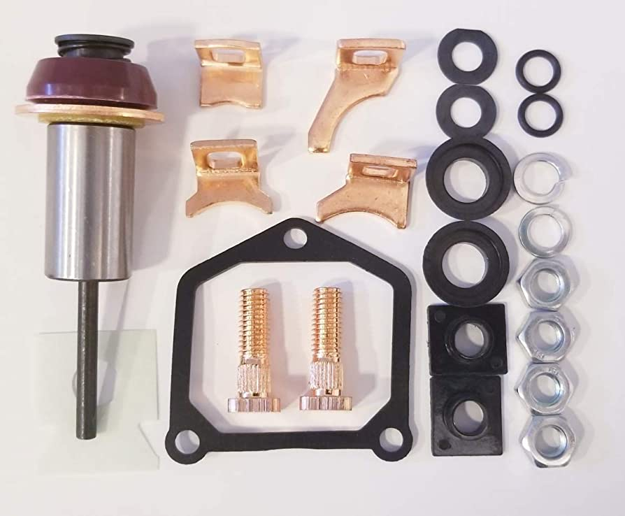

El kit de Solenoide Toyota Hilux (Nippondenso) es muy similar. Llevar muestra al repuestero.

---

# Arranque a patada (kickstarter)

Los modelos modernos **NO** traen patada, pero existe un kit de conversión de V-Twin Manufacturing. Es costoso y requiere separar los cárteres (modelos 2004+).

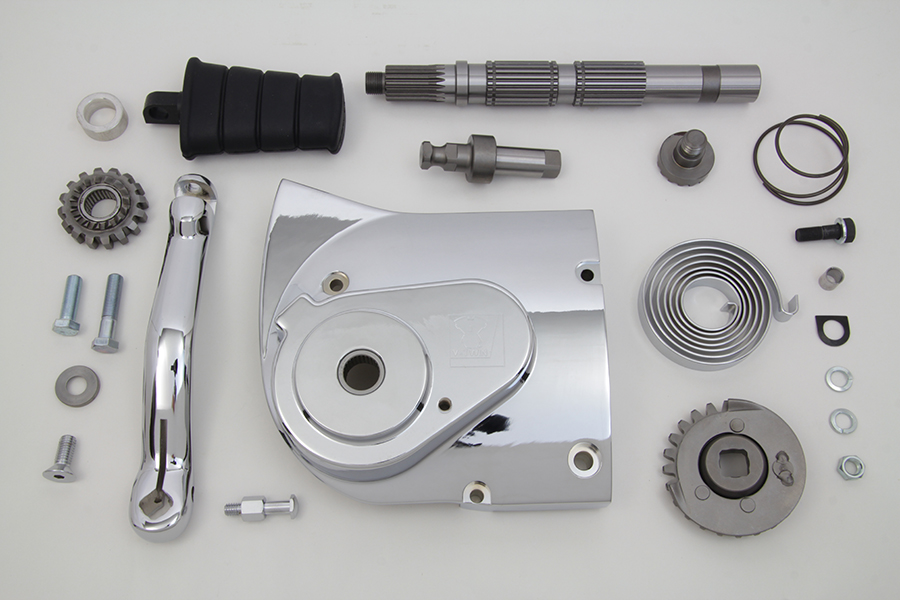
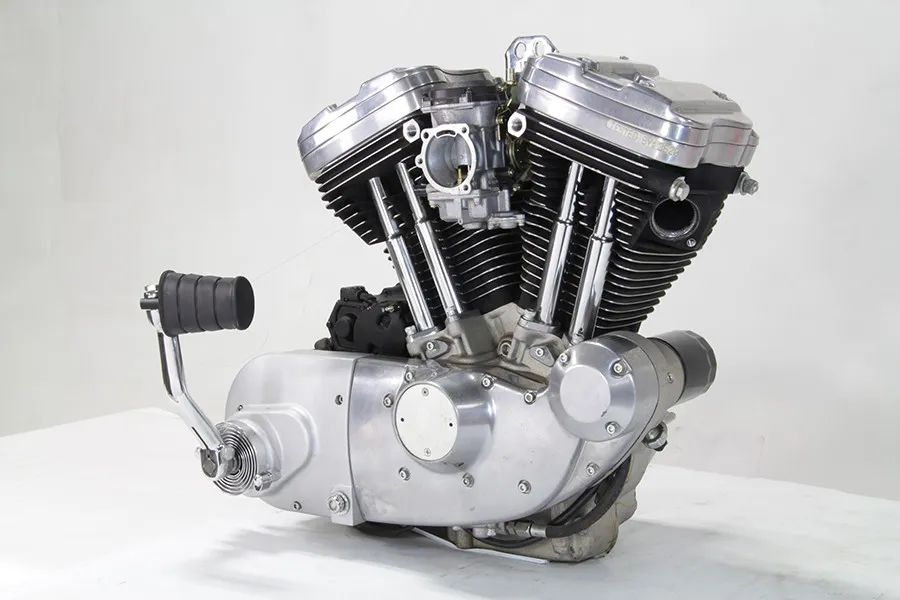

- https://california-motorcycles.com/products/kit-pata-arranque-para-harley-davidson-sportster-kick-starter-conversion-kit
- https://www2.vtwinmfg.com/kick-starter-conversion-kit-chrome-3.html

> **Opinión personal**: No lo compraría. Los sistemas EVO Sporty son excelentes y no hay excusa para que no sean confiables. Si es absolutamente necesario, consideraría mecanizar el eje principal en un torno.

---

# Cubiertas / Gomas / Neumáticos

**Marcas recomendadas:** Metzeler ME880, Dunlop, Michelin, Pirelli. Las marcas chinas de bajo costo tienen caucho duro y poco grip — **no recomendables**.

## Presión de inflado

| Condición | Delantera | Trasera |
|-----------|-----------|---------|
| Solo conductor | 30 psi | 36 psi |
| Con carga / 2 pasajeros | 36 psi | 40 psi |

## Medidas por modelo

Guía Harley: https://www.harley-davidson.com/app-content/eStore/OE_and_Recommended_Replacement_Tires.pdf

Copia en repo: https://raw.githubusercontent.com/alvarogonzalezferrer/harley_alternativas_argentina/master/archivos_soporte/gomas/Harley_OE_and_Recommended_Replacement_Tires.pdf

### Delantera

| Modelos | Medida |
|---------|--------|
| 1983–2003 XL883/1200/XR1000 y 2004+ XL | 100/90-19 / 2.15 x 19" |
| XL883C / XL1200C / XL1200V | 90/90-21 / 2.15 x 21" |
| +2010 XL1200X / +2018 XL1200XS | MT90B16 / 3.00 x 16" |
| 2008–2013 XR1200/X / 2017–2020 XL1200T | 120/70-18 / 3.5 x 18" |
| +2016 XL1200CX | 120/70-19 / 3.00 x 19" |

### Trasera

| Modelos | Medida |
|---------|--------|
| 1981–2003 | 130/90-16 / 3.00 x 16" |
| XL 2004+ | 150/80-16 / 3.00 x 16" |
| 2016+ XL1200CX | 150/70-18 / 4.25 x 18" |
| 2008–2013 XR1200/X | 180/55-17 / 5.50 x 17" |
| 2011+ XL883L / XL1200T Superlow | 150/60-17 / 4.50 x 17" |
| 2014–2017 XL1200T | 150/70-17 / 4.50 x 17" |

### Off-road / dual purpose

- [Video 1](https://www.youtube.com/watch?v=LKuYt_5O_6k) / [Video 2](https://www.youtube.com/watch?v=tm7g6PjSVQg)
- Delantera: Shinko E804 (19" y 21")
- Trasera 16": Duro HF904 130/90-16 / Shinko E805 150/80/16 / Pirelli MT60 Enduro 150/80-16

## Gomerías en Buenos Aires

- ~~Moto Vivac~~ — **⚠️ cerró en 2024**
- 2TBoxes / Cyclegom / Gomería Floresta
- Todo Moto 935: https://todomoto935.com.ar/
- Armotorrad, Olivos: http://armotorrad.com/ — Av. Libertador 2227
- Av. Libertador 2216, Olivos — +54 9 11 6417-1823

---

## Rulemanes / rodamientos de rueda

**⚠️ Diferentes años usan diferentes rodamientos.** Reemplazar cada ±40.000 km.

- Allballs Racing: https://www.allballsracing.com/
- Instrucciones: https://www.allballsracing.com/media/installation/Wheel_Bearing_Install.pdf
- Video: https://www.youtube.com/watch?v=sVXWt7xE9LI

| Modelo OEM | Años | Ø exterior | Ø interior | Grosor |
|------------|------|-----------|-----------|--------|
| **9052** | 1973–1999 (D) / 1979–1999 (T) | 45,3 mm | 3/4" / 19,05 mm | 16,6 mm |
| **9267** | 2000–2007 (D) / 2000–2004 (T) | 52 mm | 3/4" / 19,05 mm | 21 mm |
| **9247** | 2005–2007 (T) | 52 mm | 1" / 25,4 mm | 21 mm |
| **9276/A/B** | 2008–2020 SIN ABS / RH 2021–2023 | 52 mm | 25 mm | 15 mm |
| **9252 (ABS)** | Modelos con ABS | 52 mm | 25 mm | 15 mm |

Reemplazo para 9276 en SKF: **6205 2RSJEM** (25x52x15). Referencia: https://www.americanwheels.it/en/695-wheel-bearings

**⚠️ Modelos ABS**: parte magnética del rodamiento debe apuntar hacia afuera del aro.

---

# Levantar la moto

Siempre apoyada en **tres puntos**. Al sacar una rueda: la otra rueda + la pata + el elevador.

1. **Viga de madera** 4x8" x 1 m — la más barata. Guía: http://www.nightrider.com/biketech/bikelift.htm — [Video fabricación](https://www.youtube.com/watch?v=U10ZQbfK6bI)
   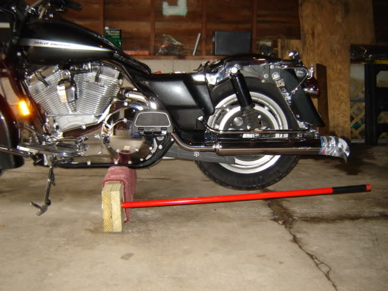
2. **Criquet carrito perfil bajo** (2 toneladas).
   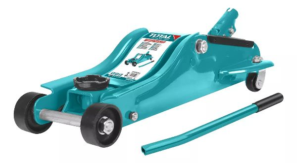
3. **Elevador profesional de motos**.
   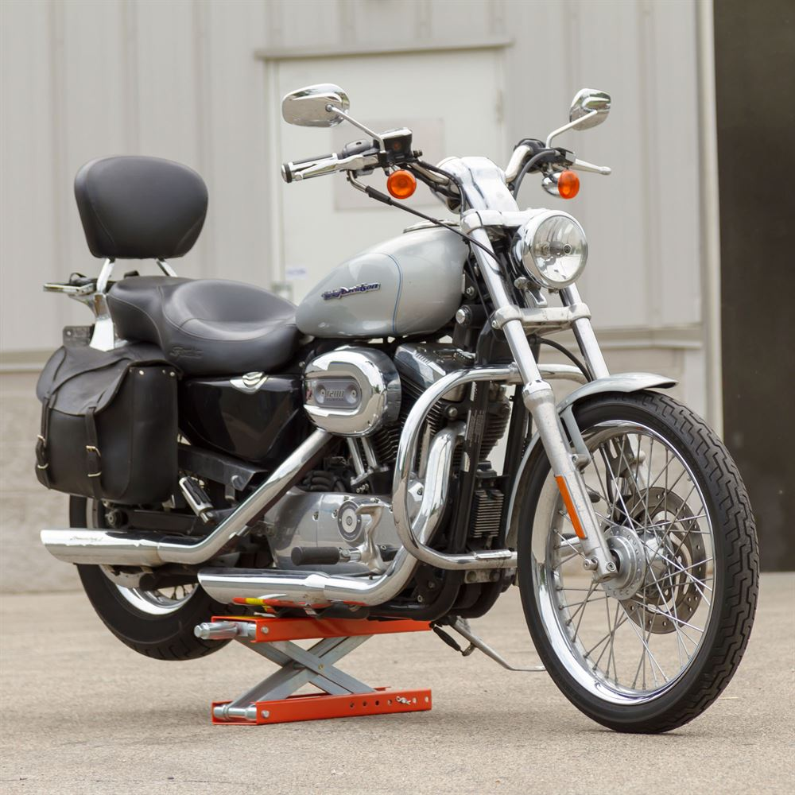
4. **Gato de auto en emergencia** — **LA MÁS PELIGROSA.** Ver antes: [Video](https://www.youtube.com/watch?v=aKX6fuGW_a8)
   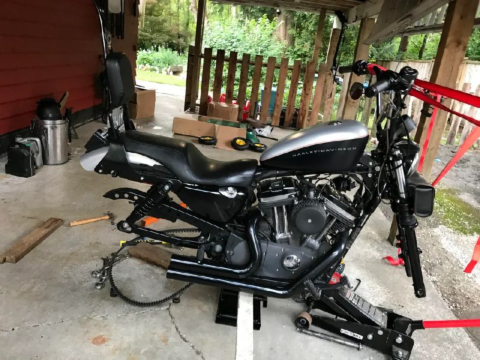

Referencia: http://sportsterpedia.com/doku.php/techtalk:ref:tools110

---

# Acabados del motor

## Aluminio pulido

Videos: [1](https://www.youtube.com/watch?v=c1mbRoaGs3s) — [2](https://www.youtube.com/watch?v=p6W-snSeCtg) — [3](https://www.youtube.com/watch?v=Qj2aFJeFdA0)
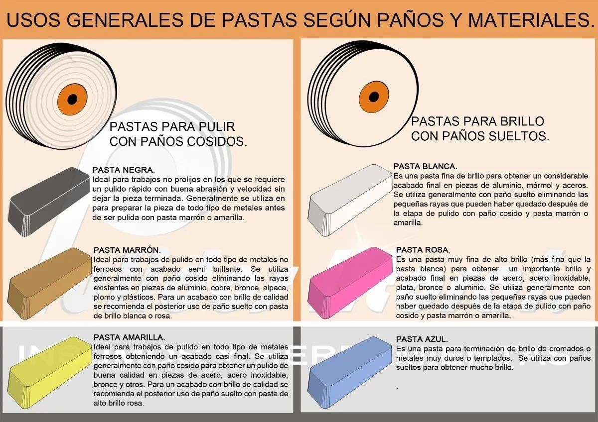

**Pasta casera**: aceite vegetal + Maizena + bicarbonato sódico.

## Negro

Tutorial: https://www.hdforums.com/how-tos/a/harley-davidson-sportster-how-to-black-out-engine-casing-412785

## Cromado

Kit de embellecimiento: https://www.google.com/search?q=chrome+dress+up+kit+sportster

**Cromados en Argentina:**
- **Saavedra Cromados** ← EXCELENTE, aceptan escapes: http://cromadossaavedra.com.ar/ — Av. García del Río 4522, Buenos Aires
- **Cromados Albacrom**: https://cromadosalbacrom.com/
- **Cromados Peduto** — excelente calidad, no acepta escapes.

---

# Tornillería

## Tornillos comunes que se redondean (modelos +2004)

- **Filtro de aire**: ALLEN PLANO 5/16 x 1/2 UNC
- **Soporte batería**: HEXAGONAL 1/4 - 3/4 UNC
- **Soporte tambor de la llave**: ALLEN BOTÓN INOX #10-24 x 1/2 SOCKET BUTTON HD
- **Tapa inspección primaria**: 41191-74A — **⚠️ EN REVISIÓN, llevar muestra**

Referencias de tamaños:
- http://sportsterpedia.com/doku.php/techtalk:ref:tools804
- https://www.thunderbike.com/parts/thunderbike-h-d-partsfinder/
- https://www.torec.mx/pages/como-medir
- https://www.fastenersuperstore.com/fastener-guides/measuring-screws-bolts

---

# Filtro de aire

El filtro original es **lavable**. Para reemplazarlo: K&N — https://www.knfiltros.com/

## Limpieza (modelos 2004+ con filtro original)

> **⚠️ Instalar ANTES de encender el motor.**
> **⚠️ NO usar gasolina ni solventes.**

1. Extraer cubierta y filtro.
2. Lavar en agua jabonosa tibia.
3. Verificar limpieza a contraluz.
4. Secar al sol o con aire a presión baja.
5. Reinstalar al revés con Loctite en las roscas.

---

# Aceite de horquilla

- **Motul Fork Oil 20W** (recomendado por Motul para Harley)
- **Castrol Fork Oil 15W**

Ver en el manual de desarme la cantidad en cc y el intervalo de cambio.

---

# Frenos

## Líquido de frenos

| Modelos | Líquido |
|---------|---------|
| 2006 y anteriores | **DOT 5** (silicona) |
| 2007 y posteriores | **DOT 4** |

> **⚠️ DOT 5 y DOT 4 NO se pueden mezclar.**
> **⚠️ DOT 5 ≠ DOT 5.1.** El DOT 5 es siliconado; los demás NO.

- DOT 4: Wagner Lockheed, se fabrica en Argentina.
- DOT 5: Bel-Ray lo tiene. Difícil conseguir con stock permanente.

## Bomba de freno

Buscar "Master Cylinder Rebuild Kit". La bomba trasera pre-ABS es muy similar a la **AKT CR5 / Loncin** (Guerrero GR5 230 en Argentina).

## Pastillas de freno

Reempastar con ferodo (~8,5 mm espesor): Tosso Frenos, Jesús María.

**EBC** — excelentes, mejor que las originales en lluvia. https://ebcbrakes.com/

| Modelo | Delantera | Trasera |
|--------|-----------|---------|
| 1979–1981 | FA071 | FA072 |
| 1982–1983 | FA071 | FA078 |
| 1984–inicio 1987 | FA094 | FA078 |
| 1987–1999 | FA094 | FA200 |
| 2000–2003 | FA400 | FA400 |
| 2004–2013 | FA381HH | FA387HH |
| 2014–2020 | FA640HH | FA254HH |
| XR1200 / XR1200X | FA296HH (2 uds) | EPFA387HH |

Selector: https://ebcbrakes.com/brakes-selector-chart/ | Para Sportster: https://ebcbrakesdirect.com/motorcycle/harley-davidson-sportster

## Discos de freno

Se pueden rectificar si están rayados. **EBC** vende discos excelentes.

---

# Bujías

Llave sacabujía de **5/8" o 16mm**. Ajustar sin reventar la rosca.

> **⚠️ Solo aplica a Sportster 883/1200.** Otras (XR1000, XL1100, antiguas) llevan diferentes.

**Bujía original: 6R12** — Ø rosca 12mm, largo rosca 19mm, llave 5/8" ó 16mm.

**Alternativas:**
- **Champion RA8HC** — misma bujía sin el logo HD. Buscar en casas de náutica (motores Mercury 40/50/60 fuera de borda). La tengo desde 2018 en la 883.
- **NGK DCPR7E** — excelentes (Fiat 500 Sport 16v, algunos Alfa Romeo).
- **NGK DCPR8E** — un poco más frías, baratas en Argentina.
- **NGK DCPR7EIX / DCPR8EIX** — iridio, difíciles en Argentina.
- **NGK DR7EA** — llevan llave de 18mm aunque la rosca sea idéntica. No recomendadas.

Luz: 0,8mm. Referencias cruzadas: https://www.sparkplug-crossreference.com/convert/hd/6R12

---

# Batería

Verificar siempre los **CCA** antes de comprar, además de dimensiones y posición del polo positivo.

## Mantenimiento — Battery Tender

Usar **battery tender** (cargador flotante) siempre. Me han llegado a durar 10 años las baterías. Conector **SAE 12v** (positivo + masa en carcasa primaria).

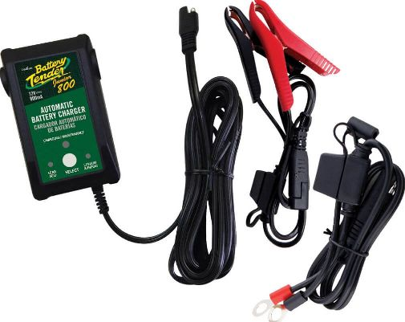
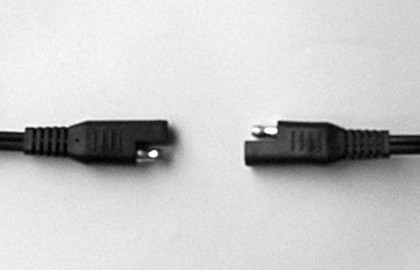

## Equivalencias Yuasa

| Año(s) | Equivalencia Yuasa |
|--------|-------------------|
| Pre 1979 | Sin info |
| 1979–1985 | YB16-B-CX / GYZ20H / YTX20H-BS |
| 1986–1996 | YTX20H-BS |
| **1997–2003** | YTX20HL-BS |
| **2004–2020** | YTX14L-BS |

## Modelos 2004–2020 — detalle

Yuasa **YTX14L-BS** — 150 x 87 x 145 mm / CCA mínimo 200 / 12 V.

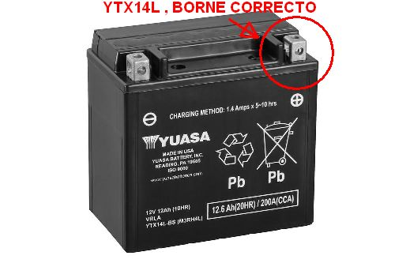

**Alternativas probadas:**
- **SLA Max BTX14HL** — mejor calidad/precio: https://bs-battery.com/btx14hl-sla-max/
- **Motobatt MBYZ16HD** — específica Harley (negro/naranja): https://www.motobatt.com/quadflex-batteries.html
- **Poweroad YG14L-BS** — chinas, baratas, sirven en EFI.
- **Litio WEX6L21-MF**: http://www.wstandard-energy.com/

### Usando la YTX14 (sin L) — borne al revés

Se consigue a mitad de precio. Orientarla hacia atrás y **extender los cables** (6 AWG Welding / 16 mm²) en cualquier casa de audio. Terminales: ojal 16mm², 5/16".

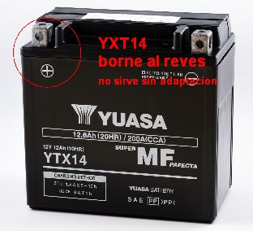
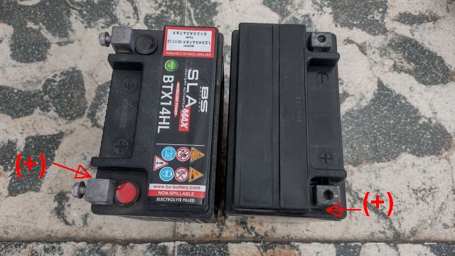
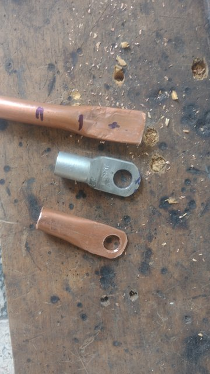
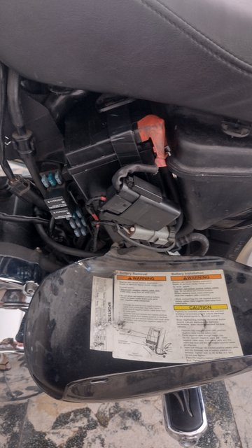

Tutorial fabricar cables: [Video](https://www.youtube.com/watch?v=XkMdlPsBxkc) — [Terminales](https://www.youtube.com/watch?v=PqOa2d8v8Tw)

Más info cables: https://sportsterpedia.com/doku.php/techtalk:evo:elec01

Compras: https://www.prestacioneselectricas.com/ | https://adnsolar.com.ar/

---

# Luces

**⚠️ Los modelos más nuevos llevan luces LED — verificar ANTES de comprar.**

- **Delantera filamento**: H4. LED: reemplazar conjunto completo, formato 5-3/4" (14,6 cm) — Harley DayMaker o similares más económicos.
- **Trasera**: OSRAM P27-7W 12V **3157**. Modelos modernos: LED.
- **Giros 2013-**: filamento; 2014+: LED. Bulbos: **1157** (US) frente, **1156/1141 P21W** trasero.

### Intermitentes (Sportsters 2004+)

Cancelación automática a los **20 parpadeos** (a más de 7 MPH). También se cancela 2 segundos después de un giro de ≥45°. Cancelación manual: pulsar botón una segunda vez.

---

# Embrague

## Marcas y proveedores

- **Barnett**: https://www.barnettclutches.com/
- **Energy One**: https://www.energyoneclutches.com
- **Harley Screaming Eagle** P/N 38002-04: https://www.harley-davidson.com/us/en/shop/screamin-eagle-performance-clutch-kit/p/38002-04
- **Alto Products**: https://www.altousa.com/

## Problema crónico: la Spring Plate ("grenade plate")

La **placa de resorte** (disco doble con muelles remachados de latón) es un problema de diseño crónico: los remaches fallan, quedan atrapados entre las placas y dañan todo el conjunto.

**Síntomas**: embrague "raro" o duro, dificultad para poner neutro, virutas de bronce en el aceite de primaria, embrague patinando.

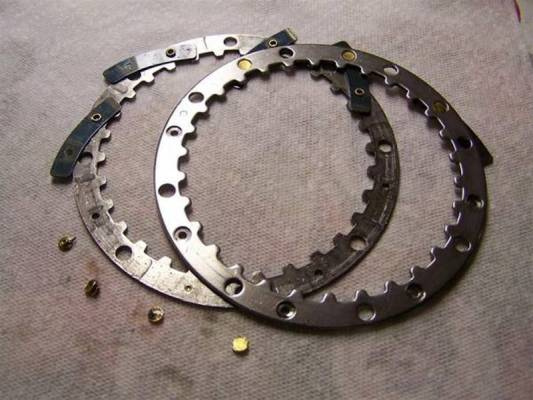

**Solución** (1991+): eliminar la placa de resorte instalando **dos placas de acero adicionales + una placa de fricción adicional**. Yo puse el Energy One BTX-11 en mi XL883L 2005: excelente resultado.

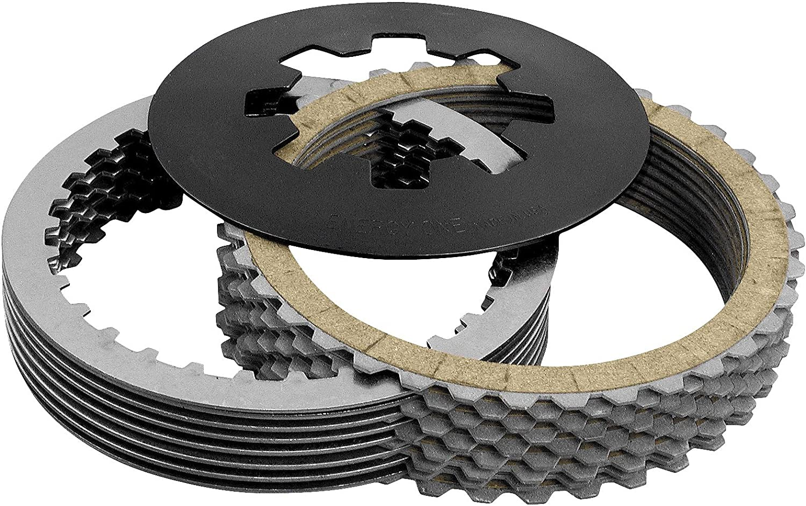

Leer más:
- http://sportsterpedia.com/doku.php/techtalk:evo:priclutch01
- https://www.cyclepedia.com/sportster-spring-plate/

## Cómo cambiar el embrague

Herramienta compresora: comprar ~70 USD o fabricar con tubo PVC 3".

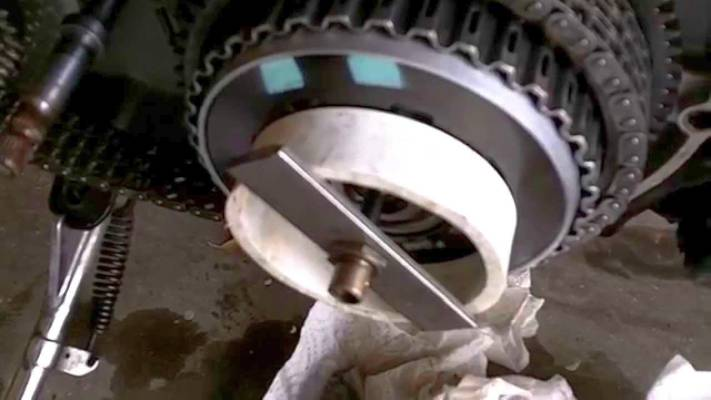

Videos:
- **[Hammer Performance — el más completo](https://www.youtube.com/watch?v=g8BMUy-pTBs)**
- [Herramienta casera](https://www.youtube.com/watch?v=0dHhb4fs96A) / [En español](https://www.youtube.com/watch?v=OK02f5lHrPo)

PDFs:
- [Instrucciones Harley](https://github.com/alvarogonzalezferrer/harley_alternativas_argentina/raw/master/archivos_soporte/embrague/embrague_screaming_eagle_instalacion.pdf)
- [Instrucciones con fotos](https://github.com/alvarogonzalezferrer/harley_alternativas_argentina/raw/master/archivos_soporte/embrague/embrague_instalar_con_fotos.pdf)

## Embrague centrífugo automático

**Rekluse Core EXP 3.0** (~900 USD): https://rekluse.com/product/core-exp-3-0-clutch/?pd=1

---

# Cables de embrague, acelerador, etc.

Reparar en ruta con "evita soldaduras" + kit universal. Buscar "Kit Reparacion Universal Cable Embrague Y Acelerador". Videos: [1](https://www.youtube.com/watch?v=D9FfYxjjL6s) — [2](https://www.youtube.com/watch?v=S_l58vS1s3c)

Largo de cables: https://www.motionpro.com/ | https://magnumshielding.com

Fabricantes en Argentina: https://www.cablescomandoarg.com/ | https://cablesbotta.com.ar/

---

# Juntas del motor

- **Cyco Gasket** — económicas y buenas: https://cycogasket.com/
- **Cometic** — MUY superiores a las originales: https://www.cometic.com/
- **James Gasket** — buena alternativa más económica: https://www.jamesgaskets.com/

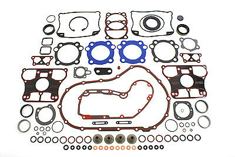

---

# Rayos de la rueda

- https://www.facebook.com/RayosyNiples33/
- http://www.chiuchich.com.ar
- https://www.mpmotosport.com/

---

# Correa de transmisión

Tensión con aparato especial (conseguir en eBay). Ver procedimiento en el manual del propietario.

Fabricantes en Argentina: http://www.ges.com.ar/ | http://www.alestel.com.ar/ | http://www.correasrincon.com.ar/

---

# Pintura

## Códigos de color

- [Lista de códigos PPG](archivos_soporte/pintura/codigos_pintura_harley_PPG.txt)
- [Base de datos completa (descomprimir → index.html)](archivos_soporte/pintura/harley_color_database.zip)
- https://paintref.com/cgi-bin/colorcodedisplay.cgi?make=Harley%20Davidson
- https://hdpaintcode.com/complete-harley-color-code-database/
- https://hdpaintcode.com/harley-davidson-paint-code-crossover/

**Pintura de retoque en Argentina:** PINTURERIAS VICTORICA — Av. Victorica 951, B1744BWJ GBA — Tel: 0237 462-2242

---

# Carburador CV40 (modelos 1988–2006)

El carburador original es un **Keihin CV 40mm**. El original tiene el logo HD; las copias chinas son casi idénticas. El CVK es para Kawasaki.

Con la moto parada mucho tiempo, agregar **estabilizador de combustible** y un **limpia carburadores STP** cada tanto. Si las gomas están rotas: comprar un "CV40 rebuild kit".

**El diafragma de la Kawasaki Vulcan VN800 es compatible.**

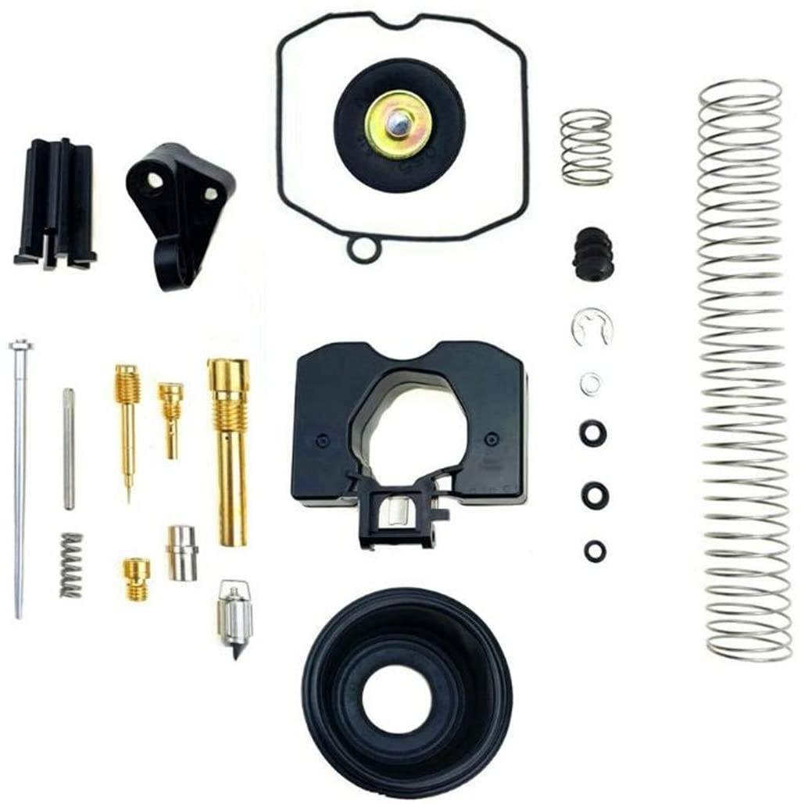
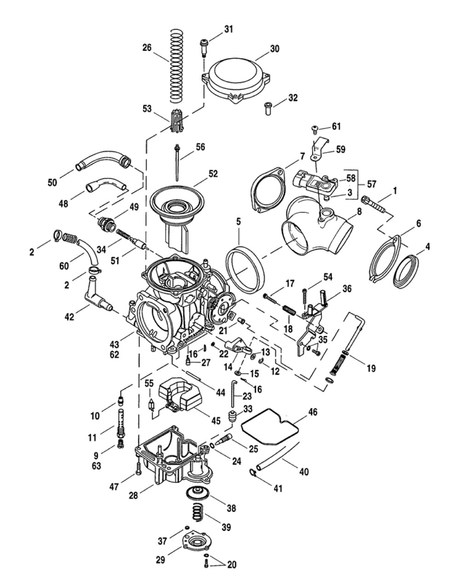

Video limpieza: https://www.youtube.com/watch?v=Pp4l-zbQcy0
Reconstrucción: http://sportsterpedia.com/doku.php/techtalk:evo:carb01a | http://sportsterpedia.com/doku.php/techtalk:evo:carb02
Kit eBay: https://www.ebay.com/sch/i.html?_nkw=sportster+cv+rebuild+kit
Cambiar diafragma: https://www.youtube.com/watch?v=H0GOExal_VA

## Filtro de nafta carburado (hasta 2006)

En la válvula de paso de combustible. Se **limpia**, no se reemplaza salvo que esté perforado.

Video: https://www.youtube.com/watch?v=8Xs6ZjrAD6o

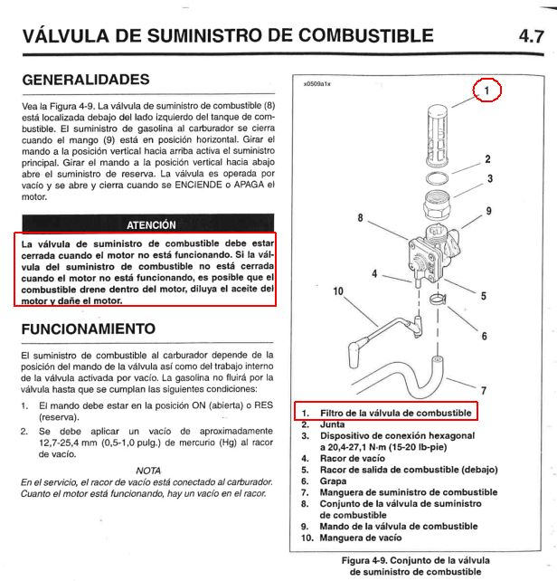
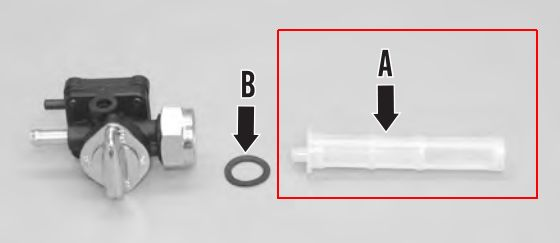

---

# Inyección EFI (2007 en adelante)

Más info: http://sportsterpedia.com/doku.php/techtalk:evo:engctl03

## Modo diagnóstico integrado

Mantener presionado el **botón de reset del cuentakilómetros** mientras se pone la llave en "on".

Video: https://www.youtube.com/watch?v=j3JiSOjkuZ0 | Tutorial: https://california-motorcycles.com/blogs/mecanicaharley/como-ver-y-borrar-los-codigos-de-error-efi-de-harley-davidson

## Diagnóstico con cable OBD2

1. Cable J1850 de 4 pines a OBD2 (2001–2014) — buscar "harley odb2 cable" en Amazon.
2. ELM327 Bluetooth.
3. App: ~~[HarleyDroid](https://play.google.com/store/apps/details?id=org.harleydroid)~~ **⚠️ ROTO** — APK en [carpeta apps](archivos_soporte/apps) — Código fuente: https://github.com/stelian42/HarleyDroid | Alternativa activa: [Torque](https://play.google.com/store/apps/details?id=org.prowl.torque)

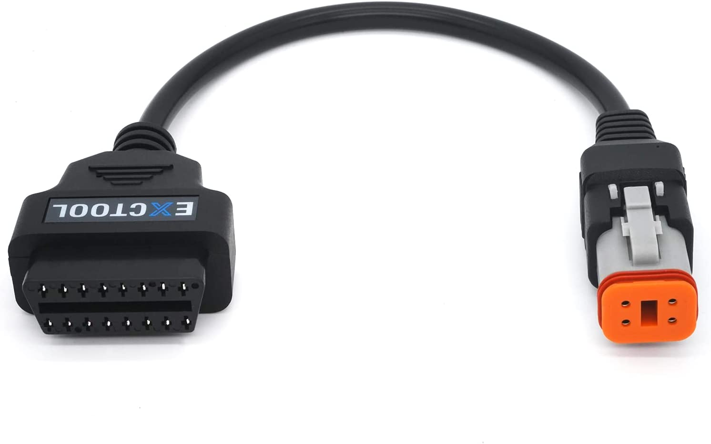
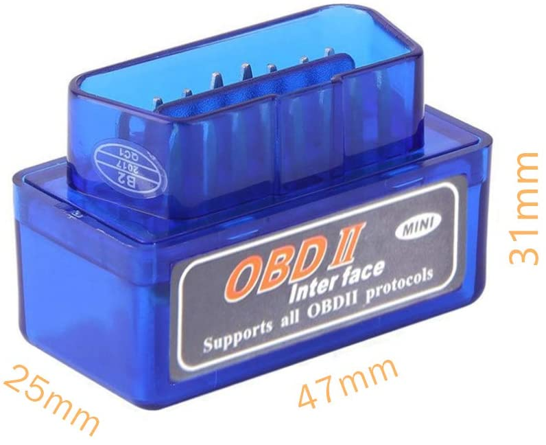

## Escáneres profesionales

- Daytona Twin Scan 2 (hasta 2013): https://daytona-twintec.com/product/15202-twin-scan-2-abs/
- Daytona Twin Scan 4 (2014–2020): https://daytona-twintec.com/product/15500-twin-scan-4-abs/
- Dynojet Power Vision: https://www.dynojet.com/dynojet-motorcycle-power-vision/
- Techno Research Centurion Super Pro: https://technoresearch.info/diagnostic-tools-harley-davidson/centurion-super-pro/

## Filtro de nafta EFI

Dentro del tanque — **dos filtros**: pre-filtro (bolsita) + filtro cilíndrico.

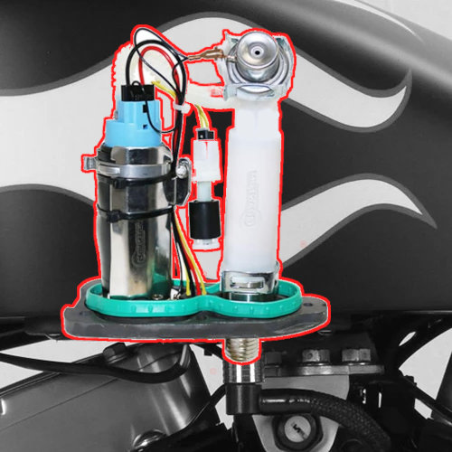
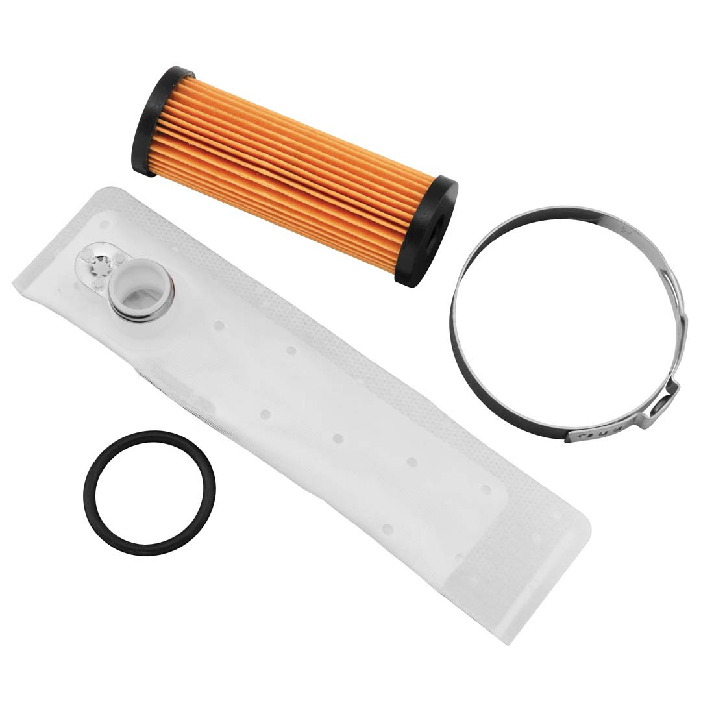

- eBay: https://www.ebay.com/sch/i.html?_nkw=sportster+fuel+filter+efi
- Dennis Kirk ~19 USD: https://www.denniskirk.com/v-factor/oe-style-fuel-filter-kit-for-efi-models-75304-07a.p1801082.prd/1801082.sku
- Drag Specialties ~40 USD: https://www.dragspecialties.com/search;q=07070014
- Harley original ~110 USD — P/N 75304-07A

Pre-filtro alternativo: Honda XRE 300. _TO-DO: medir el filtro cilíndrico para encontrar reemplazo automotriz._

## Bomba de nafta EFI

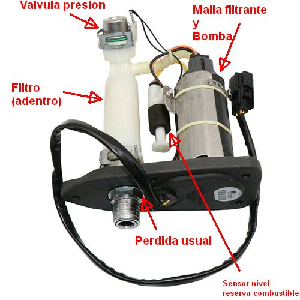

- Harley Argentina: ~300 USD
- Alternativa USA ~70 USD: https://www.jpcycles.com/harley-sportster-1200-fuel-pump-components
- **Bomba Bosch 3,5–4 Bar** (~15 USD) — reemplaza directamente, se consigue en ML y casas de repuestos.

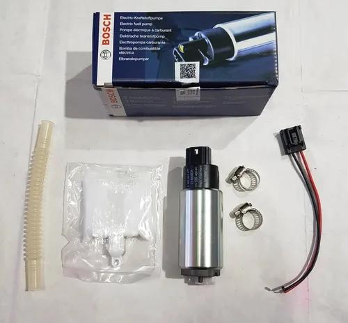
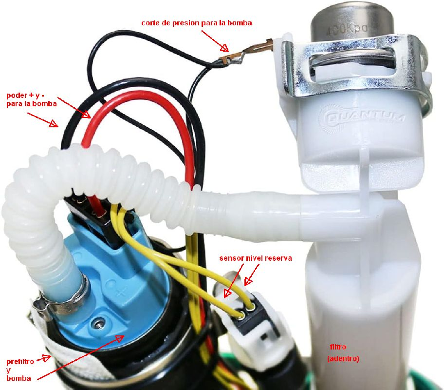

## Fugas de combustible — O-rings del acople rápido

Video: https://www.youtube.com/watch?v=dfrIwD-G-eY

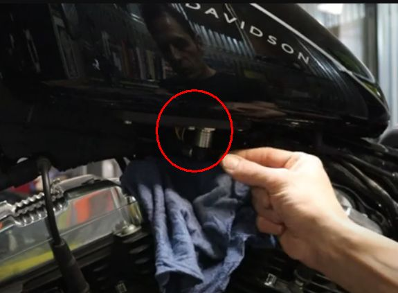
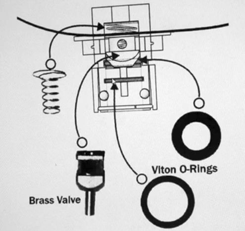

Los O-rings deben ser de **VITON**:
- **Inferior** (el que falla): Parker 2013 — DI 10, DE 14, S 2 mm. Código: M1206 / AS905.
- **Superior**: DI 8, DE 13, S 2,5 mm. Código: M1472 / AS109.

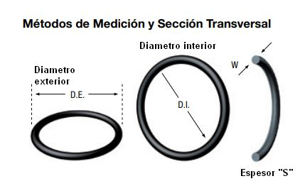

Donde comprar en Argentina: https://www.o-ring.com.ar/buscador/ | http://www.vauton.com.ar/productos.php | https://tecnosellos.com.ar/ | https://parkest.com.ar/

Kit completo EE.UU.: https://fueltool.com/products/harley-check-valve-rebuild-kit/

## Ralentí / idle EFI — IAC manual

No bajar de **950 rpm**. El IAC (motor paso a paso de aire en ralentí) controla el ralentí.

IAC manual: reemplaza el IAC eléctrico por un dispositivo ajustable a mano.

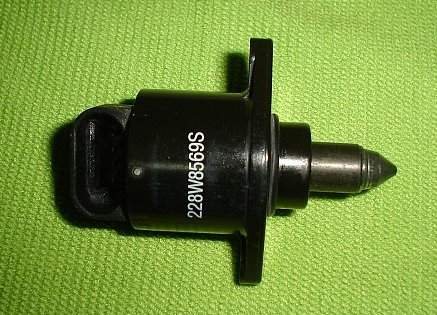
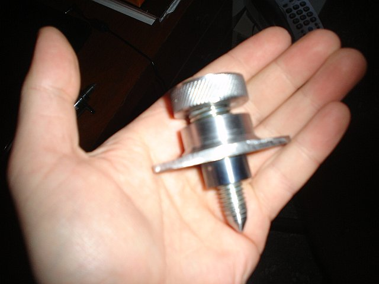

[Planos CAD del IAC manual](archivos_soporte/EFI/control_IAC)

## CANBUS / HDLAN

A partir de 2011, Harley adoptó el protocolo **HDLAN** basado en CAN BUS (2 cables de comunicaciones). Más info: https://california-motorcycles.com/blogs/mecanicaharley/el-sistema-de-comunicaciones-can-bus-de-harley-davidson-hdlan

---

# Amortiguadores traseros

**FAR** — fábrica nacional, línea completa para Harley, excelente calidad y precio: https://www.farmotopartes.com.ar/product-category/amortiguadores-far/

Guía completa:
- https://www.hdforums.com/how-tos/a/harley-davidson-sportster-the-ultimate-shocks-guide-413022
- http://sportsterpedia.com/doku.php/techtalk:evo:susp02

---

# Regulador de voltaje

**¡Pieza que se quema frecuentemente!** El regulador varía según el año:

| Años | P/N Harley | Notas |
|------|-----------|-------|
| 1996–2003 | 74523-94 | — |
| 2004–2006 | 74523-04 | Monofásico 22 A, 12 V |
| 2007–2008 | 74546-07A | 32 A — sin reemplazo argentino conocido |
| 2009–2013 | 74711-08 | 32 A — sin reemplazo argentino conocido |
| 2014+ | 74700012 | Estado sólido — solo reemplazos en EE.UU. |

**Reemplazo nacional DZE 10181** (hasta 2006): http://dzecatalogo.com.ar/es/producto/10181/Harley%20Davison

**⚠️ Reutilizar las fichas originales. Una mala adaptación puede freír la batería o la electrónica.**

Referencia: http://sportsterpedia.com/doku.php/techtalk:evo:elec02?s[]=regulator

---

# Escapes

La elección del escape modifica el **sonido**, el **look** y la **performance**. Elegir el escape del año correcto: 1986–2003 / 2004–2013 (2007+ con toma para sondas lambda) / 2014+.

Análisis en dinamómetro: https://www.1250kits.com/ttxlexhaust.shtml

**Marcas importadas:** Supertrapp / Screaming Eagle / Bassani / Arlen Ness / Vance & Hines / Cycle Shack / Roland Sands.

**Fabricantes nacionales (Argentina):**
- Giaccone: http://giacconeescapes.com/ o https://es-la.facebook.com/Giaccone001/
- http://www.escapesfabian.com.ar/ | http://www.tubosilescapes.com.ar/ | http://dmescapes.com.ar/
- https://www.mpmotosport.com/ | Lucky Custom: https://www.facebook.com/pages/category/Local-Business/Lucky-Custom-128082827250041/

---

# Mejorar performance

Las etapas son **escalonadas**: para hacer Stage 3 hay que haber hecho el 1 y 2 antes.

## Stage 1

Escape alto flujo + filtro alto flujo + remapear EFI o recarburar. Hasta un 10% de aumento en todo el rango de RPM. http://www.harley-performance.com/stage-1.html

## Stage 2

Levas modificadas + pistones de alta compresión + kits de alta cilindrada. Torque Cam o Power Cam según estilo de conducción.

## Stage 3

Culatas CNC + cuerpo de acelerador más grande + cilindros, pistones y leva adecuada.

Más info: http://sportsterpedia.com/doku.php/techtalk:ref:perf01 | https://suburbanharley.com/Performance-Kits-Sportster | http://www.hammerperf.com/techtips.shtml

---

## Convertir 883 a 1200 / 1250 / 1275 cc

**⚠️ Modelos 2008+**: NO se pueden rectificar los cilindros 883 para usar pistones 1200. Se requieren cilindros nuevos. Ver boletín HD 1267 → http://sportsterpedia.com/lib/exe/fetch.php/pdf-bulletin:tsb1267.pdf

**Kits:**
- **Hammer Performance** (el que yo tengo): http://hammerperf.com/883conversions.shtml
- **S&S**: https://www.sscycle.com/big-bore-sportster/
- Conversión de bajo costo: http://rosysumenteinquieta.blogspot.com/2016/01/como-convertimos-una-sportster-de-883cc.html

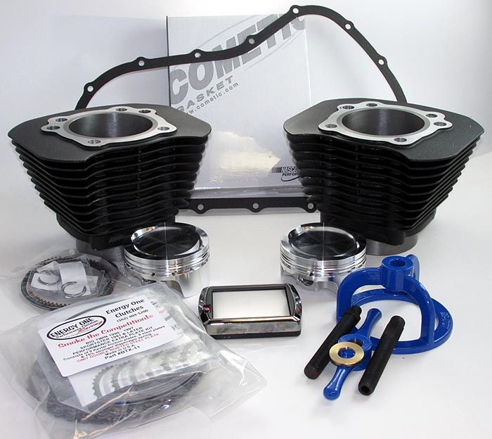

**INSTRUCCIONES**: https://www.1250kits.com/ttinstallkit.shtml

**⚠️ Es VITAL ajustar el encendido** (compresión más alta requiere menos avance). Ajuste incorrecto = pistones dañados.

**⚠️ En EFI: PROGRAMAR LA ECM ANTES DEL PRIMER ARRANQUE.**

### Encendido — carburadas 2004–2006

- **Daytona TC88A** (recomendado): https://daytona-twintec.com/product/1009-tc88a-twin-cam-ignition/
- Dynatek Dyna Performance: https://www.dynaonline.com/dspt-ign-04-06-hd-sportster-883-1/ — menos funcional, no recomendado.

### Encendido/ECM — EFI 2007+

- **Dynojet Power Vision** (reprogramación real, no add-on): https://www.dynojet.com/power-vision/
- **ThunderMax**: https://store.thunder-max.com/
- **Daytona Twintec ECM**: https://daytona-twintec.com/shop_products/
- Vance & Hines FP3: **NO funciona bien para kits 1250**.

---

# Velocímetro GPS

Lee la velocidad mediante GPS, no del sensor VSS. Lo instalé en mi XL 2005 S cuando el velocímetro original se quemó. Solo requiere +12 V y GND.

Amazon: https://www.amazon.com/ELING-DigitalGPS-Speedometer-Adjustable-Back-Lights/dp/B07KP7HGJ4?th=1

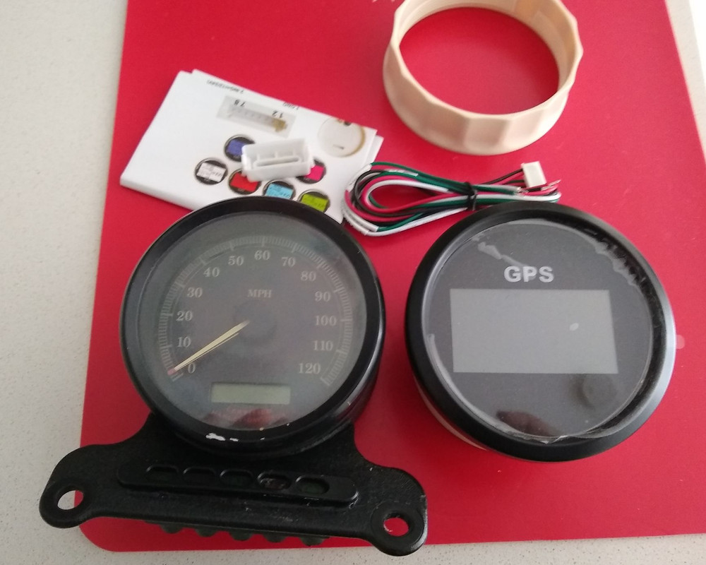
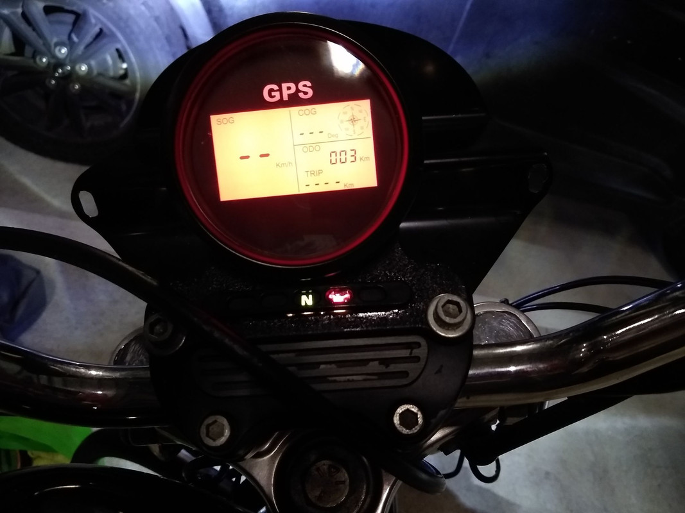
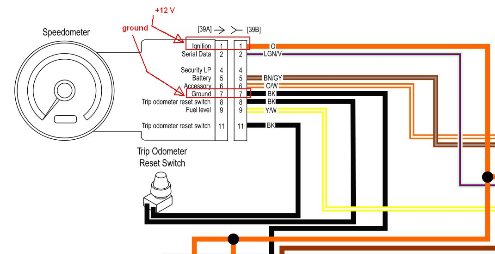

---

# Navegación GPS y electricidad

Para consumos bajos como el cargador de celular, se puede tomar corriente de las luces delanteras. **Siempre fusible.**

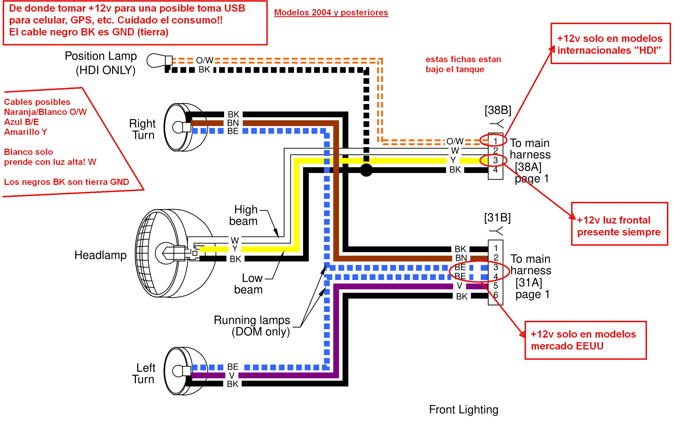

**Apps GPS:**

| App | Descripción |
|-----|-------------|
| [Waze](https://play.google.com/store/apps/details?id=com.waze) | El mejor. Marca cámaras, policía, retenes. |
| [Organic Maps](https://play.google.com/store/apps/details?id=app.organicmaps) | Offline, sin publicidad. |
| [OsmAnd](https://play.google.com/store/apps/details?id=net.osmand) | Similar, con más puntos de interés. |
| [Maps.ME](https://play.google.com/store/apps/details?id=com.mapswithme.maps.pro) | Funciona offline. Contiene anuncios. |
| [Google Maps](https://play.google.com/store/apps/details?id=com.google.android.apps.maps) | Viene con el celular. |

Sitios para planear viajes: https://www.openstreetmap.org/ | https://www.google.com/maps | https://www.ruta0.com/ | https://www.waze.com/es/live-map

---

# Accesorios varios

## Manillares

Original de **1 pulgada**. Si ponés uno más alto, reemplazar también línea de freno, embrague, cables eléctricos y acelerador. Nacionales: https://houseofhandlebar.mercadoshops.com.ar/

## Respaldos & Sissy bar

The House Of Handlebar: https://houseofhandlebar.mercadoshops.com.ar/

## Asientos

- Hasta 2003: un modelo. 2004+: otro sistema de anclaje. 2007–2009: ECU bajo el asiento.
- Referencia: https://www.hdforums.com/forum/sportster-models/975513-seat-fitment-guidelines-for-04-06-07-09-and-2010-with-pics-factory-saddles.html

## Defensa / "mataperros"

Útil para proteger el motor en caídas a baja velocidad. The House Of Handlebar tiene clones: https://houseofhandlebar.mercadoshops.com.ar/

## Llaves

Con el número de 4 dígitos en el dorso de la llave, el concesionario puede pedir un repuesto.

**Programar llavero FOB**: https://www.hdforums.com/how-tos/a/harley-davidson-sportster-how-to-reprogram-key-fob-412757

---

# Almacenar la moto

1. **Lavar**, secar, encerar. WD-40 en partes bajas.
2. **Neumáticos**: inflar +5 psi.
3. **Combustible**: llenar con nafta premium + **estabilizador de combustible**. En carburadas: vaciar el carburador.
4. **Batería**: battery tender + quitar fusible MAXI.
5. **Aceite** (opcional): cambiar si va a quedar mucho tiempo.
6. **WD-40 en bujías**: sacar ambas, tirar WD-40 en los cilindros, volver a colocarlas.

Guardar en lugar **fresco, seco, tapado y bajo techo**.

## Estabilizador de combustible

Las naftas con etanol se ponen rancias después de ~3 meses. Con estabilizador duran más de un año. Yo dejé la moto **3 años parada** con estabilizador Honda durante la pandemia: arrancó sin problemas.

**Dosis**: 25 ml cada 20 litros (varía según marca). Video comparativo: https://www.youtube.com/watch?v=chsGBhB5g7o

**Marcas**: Honda / Stabil / Sea Foam / Liqui Moly / Ipone.

---

# Comprar repuestos

- J&P Cycles: https://www.jpcycles.com/
- Dennis Kirk: https://www.denniskirk.com/
- Drag Specialties: https://www.dragspecialties.com/
- California Motorcycles: https://california-motorcycles.com/
- eBay: https://www.ebay.com/ | Amazon: https://www.amazon.com/

---

# Indumentaria y equipo

**Traje de lluvia**: Givi y LS2 son buenas marcas. Cómo doblar: https://www.youtube.com/watch?v=U0s4NPuX7ww

**Equipo calefaccionado**: https://sraggioweb.com.ar/ | https://www.wanderwarm.com.ar/ | También se pueden poner puños calefaccionados a la moto.

**Infladores portátiles**: SPARCO. Xiaomi: https://www.mi.com/global/product/xiaomi-portable-electric-air-compressor-1s/

**Defensa personal**: Kit básico: bastón plegable + spray pimienta.
En países donde es legal portar: [Taurus Judge 2"](https://www.taurususa.com/revolvers/taurus-judge/judge-public-defender-r-45-colt-410-ga-matte-black-oxide-2-in) | [Ruger LCP II](https://ruger.com/products/lcpII/models.html) | [S&W 642 Airweight](https://www.smith-wesson.com/product/j-frame-163810)

---

# Anexo: Reparar roscas — Helicoil

Un **Helicoil** es un alambre helicoidal de acero inoxidable o bronce fosforado que repara roscas peladas. Aplicaciones más comunes en motos: culatas y bujías. No soluciona hilos del tornillo dañados.

**Cómo se usa:**
1. Taladrar con la broca del kit, manteniendo el ángulo original.
2. Roscar con el macho del kit (se puede engrasar).
3. Insertar el Helicoil con la herramienta de compresión.
4. Eliminar la espiga sobrante con punzón o alicates.

**Ventajas**: resistente a corrosión y temperatura, duradero, distribución uniforme de cargas.

---

# Anexo: Costa Rica

La agencia Harley oficial se fue de Costa Rica, pero es más fácil conseguir repuestos que en Argentina.

**Talleres:** Motochopper / Harley Point / Harleywood / Planet Speed CR / Garaje 33 / Moto Bike CR / Motohouse / Locos Por Las Motos
- **H-D Motors S.A.**: https://www.facebook.com/hdmotorscr/ — Tel 2101-0095 / Cel 7109-0690. Grúa, servicio técnico ex-oficial.
- **Ragnarok**: https://www.facebook.com/ragnarokmotorcycles/

**Tornería:** Precisión Barquero — https://www.facebook.com/tallerdeprecisionbarquero

**Aceites:** Walmart (Castrol Actevo 20w50 más barato). Motul 7100 20w50 se consigue.

**Herramientas:** Capris / EPA / El Lagar / Walmart / NOVEX

**Tornillería:** Universal de Tornillos y Herramientas / La Casa del Tornillo

**Traer de EE.UU.:** Jetbox / Aeropost / **AirboxCR**: https://airboxcr.com/ / Correos de Costa Rica

**Neumáticos:** Moto Llantas Virtual — https://www.facebook.com/Motollantasvirtual/

---

# Próximamente más información

¡No olvides **revisar frecuentemente** esta página, se actualiza a menudo!

**Saludos y buenas rutas!** 🏍️
