# Harley Davidson Sportster — Apuntes del Propietario

:wrench: :wrench: :wrench: :wrench:

> **Este sitio NO está asociado en manera alguna a Harley-Davidson Motor Company.**
> Harley-Davidson® y el logotipo Bar & Shield son marcas registradas de HD Michigan, Inc.

**Última actualización: 30/06/2024** — ±184.000 km recorridos sin problemas.

---

## Tabla de contenidos

La tabla de contenidos se actualiza automáticamente; dar click en el ícono :bookmark_tabs: de arriba.

---

## Introducción

Estas notas nacieron del mantenimiento de mis propias motos. Llevo más de 20 años con Sportsters y las disfruto muchísimo. El contenido está en constante evolución: cada vez que encuentro nueva información o soluciones, las agrego.

**No olvides revisarlas seguido, crecen día a día.**

En la carpeta de [archivos de soporte](/../../tree/master/archivos_soporte) hay información recopilada muy útil: diagramas, documentos, manuales, apps, etc. Mucho de ese material todavía no fue incorporado a este documento.

Espero que la información les sea de mucha utilidad. ¡Gracias por leer!

### Mis motos

Amo las Sportster. Las mías son:

- **2004 XL 883** — ¡Mi primer amor!
- **2005 XL 883 L** — La que compré rota.
- **2008 XL 1200 C** — La que más viajé.

---

## Alternativas de repuestos en Argentina

Lista de repuestos alternativos para Harley Davidson Sportster conseguibles en Argentina. Puede servir también para otros países; en un mundo globalizado todo es posible.

Dado la situación argentina — en permanente crisis, con constantes cepos a la importación y a la moneda extranjera — se hace difícil mantener funcionando una moto importada. Por eso recopilé, a lo largo de más de 20 años, una lista de repuestos alternativos para mantener la Sportster en condiciones óptimas.

Este proyecto inicia en 2004, cuando compré mi primera HD XL 883.

---

## Donaciones

Hacer este documento lleva mucho tiempo, esfuerzo e investigación.

**Donar** mediante Bitcoin; todo ayuda, pueden ser centavos, no importa:

**33Xh8YBQsMW8LGrnRR5wgEKXNzoaE5C95Q**

**¡Muchas gracias por tu donación!**

---

## ⚠️ ATENCIÓN — Aviso legal

LA INFORMACIÓN SE PROPORCIONA "COMO ESTÁ", **SIN GARANTÍA DE NINGÚN TIPO**. EN NINGÚN CASO LOS AUTORES SERÁN RESPONSABLES DE RECLAMOS, DAÑOS U OTRAS RESPONSABILIDADES DERIVADAS DEL USO DE ESTA INFORMACIÓN.

- Modelos más nuevos o más viejos **TIENEN DIFERENCIAS**, especialmente eléctricas. Esta información es orientativa.
- La Sportster se fabrica desde 1957; las variantes son enormes. Es importante investigar a qué generación pertenece tu moto.
- Este documento sirve principalmente para **modelos 2004 en adelante**. Algunas cosas aplican a modelos más viejos.
- **SOLO SE PERMITE EL USO NO COMERCIAL DE ESTA INFORMACIÓN.**

---

## No soy mecánico

Solo soy un enamorado de las motos, principalmente de mi Sportster. Mi primera moto la tuve a los 13 años (una Daelim Liberty 50cc, hace más de 25 años). Soy Licenciado en Informática.

Estos apuntes surgen porque toda pasión lleva a conocer más el objeto de adoración.

[_"No detenga su motor, e investigue su interior"_](https://www.youtube.com/watch?v=FAyTabHw-Gk)

### Mecánicos

Cuando un problema supera nuestra habilidad, lo mejor es ir a un mecánico calificado o al concesionario oficial [Harley Davidson Argentina](https://www.harley-davidson.com.ar/).

En Argentina hay excelentes mecánicos, honestos y profesionales. Yo fui a varios y todos me atendieron excelentemente. Simplemente me quedan lejos, y es más divertido hacerlo uno mismo. Pero repito: **si el problema supera nuestra habilidad, lo mejor es consultar a los profesionales**.

---

# Manuales

**La primera referencia que debemos consultar siempre es el manual del propietario, y sobre todo el manual de taller.**

## Sportster 1957–2021 — RIP

Harley discontinuó la Sportster XL en 2021, reemplazándola con la **Sportster S (RH1250S)**, que solo comparte el nombre. Estos apuntes **NO** hablan del nuevo modelo RH1250S.

## Sportster S RH1250S (2021 en adelante)

Estos manuales son para la **nueva** Sportster S (código RH), **no** para las XL de motor refrigerado por aire.

VIN de referencia para buscar manuales: `5HD1ZC43XPB312865`

- Manual de usuario: https://serviceinfo.harley-davidson.com/sip/content/document/view?id=1922009926143166862&groupId=2518 — **⚠️ ROTO** _(Harley lo dio de baja en 2024. Si alguien lo tiene, por favor compartirlo.)_
- ~Catálogo de partes: https://serviceinfo.harley-davidson.com/sip/content/document/view?id=1547686249569650976~ — **⚠️ ROTO**

> **Datos de referencia del manual (Sportster S):**
> - Sale de fábrica con aceite SYN-BLEND 15w-50.
> - Bujías: cada 10.000 millas (vs 30.000 mi en XL).
> - Aceite y filtro: cada 5.000 millas (incluye primaria/transmisión, ya que comparten cárter).
> - Refrigerante: cada 30.000 millas.

## Sportster XL 2021 y anteriores

Portal de información técnica Harley: https://serviceinfo.harley-davidson.com/sip/index

**Manual del propietario** (requiere VIN): https://serviceinfo.harley-davidson.com/sip/vehicle/lookupForm

**Hojas de servicio de piezas**: https://serviceinfo.harley-davidson.com/sip/isheet/lookupForm

### VINs genéricos de referencia

Si no tenés el VIN a mano, podés usar estos:

**1. Noventosas (199x) — VIN: `1HD1CAP14SY219269` (1995)**
- [Manual del propietario 1995](https://serviceinfo.harley-davidson.com/sip/content/document/view?id=6335&groupId=16)
- [Catálogo de partes 1995](https://serviceinfo.harley-davidson.com/sip/content/document/view?id=273239&groupId=14)

**2. Carburadas 2004–2006 — VIN: `5HD1CGP1X6K468728` (2006)**
- [Catálogo de partes 2006](https://serviceinfo.harley-davidson.com/sip/content/document/view?id=273005&groupId=14)
- [Manual del propietario 2006](https://serviceinfo.harley-davidson.com/sip/content/document/view?id=1545139912053563680&groupId=16)

**3. EFI 2007 en adelante — VINs: `1HD1CT311CC442353` (2012) / `1HD4LE218LB434556` (2020)**
- [Manual del propietario 2012](https://serviceinfo.harley-davidson.com/sip/content/document/view?id=1545140320163801375)
- [Catálogo de partes 2012](https://serviceinfo.harley-davidson.com/sip/content/document/view?id=273148&groupId=14)
- [Manual del propietario 2022](https://serviceinfo.harley-davidson.com/sip/content/document/view?id=1807548144722844022)

## Manual de taller

El manual de taller ("workshop manual") se **compra**; normalmente son tres tomos: manual de taller, diagnóstico eléctrico y catálogo de partes. A veces se consigue online (eBay o versiones no oficiales).

**Compatibilidades entre años:**
- 1959 a 1969: mismo manual
- 1986 a 2003: muy similares
- 2004 a 2006: motor sobre goma, carburado
- 2007 a 2012: EFI, motor sobre goma
- 2013 a 2021: EFI, motor sobre goma, cambios en electrónica, ABS, etc.

Si la info no está en el manual de tu año, buscá en años cercanos (ej: para 2005, mirá el 2004 o el 2006).

### Manuales para descargar

- [Manual de taller 2021](https://github.com/alvarogonzalezferrer/harley_alternativas_argentina/raw/master/archivos_soporte/manuales/XL_2021.7z)
- [Manual de taller 2018](https://github.com/alvarogonzalezferrer/harley_alternativas_argentina/raw/master/archivos_soporte/manuales/XL_2018.7z)
- [Manual de taller 2015](https://github.com/alvarogonzalezferrer/harley_alternativas_argentina/raw/master/archivos_soporte/manuales/XL_2015.7z)
- [Manual de taller 2013](https://github.com/alvarogonzalezferrer/harley_alternativas_argentina/raw/master/archivos_soporte/manuales/XL_2013.7z)
- [Manual de taller 2011](https://github.com/alvarogonzalezferrer/harley_alternativas_argentina/raw/master/archivos_soporte/manuales/XL_2011.7z)
- [Manual de taller 2010 — español](https://github.com/alvarogonzalezferrer/harley_alternativas_argentina/raw/master/archivos_soporte/manuales/XL_2010.7z)
- [Manual de taller 2010 — inglés](https://github.com/alvarogonzalezferrer/harley_alternativas_argentina/raw/master/archivos_soporte/manuales/XL_2010_v2.7z)
- [Manual de taller 2009 — español](https://github.com/alvarogonzalezferrer/harley_alternativas_argentina/raw/master/archivos_soporte/manuales/XL_2009_ES.7z)
- [Manual de taller 2009 — inglés](https://github.com/alvarogonzalezferrer/harley_alternativas_argentina/raw/master/archivos_soporte/manuales/XL_2009.7z)
- [Manual de taller 2008](https://github.com/alvarogonzalezferrer/harley_alternativas_argentina/raw/master/archivos_soporte/manuales/XL_2008.7z)
- [Manual de taller 2006](https://github.com/alvarogonzalezferrer/harley_alternativas_argentina/raw/master/archivos_soporte/manuales/XL_2006.7z)
- [Manual de taller 2004–2006 (no oficial, muy bueno)](https://github.com/alvarogonzalezferrer/harley_alternativas_argentina/raw/master/archivos_soporte/manuales/Sportster_04-06_Repair_Manual_JADE_NO_OFICIAL_MUY_BUENO.compressed.pdf)
- [Manual de taller 2005 v2](https://github.com/alvarogonzalezferrer/harley_alternativas_argentina/raw/master/archivos_soporte/manuales/XL_2005_v2.7z)
- [Manual de taller 2005 v1](https://github.com/alvarogonzalezferrer/harley_alternativas_argentina/raw/master/archivos_soporte/manuales/XL_2005.7z)
- [Manual de taller 2004](https://github.com/alvarogonzalezferrer/harley_alternativas_argentina/raw/master/archivos_soporte/manuales/XL_2004.7z)
- [Manual de taller 2003](https://github.com/alvarogonzalezferrer/harley_alternativas_argentina/raw/master/archivos_soporte/manuales/XL_2003.7z)
- [Manual de taller 2002](https://github.com/alvarogonzalezferrer/harley_alternativas_argentina/raw/master/archivos_soporte/manuales/XL_2002.7z)
- [Manual de taller 1986–2003](https://github.com/alvarogonzalezferrer/harley_alternativas_argentina/raw/master/archivos_soporte/manuales/Harley-Davidson-Sportster-1986-2003-Service-Manual.compressed.pdf)
- [Manual de problemas comunes 1986–2003 (Cycletech)](https://github.com/alvarogonzalezferrer/harley_alternativas_argentina/raw/master/archivos_soporte/manuales/Sportster_troubleshooting_manual_CYCLETECH_1986_2003.compressed.pdf)
- [Manual de problemas comunes hasta 2003, alternativo](https://github.com/alvarogonzalezferrer/harley_alternativas_argentina/raw/master/archivos_soporte/manuales/XL_troubleshooting_manual.compressed.pdf)
- [Manual de taller 1970–1978](https://github.com/alvarogonzalezferrer/harley_alternativas_argentina/raw/master/archivos_soporte/manuales/1970_78_XL_XLH_XLCH_XLT_1000_Service_Manual.compressed.pdf)
- [Manual de taller 1959–1969](https://github.com/alvarogonzalezferrer/harley_alternativas_argentina/raw/master/archivos_soporte/manuales/XL_1959_1969.7z)

_Algunos manuales están en PDF o comprimidos. Software recomendado:_
- Archivos comprimidos: https://www.7-zip.org/
- PDFs: https://www.sumatrapdfreader.org/free-pdf-reader

### Buscar más manuales

- Comprar manuales online: https://motorcycle-manual-download.com/
- Carl Salter (varios manuales): https://www.carlsalter.com/harley-service-manuals.asp
- Lowbrow Customs (manuales y guías): https://www.lowbrowcustoms.com/blogs/events-features/harley-davidson-motorcycle-manuals-trouble-shooting-guides-parts-books-free-download
- Foro con manuales **en español**: https://harleyexpert.com/resources/
- Búsqueda en Google: https://www.google.com/search?q=sportster+service+manual+filetype:pdf
- Búsqueda en DuckDuckGo: https://www.duckduckgo.com/?q=sportster+service+manual+filetype:pdf

### Despieces y microfichas

- https://www.harley-davidson.com/us/en/shop/c/motorcycle-service-parts
- https://www.thunderbike.com/parts/thunderbike-h-d-partsfinder/
- https://partsfinder.onlinemicrofiche.com/ronnies/showmodel.asp?make=hdmc
- https://shop.suburbanharley.com/oem-parts
- https://www.jerseyh-d.com/original-harley-davidson-parts/

### Recursos adicionales

- Foro con manuales: https://foroharley.com/forums/manuales-y-documentos.33/
- **Sportsterpedia** (enciclopedia online de la Sportster): http://sportsterpedia.com/doku.php/start
- **XL Forum** (foro Sportster): https://www.xlforum.net/
- Generaciones de Sportster: https://www.autoevolution.com/moto/harley-davidson/sportster-1/

---

# Evolución de la Sportster

La Sportster es una línea producida continuamente desde **1957** por Harley-Davidson. El código "XL" hace referencia al modelo eXperimental Ligero original. Sus predecesores fueron los Modelos K, KH y KHK (1952–1956), creados para competir con las marcas europeas, principalmente las británicas.

**Hitos clave:**
- **1958** — Se incorpora el "peanut tank" característico.
- **1967** — Se agrega arranque eléctrico.
- **1969** — Se instalan silenciadores por contaminación acústica.
- **1972** — La cilindrada sube a 1.000 cc para competir con las japonesas.
- **1983** — Se relanza el modelo XL.
- **1986** — Motores "Evolution" (EVO).
- **1991** — Se pasa a cinco velocidades (hasta 1990 eran cuatro).
- **2004** — Rediseño completo: motor montado sobre tacos de goma (menos vibración), escapes rediseñados, rueda trasera de 150 mm (antes 130 mm).
- **2007** — Se reemplaza el carburador por inyección electrónica EFI (50° aniversario de la línea).
- **2014** — Rotores de freno de 300 mm (antes 292 mm), ABS opcional, CANBUS, sistema H-D1 de personalización.
- **2020** — Harley confirma que la Sportster no se actualizará para cumplir Euro 5 y se descontinuará en Europa.
- **2022** — Fin de la producción de la Sportster XL. Fin de una era.

_Más info:_
- https://haynes.com/en-us/tips-tutorials/harley-davidson-sportster-history-1970-2013
- https://www.hdforums.com/forum/sportster-models/1304092-six-decades-of-the-sportster-is-coming-to-a-close.html
- https://ultimatemotorcycling.com/2014/09/16/harley-davidson-sportster-history-reaching-every-niche/
- https://www.lowbrowcustoms.com/blogs/events-features/history-harley-davidson-sportster-blowing-away-big-twins-since-1957

---

# Mantenimiento

El buen mantenimiento es sinónimo de una motocicleta segura. Inspeccionar frecuentemente entre los intervalos regulares de servicio.

**Intervalos básicos:**
- **Aceite motor y filtro**: cada 8.000 km o un año (lo que ocurra primero).
- **Aceite primaria**: cada 16.000 km.
- En climas fríos o trayectos cortos frecuentes: reducir a 5.000 km.

**Checklist de inspección regular:**
1. Neumáticos: presión correcta, sin abrasiones ni cortes.
2. Correa y cadena primaria: tensión correcta, sin desgaste ni daño.
3. Frenos, dirección y acelerador: respuesta correcta, sin atascamientos.
4. Nivel y estado del líquido de frenos. Desgaste de pastillas y discos.
5. Cables: sin deshilachado, operación libre.
6. Niveles de aceite (motor y primaria/transmisión).
7. Luces: delantera, trasera, freno y giros.

### Archivos extra

En la carpeta [archivos_soporte](/../../tree/master/archivos_soporte) hay diagramas, documentos y manuales adicionales. Revisarla vale la pena.

---

# Cambios de aceite

## Especificaciones

| Compartimiento | Cantidad         | Especificación                          | Intervalo           |
|---------------|------------------|-----------------------------------------|---------------------|
| **Motor**     | 3 US qt = 2,83 L | 20w50, JASO MA2, API SJ/SL/SM/SN        | 8.000 km o 1 año   |
| **Primaria**  | 1 US qt = 0,946 L | 20w50 **mineral**, JASO MA2, API SJ/SL/SM/SN | 16.000 km o 2 años |
| **Filtro**    | Ø 75 mm, rosca 3/4"-16, válvula ≤ 12 PSI | — | 8.000 km o 1 año |

> **Lo más importante: que NO le falte aceite. Verificar el nivel ANTES de arrancar.**

**Nota**: si usás aceite Castrol Actevo o Motul 3000 en la primaria, cambiarlo cada 8.000 km junto con el del motor. Si usás Motul 3000, 5.000 km para más seguridad.

### Clima frío

En climas bajo 16°C o trayectos frecuentes de menos de 24 km, reducir el intervalo a **5.000 km**. El vapor de agua es subproducto de la combustión y, si el motor no alcanza temperatura normal, se acumula agua en el aceite formando lodo dañino para el motor.

---

## Aceite de motor — Opciones

Lo más importante al elegir un aceite:
- **Viscosidad SAE**: usar **20w50** (o 15w50 según clima).
- **API**: mínimo SJ. Los actuales son SL (2004+), SM (2010+), SN/SP (2020+). Los códigos SA a SH son **obsoletos** — evitarlos.
- **JASO MA o MA2**: garantiza compatibilidad con embragues húmedos. MA2 es el ideal.
- **NO mezclar** marcas y viscosidades indiscriminadamente.
- Un aceite almacenado **sellado** en su envase original dura hasta **5 años**.

### Kits oficiales Harley

- Kit oficial mineral: **H-D 360** motorcycle oil, SAE 20w50 (~55 USD). 
- Kit oficial sintético: **H-D SYN3**, SAE 20w50 (~80 USD). 

Ver: https://www.harley-davidson.com/us/en/shop/c/motorcycle-oil-change-kits

### Opciones alternativas (recomendadas)

**Opción económica** (casi omnipresente en Latinoamérica):
- Filtro: FRAM PH3614, FRAM PH6022, Mahle OC1021, HiFlo HF170B/C
- Motor: Castrol Actevo 20w50 o Motul 3000 20w50
- Primaria: Castrol Actevo o Motul 3000 20w50
- Costo total estimado: 37–50 USD

**Semi sintético:**
- Motor: Castrol Actevo X-Tra 20w50, Motul 5100 15w50, Ipone Road Twin 15w50, Ipone R4000 RS 20w50, Valvoline Durablend 4T 20w50 (API SL, JASO MA2)
- Primaria: aceite mineral 20w50 de buena calidad

**Sintético:**
- Mannol V-Twin 20w50, Putoline Genuine V-Twin 20w50, Bel-Ray V-Twin 10w50, Motul 7100 20w50, AMSOIL 20w50 (este último difícil de conseguir en Argentina)
- Ipone Full Power Katana 15w50 (recomendado por Ipone para Sportster)

**Mineral:**
- Castrol Actevo 20w50, Silkolene V-Twin 20w50, Motul 3000 20w50, Ipone R4000 RS 20w50

> **⚠️ Nota importante sobre aceites de auto**: Solo usar en emergencias. **NUNCA** usar aceite para autos nafteros/gasolina. El aceite diesel de servicio pesado puede usarse en motor (no en primaria). Ver boletín oficial Harley más abajo.

### Recomendación oficial Harley (boletín de servicio)

https://serviceinfo.harley-davidson.com/sip/service/procedure/1332041847506356430/BLAISE/1137435/en_US?nid=5728

Orden de preferencia según Harley: 1°) SYN3; 2°) H-D 360 motorcycle oil; 3°) Aceite diesel de emergencia (categorías SH, CH-4, CI-4 o CJ-4, viscosidades 20w50, 15w40 o 10w40). **El aceite diesel solo va en el motor, nunca en primaria ni transmisión.**

### Recomendaciones de otras marcas

| Marca | Recomendación motor | Recomendación primaria |
|-------|--------------------|-----------------------|
| **Harley** | SYN3 o H-D 360 20w50 | Igual al motor |
| **Castrol** | Actevo 20w50 / Actevo X-Tra 20w50 / Power 1 V-Twin 20w50 | Mismo |
| **Motul** | 7100 20w50 (o 5100 15w50 semi-sint.) | 3000 20w50 |
| **Motorex** | Legend 20w50 | Mismo |
| **Bel-Ray** | V-Twin 20w50 o 10w50 | Sport Trans 85w |
| **Silkolene** | V-Twin 20w50 | Mismo |
| **Ipone** | R4000 RS 20w50 o Full Power Katana 15w50 | Road Twin 15w50 |
| **AMSOIL** | 20w50 | Mismo |
| **Mannol** | Harley Davidson 20w50 | Mismo |

**Nota sobre la primaria**: Embragues Barnett y Energy One recomiendan aceite **mineral** con JASO MA/MA2, nunca sintético. Si no sabés qué embrague tiene tu moto, usá mineral.

_Más info:_ http://sportsterpedia.com/doku.php/techtalk:ref:oil01

---

## Filtros de aceite

**Características del filtro correcto:**
- Altura: ±86 mm (puede variar un poco)
- Diámetro exterior: 75 mm
- Rosca: **3/4"-16 UNF**
- Válvula de alivio: **máx. 12 PSI** ← MUY IMPORTANTE

> **⚠️ NO usar cualquier filtro de auto. La válvula de retorno de alto PSI puede matar el motor. Verificar siempre los PSI de la válvula.**

**Filtros específicos para Harley (recomendados):**
- **Mahle OC1021** — negro, económico, específico para Harley.
- **HiFlo HF170C** — cromado (HF170B negro). Mejor calidad que el original Harley. http://www.hiflofiltro.com/catalogue/filter/hf170
- **HiFlo HF170RC** — "high performance" con elemento filtrante mejorado. http://www.hiflofiltro.com/catalogue/filter/HF170RC
- **CHAMPION COF071C** — visto en ML (mayo 2021).

**Filtros de auto compatibles (alternativos):**
- FRAM PH3614 (Neon, Stratus, Hilux) — PSI 12 — omnipresente en Latinoamérica.
- Mahle OC988 (Stratus, Neon) — casi idéntico al de Harley.
- FRAM PH6022 — negro, PSI 12.
- FRAM PH6065B — cromado, PSI 7-9. _(Difícil en Argentina)_
- Purolator PL14476 / Mobil1 M1-102 / Bosch 3330 / WIX 51394 / WEGA JFO-0050 / TECFIL PSL637

**Lista completa de filtros automotrices compatibles** (Ø exterior 78 mm, altura 78 mm, rosca 3/4x16):

| Marca | Código |
|-------|--------|
| FRAM | PH 3614 |
| MAHLE | OC216 / OC988 |
| MANNFILTER | W71180 / W71283 |
| BOSCH | 0451103322 / 451103271 |
| PUROLATOR | L1063 |
| BALDWIN | BT223 |
| DONALDSON | P550335 |
| TECFIL | PSL134 / PSL146 |
| TECNECO | OL449 / OL479 |
| FIAAM | FT5274 |
| FLEETGUARD | LF3335 |
| CHRYSLER | 04105409AC |
| TOYOTA | 9091520003 / 9091520004 / 90915YZZA1 |
| SUBARU | 15208AA020 |
| SUZUKI | 1651060B01 |
| WEGA | JFO211 |

Vehículos de referencia: Alfa Romeo 166, Chery Fulwin/Face, Chrysler PT Cruiser/Neon/Stratus/Sebring/Caravan, Ford Bronco, Jeep Wrangler (07), Saab 9-3/9-5, Toyota Supra/Hilux/SW4/RAV4/Camry/Previa/Innova/4Runner.

---

## Temperatura del aceite

**Normal**: entre **220°F y 250°F** (104–121°C) en el tanque. Picos de hasta **300°F** en ralentí prolongado, verano o crucero de alta velocidad.

Se puede medir con un tapón termómetro (varilla medidora con termómetro incorporado):

- Buscar en eBay: https://www.ebay.com/sch/i.html?_nkw=sportster+oil+dipstick
- Buscar en Amazon: https://www.amazon.com/s?k=sportster+oil+dipstick
- También se puede fabricar con un termómetro de horno modificando el tapón original.

---

## Radiador de aceite

**Primero verificar si realmente recalienta** (usando el tapón termómetro; ¿pasa de 300°F?). Si no es necesario, no comprarlo. En climas fríos generalmente no hace falta; en climas tropicales o con veranos intensos puede ser necesario, sobre todo en el 1200cc.

**Kit oficial Harley (P/N 62700082):**

Más info: http://sportsterpedia.com/doku.php/techtalk:ref:oil14 | https://jagg.com/collections/harley-davidson-sportster | https://www.jpcycles.com/motorcycle-oil-cooler-kits

### Kit universal casero

1. **Adaptador** ("torta") para el filtro — buscar en ML "adaptador universal radiador aceite", rosca 3/4"-16 UNF.
2. **Líneas de aceite** AN10 — se fabrican en casas de hidráulica.
3. **Radiador** pequeño de 6, 8 o 10 líneas.

**Radiadores de otras motos con dimensiones adecuadas:** Zanella RZ 25, Gilera VC 200R, Mondial HD 254, YBR 250.

**Casas de hidráulica en Argentina:**
- http://www.todoflex.com.ar/ ← tiene mangueras y acoples
- http://mangueraflexarg.com.ar/ ← catálogo completo
- https://conman.com.ar/
- https://www.hidraulicagomar.com.ar/

---

# Motor de arranque (burro / starter)

Si la batería está buena pero al darle arranque hace un **solo clic** (no varios), es muy probable que sea el **solenoide** sucio, gastado o trabado. Se puede reparar sin sacar el burro (con codo flexible), aunque es más cómodo bajarlo — lo que implica drenar el aceite de la primaria y abrirla.

**Kit de reparación del solenoide:**

El kit de Reparación de Solenoide Toyota Hilux (Nippondenso) es muy similar al de Harley. El émbolo de Toyota Corolla/Celica también parece compatible. Se puede usar kit automotriz; llevar muestra al repuestero.

---

# Arranque a patada (kickstarter)

Los modelos modernos de Sportster **NO** traen arranque a patada, pero existe un kit de conversión.

Es costoso y complicado (especialmente en modelos 2004 y más nuevos, donde hay que separar los cárteres). Lo fabrica V-Twin Manufacturing para 1991–2003, 2004–2006 y 2007 en adelante.

- https://california-motorcycles.com/products/kit-pata-arranque-para-harley-davidson-sportster-kick-starter-conversion-kit
- https://www2.vtwinmfg.com/kick-starter-conversion-kit-chrome-3.html

> **Opinión personal**: No lo compraría. Los sistemas de arranque EVO Sporty son excelentes. Si fuera absolutamente necesario, consideraría mecanizar el eje principal original en un torno en lugar de instalar la pieza taiwanesa. Si igual querés hacerlo, nota que **requiere desmontar la transmisión**.

---

# Cubiertas / Gomas / Neumáticos

**Marcas recomendadas**: Metzeler ME880, Dunlop, Michelin, Pirelli. Las marcas chinas de bajo costo tienen caucho muy duro y poco grip — **no recomendables**.

Metzeler tiene mejor grip (caucho más blando) pero duran menos. Las Dunlop son más duras y no se agarran bien en lluvia.

## Presión de inflado

| Condición | Delantera | Trasera |
|-----------|-----------|---------|
| Solo conductor | 30 psi | 36 psi |
| Con carga / 2 pasajeros | 36 psi | 40 psi |

Al almacenar la moto, inflar +5 psi en cada neumático.

## Medidas por modelo

Guía oficial Harley: https://www.harley-davidson.com/app-content/eStore/OE_and_Recommended_Replacement_Tires.pdf
Copia: https://raw.githubusercontent.com/alvarogonzalezferrer/harley_alternativas_argentina/master/archivos_soporte/gomas/Harley_OE_and_Recommended_Replacement_Tires.pdf

**⚠️ Verificar siempre antes de comprar que correspondan a tu modelo.**

### Delantera

| Modelos | Medida |
|---------|--------|
| 1983–2003 XL883/1200/XR1000 y 2004+ XL | 100/90-19 / 2.15 x 19" |
| XL883C / XL1200C / XL1200V | 90/90-21 / 2.15 x 21" |
| +2010 XL1200X / +2018 XL1200XS | MT90B16 / 3.00 x 16" |
| 2008–2013 XR1200/X / 2017–2020 XL1200T Superlow | 120/70-18 / 3.5 x 18" |
| +2016 XL1200CX | 120/70-19 / 3.00 x 19" |

### Trasera

| Modelos | Medida |
|---------|--------|
| 1981–2003 | 130/90-16 / 3.00 x 16" |
| XL 2004+ y variantes | 150/80-16 / 3.00 x 16" |
| 2016+ XL1200CX | 150/70-18 / 4.25 x 18" |
| 2008–2013 XR1200/X | 180/55-17 / 5.50 x 17" |
| 2011+ XL883L / XL1200T Superlow | 150/60-17 / 4.50 x 17" |
| 2014–2017 XL1200T | 150/70-17 / 4.50 x 17" |

### Tamaños máximos sin modificar

- Modelos 2003 y anteriores: se puede poner 130 de ancho.
- Modelos 2004+: se puede poner 160 sin modificar mucho.
- Para ruedas más anchas: http://xlforum.net/forums/showthread.php?t=10170

### Off-road / dual purpose

Para rutas de ripio (Ruta 40, Panamericana), etc. Se recomienda neumático 60/40 trail-aventura. También agregar defensa de motor y suspensiones de 13 pulgadas.

- [Video referencia 1](https://www.youtube.com/watch?v=LKuYt_5O_6k) / [Video referencia 2](https://www.youtube.com/watch?v=tm7g6PjSVQg)

**Delanteras off-road**: Shinko E804 (disponible en medidas 19" y 21").

**Traseras off-road**:
- Para rueda 17"/18": amplia oferta (BMW, Honda trail, etc.).
- Para rueda 16": **Duro HF904 Median 130/90-16**, **Shinko E805 150/80/16**, **Pirelli MT60 Enduro 150/80-16**.
- Opción alternativa: cambiar a aro trasero 18" para más opciones.

## Gomerías en Buenos Aires

- ~~Moto Vivac~~ — **⚠️ cerró en 2024**
- 2TBoxes
- Cyclegom
- Gomería Floresta
- Todo Moto 935 — https://todomoto935.com.ar/
- Armotorrad, Olivos — http://armotorrad.com/ (también lavadero y taller)
- Av. Libertador 2216, Olivos — +54 9 11 6417-1823

---

## Rulemanes / rodamientos de rueda

**⚠️ Diferentes años usan diferentes rodamientos** (cambia el diámetro del eje). Se recomienda cambiarlos cada ±40.000 km.

Buena marca: https://www.allballsracing.com/

**Instrucciones de instalación:**
- https://www.allballsracing.com/media/installation/Wheel_Bearing_Install.pdf
- https://www.youtube.com/watch?v=sVXWt7xE9LI
- https://sportsterpedia.com/doku.php/techtalk:evo:wheels01

### Tabla de rodamientos por año

| Modelo OEM | Años | Ø exterior | Ø interior | Grosor |
|------------|------|-----------|-----------|--------|
| **9052** | 1973–1999 delante / 1979–1999 atrás | 45,3 mm | 3/4" / 19,05 mm | 16,6 mm |
| **9267** | 2000–2007 delantero / 2000–2004 trasero | 52 mm | 3/4" / 19,05 mm | 21 mm |
| **9247** | 2005–2007 trasero | 52 mm | 1" / 25,4 mm | 21 mm |
| **9276/A/B** | 2008–2020 SIN ABS / RH 2021–2023 | 52 mm | 25 mm | 15 mm |
| **9252 (ABS)** | Modelos con ABS | 52 mm | 25 mm | 15 mm |

Reemplazo para 9276 en SKF: **6205 2RSJEM** (25x52x15, double sealed, C3).

**⚠️ Los modelos CON ABS tienen ranura en el rodamiento para el decodificador ABS. Al instalar, asegurarse que la parte magnética apunte hacia afuera del aro.**

### Extracción e instalación

**Extracción**: Usar punzón largo. Retirar circlips. Insertar punzón y golpear con martillo alrededor de la circunferencia. Los rodamientos se dañan al extraerlos — **no reutilizar**.

**Instalación**:
1. Aplicar presión solo en la **pista exterior** del rodamiento.
2. Presión uniforme para que quede escuadrado.
3. Asentar completamente el primer rodamiento.
4. Colocar el espaciador interior entre rodamientos.
5. Golpear suavemente el segundo hasta que la pista interior toque el espaciador (no asentar completamente o se cargarán lateralmente).

_Referencia de medidas:_ https://www.americanwheels.it/en/695-wheel-bearings

---

# Levantar la moto

La moto debe estar apoyada en **tres puntos** siempre. Al sacar una rueda: la otra rueda, la pata y el elevador/gato.

**Opciones de menor a mayor costo:**

1. **Viga de madera** 4x8" x 1 m (10x20 cm) — la más barata. Guía: http://www.nightrider.com/biketech/bikelift.htm — [Video fabricación](https://www.youtube.com/watch?v=U10ZQbfK6bI) — [Otra idea](https://www.youtube.com/watch?v=eRIyCkiNV9k)

   
   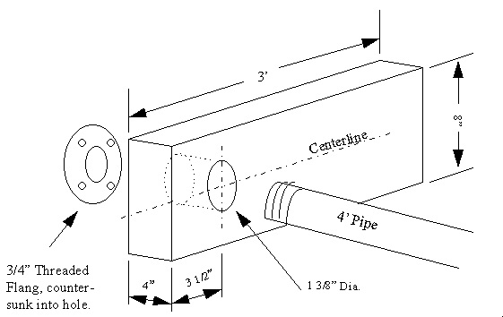

2. **Criquet carrito de perfil bajo** (2 toneladas) — sirve tanto para la moto como para el auto.

   

3. **Elevador profesional de motos** — caro pero lo más práctico.

   
   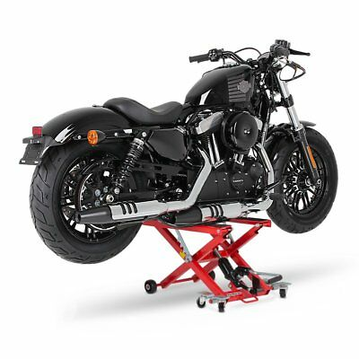

4. **Gato de auto en emergencia** (tijera o hidráulico ≥ 1 tonelada) con taco de madera en el cuadro. **ES LA MANERA MÁS PELIGROSA.** Ver antes: [Video 1](https://www.youtube.com/watch?v=aKX6fuGW_a8) / [Video 2](https://www.youtube.com/watch?v=qDD82jzgvJo)

   

Referencia general: http://sportsterpedia.com/doku.php/techtalk:ref:tools110

---

# Acabados del motor

El motor puede venir en tres terminaciones: **negro**, **aluminio pulido** o **cromado**.

## Aluminio pulido

Fácil de arruinar sin mantenimiento constante. El pulido tiene una capa de laca; si se opaca, hay que retirarla antes de pulir.

Para pulir: discos de pulido y pastas de pulir. Videos: [1](https://www.youtube.com/watch?v=c1mbRoaGs3s) — [2](https://www.youtube.com/watch?v=p6W-snSeCtg) — [3](https://www.youtube.com/watch?v=Qj2aFJeFdA0)

**Pasta de pulir casera**: aceite vegetal (girasol/colza/soja) + harina de maíz/Maizena + bicarbonato sódico. El bicarbonato es lo que realmente pule; si tiene poco, será poco efectiva.

## Negro

Tutorial para pintar el motor negro: https://www.hdforums.com/how-tos/a/harley-davidson-sportster-how-to-black-out-engine-casing-412785

## Cromado

**Opción fácil**: kit de embellecimiento (tapas cromadas que van sobre las tapas originales). Buscar: https://www.google.com/search?q=chrome+dress+up+kit+sportster

**Cromados en Argentina:**
- **Saavedra Cromados** ← EXCELENTE, calidad superior, aceptan cromar escapes. http://cromadossaavedra.com.ar/ — Av. García del Río 4522, Buenos Aires. https://www.facebook.com/Est-Galvanotecnico-Saavedra-Cromados-875530772483854/
- **Cromados Albacrom** — https://cromadosalbacrom.com/
- **Cromados Peduto** — excelente calidad, no acepta cromar escapes.

---

# Tornillería

## Cómo medir e identificar tornillos

Tres medidas clave: **diámetro**, **largo** y **tipo de rosca** (gruesa, fina o métrica). Un tornillo 1/2" x 2": diámetro 1/2", largo 2". Prestar mucha atención a la rosca para no barrer una rosca incorrecta.

- https://www.torec.mx/pages/como-medir
- https://www.fastenersuperstore.com/fastener-guides/measuring-screws-bolts
- https://www.demaquinasyherramientas.com/herramientas-manuales/medicion-identificacion-roscas-pernos-tornillos

## Tamaños de tornillos de la moto

- Catálogo online: https://www.thunderbike.com/parts/thunderbike-h-d-partsfinder/
- Lista Sportsterpedia: http://sportsterpedia.com/doku.php/techtalk:ref:tools804

## Tornillos comunes que se redondean (modelos +2004)

- **Filtro de aire tipo "lata de jamón"** (tornillos externos): ALLEN PLANO 5/16 x 1/2 UNC
- **Soporte de batería**: HEXAGONAL 1/4 - 3/4 UNC (SCREW 1/4-20 x 3/4 FLANGE)
- **Soporte tambor de la llave**: ALLEN BOTÓN INOXIDABLE 3/16 - 1/2 - UNC (#10-24 x 1/2 SOCKET BUTTON HD)
- **Tapa de inspección cadena primaria**: 41191-74A ← **⚠️ EN REVISIÓN — llevar muestra al repuestero, el manual tiene el tamaño mal**

---

# Filtro de aire

El filtro original es **lavable**. Ver procedimiento en el manual del propietario.

Para reemplazarlo: K&N tiene todos los modelos — https://www.knfiltros.com/

## Limpieza (modelos 2004+ con filtro original)

> **⚠️ Instalar el filtro ANTES de encender el motor. Sin filtro puede entrar suciedad al motor.**
> **⚠️ NO usar gasolina ni solventes. Pueden causar incendio.**
> NO golpear el filtro para aflojar suciedad. Reemplazar si está dañado.

1. Extraer tornillo(s) de la cubierta y cubierta del filtro.
2. Inspeccionar el elemento.
3. Lavar en agua jabonosa tibia.
4. Verificar limpieza sosteniendo frente a una luz (debe verse a través del filtro).
5. Secar al sol o con aire a presión baja (desde adentro hacia afuera).
6. Reinstalar al revés. Usar trabacuerdas (Loctite) en las roscas.

---

# Aceite de horquilla

- **Motul Fork Oil 20W** (recomendado por Motul para Harley)
- **Castrol Fork Oil 15W**

Ver en el manual de desarme la cantidad en cc y el intervalo de cambio.

---

# Frenos

## Líquido de frenos

| Modelos | Líquido |
|---------|---------|
| 2006 y anteriores | **DOT 5** (silicona, NO higroscópico) |
| 2007 y posteriores | **DOT 4** |

> **⚠️ DOT 5 y DOT 4 NO se pueden mezclar.**
> **⚠️ DOT 5 NO es lo mismo que DOT 5.1.** El DOT 5 es siliconado; los demás NO lo son.

- DOT 4: Wagner Lockheed se fabrica en Argentina.
- DOT 5: Bel-Ray lo tiene. Difícil conseguir en Argentina con stock permanente. (Sugerencias bienvenidas.)

## Bomba de freno

La bomba se puede **reconstruir** (preferido) o cambiar. Buscar "Master Cylinder Rebuild Kit" (REAR o FRONT según corresponda).

Para modelos pre-ABS: la bomba de freno trasera es bastante genérica. Una muy similar es la de la **AKT CR5 / Loncin**, que se vende como Guerrero GR5 230 (Argentina) o Italika 250Z (México).

## Pastillas de freno

Se pueden reempastar con **ferodo** nuevo. Testimonios: "Tosso Frenos, Jesús María" (nivel nacional debe haber muchos). El ferodo debe ser de ±8,5 mm de espesor.

**EBC** — excelentes en seco y mojado, en mi experiencia mejor que las originales Harley, especialmente con lluvia. Compuesto HH (sinterizado) frena más pero desgasta más los discos. También hay orgánico y semi-sinterizado.

- Website: https://ebcbrakes.com/ — Selector: https://ebcbrakes.com/brakes-selector-chart/
- Pastillas para Sportster: https://ebcbrakesdirect.com/motorcycle/harley-davidson-sportster

**⚠️ VERIFICAR antes de comprar — no tengo todos los años de moto.**
_Nota: Si tiene doble caliper (ej. XL883R), necesita dos juegos delanteros._

| Modelo | Delantera | Trasera |
|--------|-----------|---------|
| 1979 a 1981 | FA071 | FA072 |
| 1982 a 1983 | FA071 | FA078 |
| 1984–inicio 1987 | FA094 | FA078 |
| 1987 a 1999 | FA094 | FA200 |
| 2000–2003 | FA400 | FA400 |
| 2004 a 2013 | FA381HH | FA387HH |
| 2014 a 2020 | FA640HH | FA254HH |
| XR1200 / XR1200X | FA296HH (2 uds) | EPFA387HH |

## Discos de freno

Los discos se pueden rectificar si están rayados. **EBC** vende discos excelentes para Sportster.

---

# Bujías

Están en el lateral izquierdo de la moto. Se saca con **llave sacabujía de 5/8" o 16 mm**. Se pueden limpiar con cepillito de bronce. **Ajustar sin reventar la rosca.**

> **⚠️ Solo aplica a Sportster 883/1200.** Otros modelos (XR1000, XL1100, antiguas) llevan bujías diferentes.

**Bujía original Harley: 6R12** — características:
- Diámetro de rosca: 12 mm
- Largo de rosca: 19 mm
- Llave: 5/8" ó 16 mm

**Alternativas:**
- **Champion RA8HC** — las mismas que Harley sin el logo. Se consiguen fácil y barato (las usan motores Mercury 40/50/60 fuera de borda; buscar en casas de náutica). Las tengo desde 2018 en la 883.
- **NGK DCPR7E** — excelentes, se consiguen en Argentina (Fiat 500 Sport 16v, algunos Alfa Romeo).
- **NGK DCPR8E** — brasileras, un poco más frías que las 7E, baratas en Argentina.
- **NGK DCPR7EIX / DCPR8EIX** — iridio (japonesas), difíciles de conseguir en Argentina.
- **NGK DR7EA** — equivalente al Champion RA8HC, pero llevan llave de 18 mm aunque rosca y largo son idénticos. No recomendadas.

Luz de bujía: 0,8 mm _(TO-DO: verificar con manual)_

Referencias cruzadas:
- http://www.harley-performance.com/harley-spark-plug.html
- http://www.nightrider.com/biketech/hdsparkplugs01.htm
- https://www.sparkplug-crossreference.com/convert/hd/6R12
- https://www.sparkplug-crossreference.com/convert/CHAMP_PN/RA8HC

---

# Batería

**Siempre verificar los CCA** (Corriente de Arranque en Frío) antes de comprar, además de las dimensiones y la posición del polo positivo. Más CCA = mejor arranque en frío, especialmente en modelos EFI (2007+).

Más info: https://es.wikipedia.org/wiki/Corriente_de_arranque_en_fr%C3%ADo

## Mantenimiento

Lo ideal es usar un **battery tender** (cargador flotante/mantenedor) siempre. Me han llegado a durar hasta 10 años las baterías usándolo. El conector se llama **SAE 12v**; se conecta al positivo de la batería y a masa en la carcasa de la primaria. Algunos modelos nuevos ya lo traen de fábrica.

## Equivalencias por año

| Año(s) | Equivalencia Yuasa |
|--------|-------------------|
| Pre 1979 | Sin info disponible |
| 1979–1985 | YB16-B-CX / GYZ20H / YTX20H-BS |
| 1986–1996 | YTX20H-BS |
| **1997–2003** | YTX20HL-BS |
| **2004–2020** | YTX14L-BS |

### Modelos 1979–1985
Yuasa YB16-B-CX, GYZ20H o YTX20H-BS. Borne (+) izquierdo visto de frente.

### Modelos 1986–1996
Yuasa **YTX20H-BS** y compatibles. https://www.yuasabatteries.com/battery/ytx20h-bs/

### Modelos 1997–2003
Yuasa **YTX20HL-BS** y compatibles. Borne (+) derecho visto de frente. Dimensiones: 175 x 87 x 155 mm. https://www.yuasabatteries.com/battery/ytx20hl-bs

### Modelos 2004–2020

Yuasa **YTX14L-BS** — la "L" indica borne positivo a la derecha de la batería vista de frente (izquierda de la moto al estar colocada).

| Dato | Detalle |
|------|---------|
| Dimensiones | 150 x 87 x 145 mm |
| CCA mínimo | 200 (más es mejor) |
| Voltaje | 12 V |

Yuasa hace dos modelos que sirven: **GYZ16HL** (alta performance) y **YTX14L-BS** (común). Lamentablemente Yuasa Argentina no importa ninguna.

**Alternativas probadas:**
- **SLA Max BTX14HL** — la mejor opción por calidad/precio. Tiene más CCA que la Motobatt.  https://bs-battery.com/btx14hl-sla-max/ / https://www.facebook.com/bsbatteryargentina/
- **Motobatt MBYZ16HD** — modelo específico para Harley (negro con letras naranjas). La amarilla se queda corta en CCA para EFI.  https://www.motobatt.com/quadflex-batteries.html
- **Motobatt Gel MBTX12U** — sirve, no es maravilla pero funciona.
- **Poweroad YG14L-BS** — chinas, baratas, me comentaron que sirven incluso en EFI.
- **Litio WEX6L21-MF** — carísima pero muy livianas y con muchos CCA. http://www.wstandard-energy.com/

### Usando la YTX14 (sin L) — borne al revés

La YTX14 (sin L, borne positivo a la izquierda vista de frente) se consigue más fácil y casi a mitad de precio. Para usarla hay que orientarla hacia atrás en la moto y **extender los cables**.

**Opción 1 (recomendada)**: Extender los cables positivo y negativo. Se hacen en cualquier casa de audio para autos o en **ENCENDIDO BOEDO** (Capital Federal). Cable stock: Welding 6-AWG / 16 mm². Terminal: ojal 5/16".

**Opción 2 (NO recomendada)**: extensiones de cobre sobre la batería — riesgo de cortocircuito.

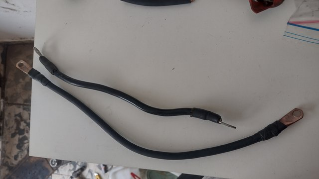

**Tutorial fabricar cables**: [Video 1](https://www.youtube.com/watch?v=XkMdlPsBxkc) — [Tutorial terminales](https://www.youtube.com/watch?v=PqOa2d8v8Tw)

Mucha información sobre cables: https://sportsterpedia.com/doku.php/techtalk:evo:elec01

**Números de parte por año:**
- 2004–2009: 70295-04A (positivo) / 70296-04A (negativo)
- 2010–2013: 70295-10_ (positivo) / 70296-04A (negativo)
- 2014+: 66000036 (positivo) / 66000035 (negativo)
- 1997–2003: OEM 70076-97 (positivo) / OEM 70097-97 (negativo)

**Materiales para fabricar cables:**
- Cable de soldadora 1x16 mm² (6 AWG Welding)
- Terminales ojal 16 mm², 5/16" — o fabricar de tubería de cobre 3/8" de aire acondicionado

Compras: https://www.prestacioneselectricas.com/ / https://adnsolar.com.ar/

---

# Luces

**⚠️ Los modelos más nuevos llevan luces LED — verificar ANTES de comprar.**

## Luz delantera

- Filamento: **H4**
- LED: reemplazar todo el conjunto por uno LED. El reemplazo ideal es el formato **5-3/4" (14,6 cm)** — Harley DayMaker o similares (hay opciones mucho más baratas en Amazon, ML y eBay que cumplen la misma función).

## Trasera (freno y posición)

- OSRAM P27-7W 12V **3157**. En modelos modernos: LED.

## Giros

- 2013 y anteriores: filamento. 2014+: LED.
- Modelos USA: doble filamento (sirven de luz de posición también). Modelos latinos: filamento simple.
- Bulbos: **1157** (US) frente, **1156 / 1141 P21W** trasero (y delantero latino).
- Se puede modernizar con kit LED; también se puede cambiar solo el bulbo por uno LED.

### Funcionamiento de los intermitentes (Sportsters 2004+)

El Módulo de Intermitentes (TSM/TSSM) controla la cancelación automática:

**Cancelación automática:**
1. Al pulsar y soltar, inicia conteo de 20 parpadeos. A más de 7 MPH (11 km/h) sin input adicional, se cancelan al llegar a 20.
2. Si la velocidad baja de 7 MPH, siguen parpadeando. El conteo se reanuda a 8 MPH (13 km/h).
3. Se cancelan 2 segundos después de completar un giro de 45° o más.

**Cancelación manual:**
1. Pulsar el botón de intermitente una segunda vez.
2. Para cambiar de sentido: pulsar el botón opuesto.

---

# Embrague

## Marcas y proveedores

- **Barnett** — reemplazos para todas las generaciones. https://www.barnettclutches.com/
- **Energy One** — reemplazos para Sportster. https://www.energyoneclutches.com
- **Harley Screaming Eagle** P/N 38002-04 — mejor que el de fábrica. https://www.harley-davidson.com/us/en/shop/screamin-eagle-performance-clutch-kit/p/38002-04
- **Alto Products** — versión con remaches de acero inoxidable. https://www.altousa.com/

## Problema crónico: la Spring Plate ("grenade plate")

El embrague tiene un problema de diseño conocido: la **placa de resorte** (disco doble con muelles remachados) falla cuando los remaches de latón se rompen, quedando atrapados entre las placas y dañando todo el conjunto.

**Síntomas**: embrague "raro" o endurecido, dificultad para poner neutro, virutas de bronce en el aceite de primaria, embrague patinando.

**Solución** (para modelos 1991+): eliminar la placa de resorte instalando **dos placas de acero adicionales y una placa de fricción adicional**. Esto lo resuelve definitivamente. Yo puse el Energy One BTX-11 en mi XL883L 2005: excelente resultado.

> Al cambiar, usar piezas mejores que las originales (kevlar, fibra de carbono). Si la placa resorte se desintegró: verificar canasta del embrague (posibles rebabas), revisar que las placas no se deformaron, y reemplazar todo para evitar daños en las piezas nuevas.

Leer más:
- http://sportsterpedia.com/doku.php/techtalk:evo:priclutch01
- https://www.cyclepedia.com/sportster-spring-plate/

## Embrague centrífugo automático

Para situaciones de tráfico intenso o limitación física de la mano izquierda: **Rekluse Core EXP 3.0** — instalación sin modificaciones extras, ~900 USD en EE.UU. https://rekluse.com/product/core-exp-3-0-clutch/?pd=1

## Cómo cambiar el embrague

Se necesita una herramienta compresora (comprar ~70 USD, o fabricar con tubo PVC 3" y planchuela perforada).

Videos:
- **[Hammer Performance — el más completo](https://www.youtube.com/watch?v=g8BMUy-pTBs)**
- [Herramienta casera](https://www.youtube.com/watch?v=0dHhb4fs96A)
- [20 minutos](https://www.youtube.com/watch?v=m26np1MntQA) — [En español](https://www.youtube.com/watch?v=OK02f5lHrPo)
- [Kit sin remaches](https://www.youtube.com/watch?v=6XimJ2aX848)

**Instrucciones en PDF:**
- [Instrucciones oficiales Harley](https://github.com/alvarogonzalezferrer/harley_alternativas_argentina/raw/master/archivos_soporte/embrague/embrague_screaming_eagle_instalacion.pdf)
- [Instrucciones con fotos](https://github.com/alvarogonzalezferrer/harley_alternativas_argentina/raw/master/archivos_soporte/embrague/embrague_instalar_con_fotos.pdf)

## Discos de embrague — reconstrucción

Se pueden reempastar en **Tosso Frenos** (Jesús María, o similares a nivel nacional). Ferodo de 8,5 mm de espesor. También: FRAS-LE https://www.fras-le.com/

---

# Cables de embrague, acelerador, etc.

## Reparación de cables

Se pueden **reparar en ruta** con "evita soldaduras" y kit universal para cable embrague/acelerador — conveniente tener uno en viajes largos. Buscar "Kit Reparacion Universal Cable Embrague Y Acelerador" en ML o Google. Soldar/estañar el evita soldadura para que no se salga.

Videos: [1](https://www.youtube.com/watch?v=D9FfYxjjL6s) — [2](https://www.youtube.com/watch?v=S_l58vS1s3c) — [3](https://www.youtube.com/watch?v=Ysd8JkWclmc)

## Largo de cables

- https://www.motionpro.com/
- https://magnumshielding.com
- https://catalog.zodiac.nl/en/15-control-cables-hydraulic-lines-27863

## Fabricantes de cables en Argentina

- https://www.cablescomandoarg.com/
- https://cablesbotta.com.ar/

---

# Juntas del motor

- **Cyco Gasket** — económicas y buenas: https://cycogasket.com/
- **Cometic** — MUY superiores a las originales: https://www.cometic.com/ (catálogo completo: motor, primaria, kits)
- **James Gasket** — buena alternativa, más económica: https://www.jamesgaskets.com/

---

# Rayos de la rueda

- https://www.facebook.com/RayosyNiples33/
- http://www.chiuchich.com.ar
- https://www.mpmotosport.com/ (fabrican ruedas a medida, rayos, aros, etc.)

---

# Correa de transmisión

## Tensión

Se mide con un aparato especial (conseguir en eBay). El procedimiento está en el manual del propietario. La correcta tensión y limpieza es vital para la durabilidad.

## Reemplazos / Fabricantes en Argentina

- http://www.ges.com.ar/
- http://www.alestel.com.ar/
- http://www.correasrincon.com.ar/

---

# Pintura

## Códigos de color

- [Lista de códigos de pintura PPG](archivos_soporte/pintura/codigos_pintura_harley_PPG.txt)
- [Base de datos completa de códigos (descomprimir e ingresar a index.html)](archivos_soporte/pintura/harley_color_database.zip)
- https://paintref.com/cgi-bin/colorcodedisplay.cgi?make=Harley%20Davidson
- https://hdpaintcode.com/complete-harley-color-code-database/
- https://hdpaintcode.com/harley-davidson-paint-code-crossover/

## Pintura de retoque en Argentina

> **PINTURERIAS VICTORICA**
> Av. Victorica 951, B1744BWJ Gran Buenos Aires
> Tel: 0237 462-2242

---

# Carburador CV40 (modelos 1988–2006)

El carburador original es un **Keihin CV 40mm**. El original tiene el logo HD en ambos lados; las copias chinas son prácticamente idénticas. El CVK es para Kawasaki y otras marcas.

Con la moto parada mucho tiempo, agregar **estabilizador de combustible**. También un **limpia carburadores STP** cada tanto.

Si quedó parada meses: limpiar los chicler/jets cuidadosamente. Si las gomas están rotas (diafragma, fuelles): comprar un "CV40 rebuild kit" (Amazon, JP Cycles, eBay).

**El diafragma de la Kawasaki Vulcan VN800 es compatible** (usan casi el mismo carburador, sin bomba de pique).

**Recursos:**
- Video limpieza: https://www.youtube.com/watch?v=Pp4l-zbQcy0
- Reconstrucción parte 1: http://sportsterpedia.com/doku.php/techtalk:evo:carb01a
- Reconstrucción parte 2: http://sportsterpedia.com/doku.php/techtalk:evo:carb02
- Identificar el carburador: http://sportsterpedia.com/doku.php/techtalk:evo:carb01b
- Reparar el choke/cebador: http://sportsterpedia.com/doku.php/techtalk:evo:carb01f
- Kit en eBay: https://www.ebay.com/sch/i.html?_nkw=sportster+cv+rebuild+kit
- Cambiar el diafragma: https://www.youtube.com/watch?v=H0GOExal_VA
- Más info: http://sportsterpedia.com/doku.php/techtalk:evo:carb01

## Filtro de nafta (modelos carburados hasta 2006)

El filtro está en la válvula de paso de combustible. Se **limpia**, no se reemplaza salvo que esté perforado.

Como limpiar el filtro: https://www.youtube.com/watch?v=8Xs6ZjrAD6o

Si el filtro está perforado, buscar "petcock screen" o "Late Style Petcock Replacement Screen".

---

# Inyección EFI (2007 en adelante)

Del 2007 en adelante, la Sportster lleva inyección electrónica de combustible.

Más información: https://www.jpcycles.com/motorcycle-fuel-injection-components | http://sportsterpedia.com/doku.php/techtalk:evo:engctl03

## Modo diagnóstico integrado

La ECM tiene modo diagnóstico incorporado, fácil de usar:

Mantener presionado el **botón de reset del cuentakilómetros** mientras se pone la llave en "on". La aguja se moverá en todo su recorrido, todos los testigos se iluminarán, y luego aparece el menú de códigos de fallo.

- Video: https://www.youtube.com/watch?v=j3JiSOjkuZ0
- Tutorial: https://california-motorcycles.com/blogs/mecanicaharley/como-ver-y-borrar-los-codigos-de-error-efi-de-harley-davidson

## Diagnóstico con cable OBD2

Para cuando no podemos usar el diagnóstico integrado (por ejemplo, velocímetro de otra marca):

Combinar:
1. **Cable J1850 de 4 pines a OBD2** (2001–2014) — buscar "harley odb2 cable" en Amazon.
2. **ELM327 Bluetooth**.
3. **Aplicación**: ~~HarleyDroid~~ / ~~RPMitUP~~ — **⚠️ ROTOS** (ya no existen en Play Store). Copias APK disponibles en la carpeta [apps](archivos_soporte/apps). Código fuente de HarleyDroid: https://github.com/stelian42/HarleyDroid. Alternativa activa: [Torque](https://play.google.com/store/apps/details?id=org.prowl.torque).

El conector de 4 pines aplica a años **2004–2013** inclusive. Para otros años hay conectores de 6 y 10 pines.

_Más info en la [carpeta EFI de diagnóstico](archivos_soporte/EFI/diagnostico)._

## Escáneres profesionales

- **Daytona Twin Scan 2** (hasta 2013, sin CANBUS): https://daytona-twintec.com/product/15202-twin-scan-2-abs/
- **Daytona Twin Scan 4** (2014–2020 Sportster): https://daytona-twintec.com/product/15500-twin-scan-4-abs/
- **Power Vision** (se asocia a una moto; licencia adicional para más motos): https://www.dynojet.com/dynojet-motorcycle-power-vision/
- **Techno Research Centurion Super Pro** (casi todo lo del Digital Technician): https://technoresearch.info/diagnostic-tools-harley-davidson/centurion-super-pro/
- **MemoBike MS6050** (~4.000 USD, ideal talleres medianos): https://www.anseddiagnostics.com/products/ms6050r23-vtwin-motorcycle-powersports-diagnostic-scan-tool-kit
- **Harley Digital Technician II** — exclusivo de concesionarios autorizados. Requiere cuenta de distribuidor activa; +10.000 USD. P/N HD-48650.

## Filtro de nafta EFI

El filtro está **dentro del tanque de nafta**, junto con la bomba. Son **dos filtros**: un pre-filtro (bolsita porosa) y un filtro cilíndrico. Según Harley, se reemplaza a las 100.000 millas (160.000 km).

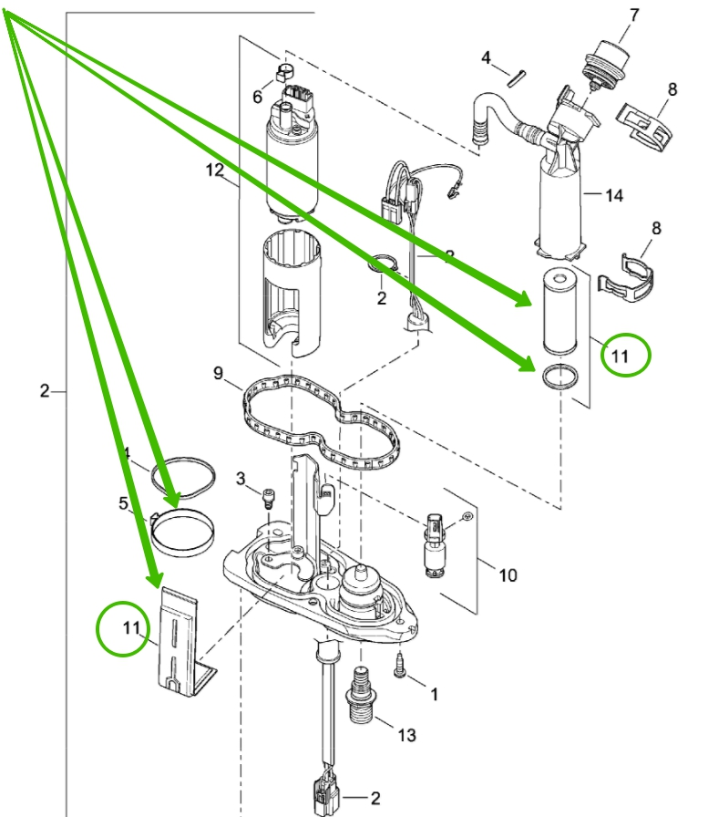

**Opciones de compra:**
- eBay (más barato): https://www.ebay.com/sch/i.html?_nkw=sportster+fuel+filter+efi
- Dennis Kirk ~19 USD — P/N 1801082: https://www.denniskirk.com/v-factor/oe-style-fuel-filter-kit-for-efi-models-75304-07a.p1801082.prd/1801082.sku
- Drag Specialties ~40 USD — P/N 0707-0014: https://www.dragspecialties.com/search;q=07070014
- Harley original kit ~110 USD — P/N 75304-07A

**Pre-filtro alternativo barato**: el pre-filtro de Honda XRE 300 tiene medidas similares. El pre-filtro automotriz para bombas Bosch también sirve (la "bolsita", no el cilíndrico). _TO-DO: medir el filtro cilíndrico de Harley para encontrar reemplazo automotriz._

**Tutoriales:**
- http://xlforum.net/forums/showthread.php?t=2014282
- https://www.youtube.com/watch?v=EWng7GX_R44

## Bomba de nafta EFI

Si la moto estuvo parada mucho tiempo, la bomba puede estar arruinada. Primer paso: intentar limpiarla con ultrasonido.

**Opciones:**
- Harley Argentina: ~300 USD
- Alternativa USA (~70 USD): https://www.jpcycles.com/harley-sportster-1200-fuel-pump-components
- **Bomba Bosch de 3,5–4 Bar** (~15 USD) — la reemplaza directamente, se consigue fácil en ML o casas de repuestos argentinas.

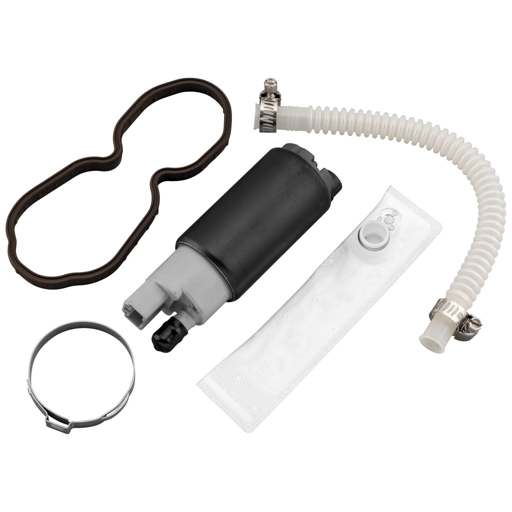

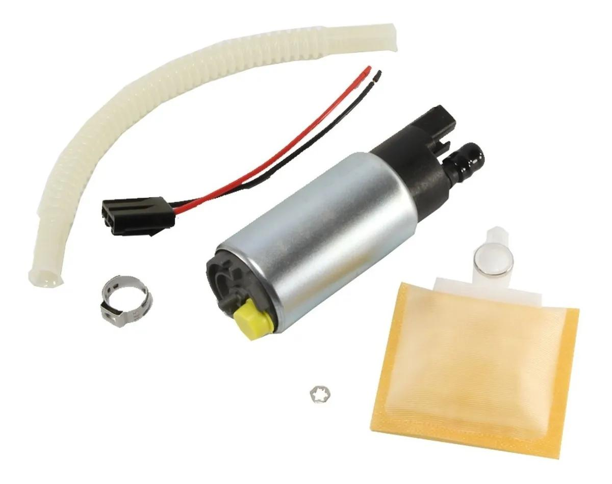

**Nota**: al cambiar la manguera que conecta bomba con filtro interno, calentarla con secador de pelo si no sale.

## Pérdidas / fugas de combustible (EFI)

Con el tiempo, los **O-rings** del acople rápido bajo el tanque se resecan y pierden combustible.

### Acople rápido hembra bajo el tanque

Video explicativo (ver primero): https://www.youtube.com/watch?v=dfrIwD-G-eY

El acople tiene dos O-rings de **VITON** (resiste combustible — no sirve cualquier O-ring):

- **O-ring inferior** (el que normalmente falla): Parker **2013** — DI 10, DE 14, S 2 mm. Código métrico: **M1206**, estándar: AS905.
- **O-ring superior**: DI 8, DE 13, S 2,5 mm. Código métrico: **M1472**, estándar: AS109.

_En emergencia, el O-ring del tapón de aceite (M930) puede funcionar como el grande; tiene 14,28 mm DE, 11,11 mm DI, 1,58 mm espesor — similar pero no idéntico._

**Dónde comprar O-rings en Argentina:**
- https://www.o-ring.com.ar/buscador/
- http://www.vauton.com.ar/productos.php
- https://www.industriasnelson.com.ar/producto/orings/
- https://tecnosellos.com.ar/pruebas/catalogo/oring-arosellos/
- https://parkest.com.ar/categoria-producto/sellos/orings/

En EE.UU.: Kit completo en https://fueltool.com/products/harley-check-valve-rebuild-kit/

## Ralentí / idle EFI

Harley dice que no se puede alterar el ralentí en modelos EFI para cumplir normas de emisiones. **Sí se puede.** El IAC (motor paso a paso de control de aire en ralentí) es el que regula.

**No bajar de 950 rpm** para mantener correcta lubricación.

**Opciones:**
- **IAC manual** — reemplaza el IAC eléctrico original por un dispositivo ajustable manualmente.

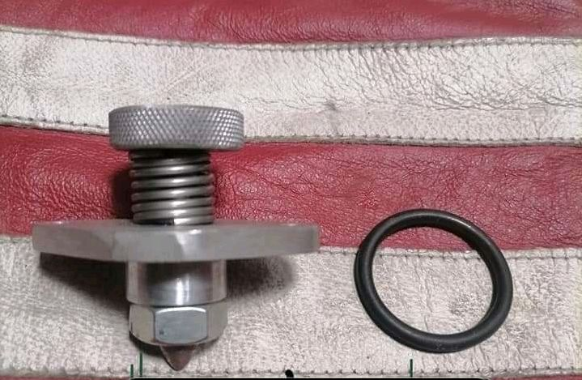
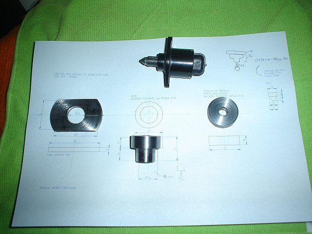
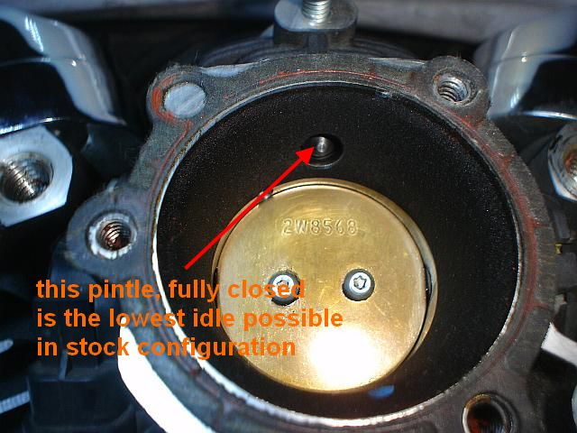

[Planos CAD del IAC manual](archivos_soporte/EFI/control_IAC)

- **Reprogramar la ECM** (ver sección de Performance)
- **Reemplazar la ECM** por una programable (ThunderMax, Daytona Twintec)

## CANBUS / HDLAN

A partir de 2011 (comenzando en Softail, luego Dyna), Harley adoptó el protocolo **HDLAN**, basado en el estándar CAN BUS de automoción — dos cables de comunicaciones, más rápido que el J1850 anterior.

Más info: https://california-motorcycles.com/blogs/mecanicaharley/el-sistema-de-comunicaciones-can-bus-de-harley-davidson-hdlan

---

# Amortiguadores traseros

**FAR** — fábrica nacional, línea completa para Harley Davidson, excelente calidad y precio conveniente. https://www.farmotopartes.com.ar/product-category/amortiguadores-far/amortiguadores-far-venta-amortig-linea-custom/

Guía completa de amortiguadores:
- https://www.hdforums.com/how-tos/a/harley-davidson-sportster-the-ultimate-shocks-guide-413022
- http://sportsterpedia.com/doku.php/techtalk:evo:susp02

---

# Regulador de voltaje

**¡Pieza que se quema frecuentemente!** Siempre revisar todo el circuito de carga.

**⚠️ CUIDADO: el regulador varía según el año de la moto.**

| Años | P/N Harley | Notas |
|------|-----------|-------|
| 1996–2003 | 74523-94 | — |
| 2004–2006 | 74523-04 | Monofásico 22 A, 12 V |
| 2007–2008 | 74546-07A | 32 A — no encontré reemplazo argentino |
| 2009–2013 | 74711-08 | 32 A — no encontré reemplazo argentino |
| 2014+ | 74700012 | Estado sólido — solo reemplazos en EE.UU. |

**Reemplazo nacional DZE 10181** — para modelos 2006 y anteriores. 12 V, 35 A, monofásico. http://dzecatalogo.com.ar/es/producto/10181/Harley%20Davison

**⚠️ Reutilizar las fichas originales (el DZE trae fichas peladas). Una mala adaptación puede freír la batería o la electrónica.**

Referencias:
- http://sportsterpedia.com/doku.php/techtalk:evo:elec02?s[]=regulator
- http://www.pietcard.com.ar/

---

# Escapes

La elección del escape modifica el **sonido**, el **look** y la **performance**. Elegir el escape del año correcto: 1986–2003 / 2004–2013 (2007+ debe tener toma para sondas lambda) / 2014+.

## Análisis de performance en dinamómetro

https://www.1250kits.com/ttxlexhaust.shtml

## Marcas importadas

Supertrapp / Screaming Eagle / Bassani / Arlen Ness / Vance & Hines / Cycle Shack / Roland Sands / etc.

## Fabricantes nacionales (Argentina)

- http://giacconeescapes.com/ o https://es-la.facebook.com/Giaccone001/ — fabrican para Harley a medida.
- http://www.escapesfabian.com.ar/
- http://www.tubosilescapes.com.ar/
- http://dmescapes.com.ar/
- https://www.mpmotosport.com/ — también hacen quillas y asientos.
- Lucky Custom: https://www.facebook.com/pages/category/Local-Business/Lucky-Custom-128082827250041/

## Modificar silenciadores originales

Se puede remover el núcleo del escape original para que haga más ruido.

---

# Mejorar performance

¿Cuánta potencia se puede obtener? Depende del presupuesto — hay relación directamente proporcional entre $ invertido y HP conseguido. Las etapas son escalonadas (para hacer Stage 3 hay que haber hecho el 1 y 2 antes).

## Stage 1

Escape de alto flujo + filtro de aire de alto flujo + remapear EFI o recarburar. Aumento de hasta un 10% en todo el rango de RPM.

Yo tengo en mi EFI: filtro Screamin' Eagle, escapes con silenciador custom, y Power Commander. En la carburada: filtro redondo genérico de alto flujo, escape SE II (con clones en venta), y kit Dynojet para el carburador.

http://www.harley-performance.com/stage-1.html

## Stage 2

Levas modificadas (Torque Cam o Power Cam según estilo de conducción) + pistones de alta compresión + kits de alta cilindrada.

## Stage 3

Todo vale: culatas CNC de mayor flujo, cuerpo de acelerador de mayor diámetro, cilindros y pistones a medida, leva adecuada.

## Más info sobre las etapas

- http://sportsterpedia.com/doku.php/techtalk:ref:perf01
- https://suburbanharley.com/Performance-Kits-Sportster
- http://www.hammerperf.com/techtips.shtml
- http://nrhsperformance.com/tech.shtml

---

## Convertir 883 a 1200 / 1250 / 1275 cc

Se pueden cambiar pistones y cilindros para ganar cilindrada. Desde preparación básica (70 HP) hasta +120 HP.

**⚠️ Modelos 2008 y posteriores**: Harley puso camisas más finas — NO se pueden rectificar los cilindros 883 para usar pistones 1200. Se deben comprar cilindros nuevos. Ver boletín de servicio HD 1267 → http://sportsterpedia.com/lib/exe/fetch.php/pdf-bulletin:tsb1267.pdf

**Kits recomendados:**
- **Hammer Performance** — el que yo tengo, excelente atención: http://hammerperf.com/883conversions.shtml
- **S&S**: https://www.sscycle.com/big-bore-sportster/
- **V-Twin Manufacturing** y otros.

**Conversión de bajo costo**: http://rosysumenteinquieta.blogspot.com/2016/01/como-convertimos-una-sportster-de-883cc.html

**Pistones más baratos encontrados**: https://vtwin.parts/supplier/v-twin/sportster-1952-up/engine/piston/883-conversion-pistons/harley-davidson-indian-motorcycle-v-twin-883cc-conversion-piston-set-standard-3.498-11-0852

**INSTRUCCIONES DE INSTALACIÓN**: https://www.1250kits.com/ttinstallkit.shtml

**⚠️ Es VITAL ajustar el encendido** — la sincronización estándar es demasiado agresiva para la mayor compresión del kit. El ajuste incorrecto es la causa número uno de pistones dañados. Ver: https://www.1250kits.com/ttinstallkit.shtml#Tuning

**⚠️ SIEMPRE PROGRAMAR LA ECM ANTES DEL PRIMER ARRANQUE** (modelos EFI).

### Encendido programable — modelos carburados 2004–2006

- **Daytona TC88A** (recomendado): https://daytona-twintec.com/product/1009-tc88a-twin-cam-ignition/ — Ver programación: https://sportsterpedia.com/doku.php/techtalk:ref:engctl50h
- **Dynatek Dyna Performance**: https://www.dynaonline.com/dspt-ign-04-06-hd-sportster-883-1/ — menos funcional que el Daytona, no recomendado si podés pagar el extra.

_Ojo con la versión TC88A EX — es para cumplir normas de California, tiene limitaciones._

### Encendido/ECM programable — modelos EFI 2007+

- **Dynojet Power Vision** (no los que se adosan a la ECM como Fuel Pak — una reprogramación real): https://www.dynojet.com/power-vision/
- **ThunderMax** (costoso pero muy completo): https://store.thunder-max.com/
- **Daytona Twintec ECM**: https://daytona-twintec.com/shop_products/
- **Vance & Hines FP3**: NO funciona bien para kits 1250.

---

# Velocímetro GPS

Este velocímetro lee la velocidad mediante GPS (no del sensor VSS de la moto). No es navegador — solo mide velocidad. Configurable en km/h, mph o nudos. Iluminación en múltiples colores.

Lo instalé en mi XL 2005 S cuando el velocímetro original se quemó. Solo requiere +12 V y GND en la ficha.

Lo compré en Amazon: https://www.amazon.com/ELING-DigitalGPS-Speedometer-Adjustable-Back-Lights/dp/B07KP7HGJ4?th=1 (Fabricante ELING, ASIN: B07KP7HGJ4)

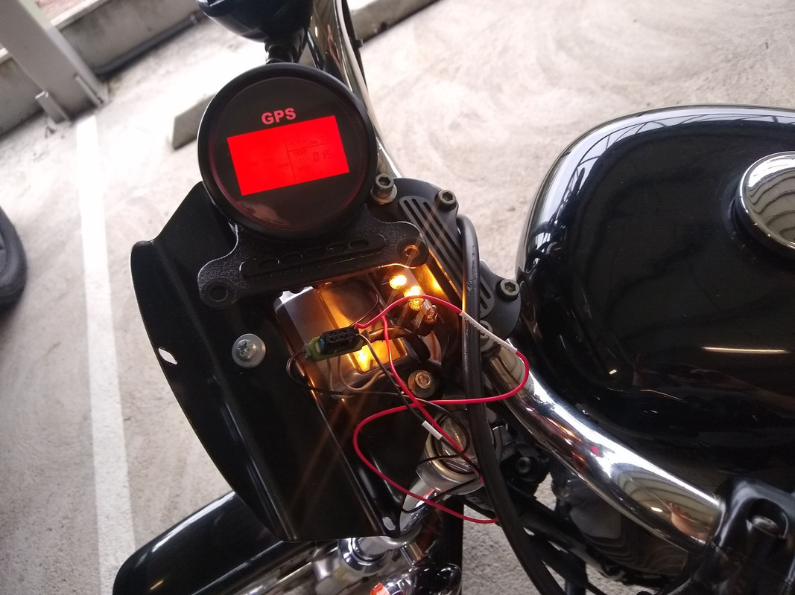
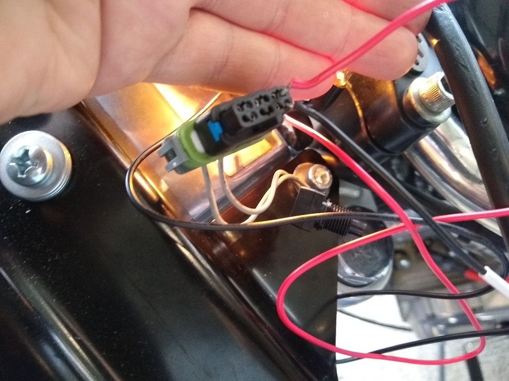
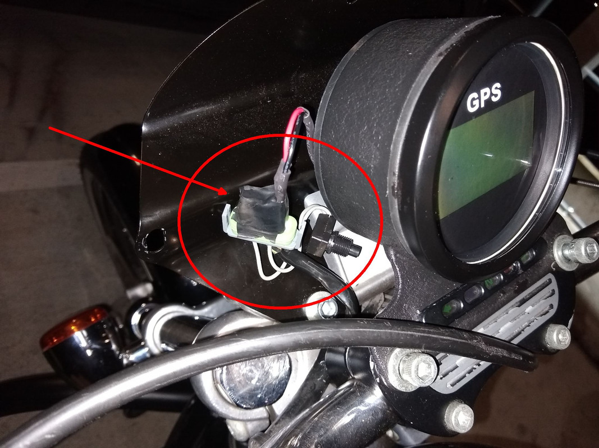

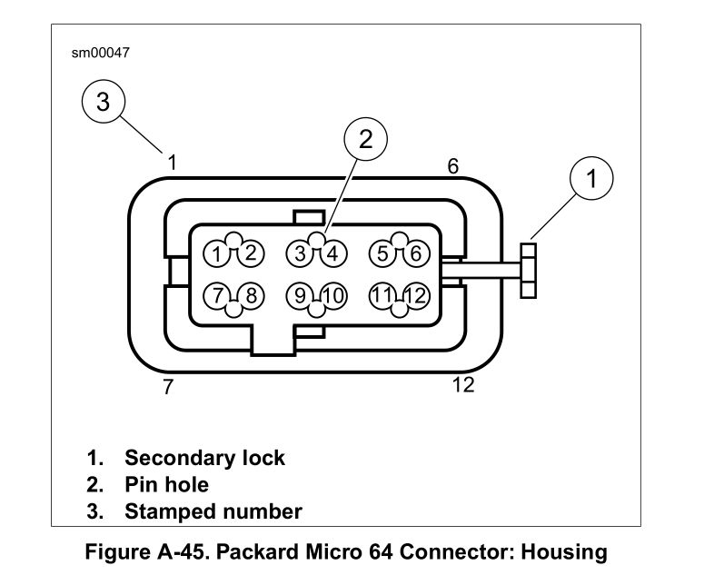

---

# Navegación GPS y electricidad

## Toma de 12 V

Se puede tomar directamente de la batería (con relay, fusible y switch de corte) para enchufar ropa calefaccionada, inflador, cargadores, etc. No exceder el consumo máximo del circuito.

## Cargador de celular USB

Para consumos bajos como un cargador celular, se puede tomar de las luces delanteras de la moto:
- Todos los modelos: luz baja.
- Modelos internacionales (VIN HDI): luz de posición delantera.
- Modelos USA: luces de posición en giros frontales.

**Recordar: consumo mínimo, fusible siempre.**

## Aplicaciones GPS para celular

| App | Descripción |
|-----|-------------|
| [**Waze**](https://play.google.com/store/apps/details?id=com.waze) | El mejor. Marca cámaras, policía, retenes. A veces rutas algo rebuscadas. |
| [**Organic Maps**](https://play.google.com/store/apps/details?id=app.organicmaps) | Mapas descargables, sin publicidad, funciona sin internet. |
| [**OsmAnd**](https://play.google.com/store/apps/details?id=net.osmand) | Similar a Organic Maps, con más puntos de interés. Algo pesado. |
| [**Maps.ME**](https://play.google.com/store/apps/details?id=com.mapswithme.maps.pro) | Mapas descargables, funciona offline. Contiene anuncios. |
| [**Google Maps**](https://play.google.com/store/apps/details?id=com.google.android.apps.maps) | Viene con el celular. No marca policía ni cámaras. |

## Sitios para planear viajes

- Open Street Map: https://www.openstreetmap.org/
- Google Maps y Street View: https://www.google.com/maps
- Ruta 0 (Argentina): https://www.ruta0.com/
- Waze Live Map (tráfico, policía, cámaras): https://www.waze.com/es/live-map
- OsmAnd: https://osmand.net/

---

# Accesorios varios

## Pedalines

Se pueden comprar o mandar a tornear; no tienen mucho secreto.

## Manillares

Original de **1 pulgada** (2,54 cm aprox). Se puede modificar para pasar los cables eléctricos por dentro. Si se pone uno más alto (ej. "cuelga monos"), hay que reemplazar también la línea de freno delantero, embrague, cables eléctricos y acelerador.

- Manillares nacionales: https://houseofhandlebar.mercadoshops.com.ar/

## Puños

Los originales de goma se pudren con los años; los de metal "billet" (cromados o negros) no se pudren.

**Puños calefaccionados**: yo tengo **Kuryakyn Heat Demon**, andan bien pero son complicados de instalar. También hay guantes calefactores con baterías.

## Respaldos & Sissy bar

The House Of Handlebar (Argentina) fabrica un sissy bar muy bueno: https://houseofhandlebar.mercadoshops.com.ar/ / https://facebook.com/pages/category/Local-Business/House-of-Handlebar-323402801569381/

## Asientos

Los asientos varían según año y modelo:
- Hasta 2003 inclusive: un modelo de anclaje.
- 2004+: cambiaron el sistema de anclaje.
- 2007–2009: la compu está bajo el asiento (necesita asiento especial o reubicar la compu, o recortar el asiento con dremel).
- 2004–2006 y 2010–2018 aprox: compatibles entre sí.

Un tapicero puede adaptar la mayoría. Referencia con fotos: https://www.hdforums.com/forum/sportster-models/975513-seat-fitment-guidelines-for-04-06-07-09-and-2010-with-pics-factory-saddles.html

## Alforjas

Barlitop hacía alforjas de cuero en Buenos Aires, buscar en Facebook. _(Info de 2010, verificar si sigue activo.)_

## Defensa / "mataperros"

Útil para proteger el motor en caídas a baja velocidad y para montar accesorios. Harley vende modelos pero el envío a Argentina los hace muy caros. The House Of Handlebar tiene un clon: https://houseofhandlebar.mercadoshops.com.ar/

## Portaequipajes

Hay parrillas disponibles en: https://houseofhandlebar.mercadoshops.com.ar/

## Llaves

**Duplicar**: necesitar llave en blanco (venta online) y un buen cerrajero. Los modelos nuevos tienen FOB de seguridad difícil de duplicar. Con el número de cuatro dígitos impreso en el dorso de la llave, el concesionario puede pedir un repuesto.

**Programar el llavero FOB**: https://www.hdforums.com/how-tos/a/harley-davidson-sportster-how-to-reprogram-key-fob-412757

---

# Almacenar la moto

Al dejar la moto parada por tiempo prolongado (viaje, pandemia, etc.):

1. **Lavar**, secar y encerar con cera protectora. Aplicar WD-40 en partes bajas para desplazar humedad.
2. **Neumáticos**: inflar +5 psi (35 psi adelante, 40 psi atrás). Caballete si es posible.
3. **Insectos**: rociar Raid en partes bajas.
4. **Sistema de combustible**: llenar el tanque con nafta premium + **estabilizador de combustible** (ver instrucciones del producto). En modelos carburados: vaciar el carburador (cerrar la canilla y dejar andar hasta que se apague).
5. **Batería**: colocar **battery tender / mantenedor de batería**. Quitar el fusible principal MAXI.
6. **Aceite** (opcional): cambiar por aceite nuevo si va a quedar mucho tiempo.
7. **WD-40 en bujías**: sacar ambas bujías, tirar un poco de WD-40 en los cilindros por los orificios, volver a colocarlas. Previene que se peguen los aros de los pistones.

**Al regresar** (más de 3 meses): cambiar la nafta vieja por nafta nueva.

**Guardar** en lugar fresco, seco, tapado y bajo techo. La humedad es enemigo de los metales.

### Estabilizador de combustible

Fundamental para almacenamiento prolongado. Las naftas con etanol/bio-alcohol se ponen rancias después de ±3 meses. Con estabilizador, duran más de un año.

**Dosis**: 25 ml cada 20 litros de combustible (varía según marca). Yo uso la botellita de Honda (2 onzas por tanque lleno), con excelentes resultados — dejé la moto 3 años parada durante la pandemia y arrancó sin problemas.

**Marcas**: Honda, Stabil, Sea Foam, Liqui Moly, Ipone, Yamalube.

Video comparativo: https://www.youtube.com/watch?v=chsGBhB5g7o

---

# Catálogos online / Comprar repuestos

_TO-DO — ampliar esta sección_

Principales tiendas online:

- J&P Cycles: https://www.jpcycles.com/
- Dennis Kirk: https://www.denniskirk.com/
- Drag Specialties: https://www.dragspecialties.com/
- Revzilla: https://www.revzilla.com/
- eBay: https://www.ebay.com/
- Amazon: https://www.amazon.com/
- California Motorcycles: https://california-motorcycles.com/

---

# Indumentaria y equipo

## Casco

_TO-DO_

## Traje de lluvia

Yo tengo Givi y LS2; ambos son buenos.

Cómo doblar el traje de lluvia: https://www.youtube.com/watch?v=U0s4NPuX7ww

## Equipo calefaccionado para invierno

También se puede poner **puños calefaccionados** a la moto (varias marcas y modelos). Indumentaria:
- https://sraggioweb.com.ar/
- https://www.wanderwarm.com.ar/

## Infladores / selladores portátiles

Existen infladores a 12 V y autocontenidos con batería propia. En viajes largos yo uso uno marca **SPARCO** — sirve de linterna y batería USB también.

Xiaomi tiene uno muy popular: https://www.mi.com/global/product/xiaomi-portable-electric-air-compressor-1s/

## Defensa personal

La mejor defensa: evitar zonas peligrosas, evitar el conflicto, salir relajado.

Kit básico: bastón plegable + spray pimienta.

En países donde es legal portar armas de fuego:
- [Taurus Judge 2"](https://www.taurususa.com/revolvers/taurus-judge/judge-public-defender-r-45-colt-410-ga-matte-black-oxide-2-in)
- [Ruger LCP II](https://ruger.com/products/lcpII/models.html)
- [S&W 642 Airweight](https://www.smith-wesson.com/product/j-frame-163810)

## Dinamómetros

Solo conviene comprarlo si tenemos un taller mecánico: https://www.saenzdynos.com.ar/es/dinamometros-de-rodillos-k-m-c.html

---

# Anexo: Reparar roscas — Helicoil

_Fuente: https://noticias.coches.com/consejos/helicoil-como-se-usa/342900_

Cuando un tornillo queda suelto por una "pasada de rosca" (hilos pelados), un **Helicoil** es la solución ideal.

## ¿Qué es un Helicoil?

Un alambre de acero inoxidable o bronce fosforado helicoidal con sección transversal en forma de diamante. La parte externa se fija en el orificio roscado; la espiral interna aloja el tornillo. Las aplicaciones más comunes en autos/motos son la reparación de culatas y bujías.

El Helicoil **no soluciona** hilos del tornillo dañados — si el tornillo también está en mal estado, hay que reemplazarlo también.

El kit incluye: insertos, macho, broca y herramienta de compresión.

## ¿Cómo se usa?

1. **Taladrar** el orificio con la broca del tamaño adecuado. Llegar hasta el fondo pero sin profundizar de más. Mantener el ángulo original del orificio — si no, ningún Helicoil te salva.
2. **Roscar** con el macho del kit (ligeramente más grande que el agujero). Se puede engrasar para facilitar la entrada.
3. **Insertar el Helicoil**: la herramienta de compresión encaja con la lengüeta del inserto. Enroscar con cuidado.
4. **Eliminar la espiga** sobrante: golpe seco con punzón o con alicates.

Los Helicoils instalados no requieren selladores. Son muy confiables y duraderos.

## Ventajas

- Resistencia a corrosión y temperatura (acero inox, bronce fosforoso, titanio, Inconel).
- Alta durabilidad y distribución uniforme de cargas.
- No requieren arandelas ni pasadores adicionales.
- Menos fricción sobre la rosca para un ajuste más preciso.

---

# Anexo: Costa Rica

La agencia Harley oficial se fue de Costa Rica, pero es más fácil conseguir repuestos que en Argentina.

## Talleres y repuestos

- Motochopper
- Harley Point
- Harleywood Motorcycles
- Planet Speed Costa Rica
- **H-D Motors S.A.** — https://www.facebook.com/hdmotorscr/ — Cel 7109-0690 / Tel 2101-0095. Tienen grúa y son servicio técnico ex-oficial Harley Davidson.
- Garaje 33
- Moto Bike CR
- **Ragnarok** — https://www.facebook.com/ragnarokmotorcycles/
- Motohouse
- Locos Por Las Motos

## Tornería y rectificación

- Precisión Barquero: https://www.facebook.com/tallerdeprecisionbarquero

## Aceites

- Walmart tiene el Castrol Actevo 20w50 más barato.
- Motul 7100 20w50 se consigue en la mayoría de casas de motos.

## Herramientas

Capris / EPA / El Lagar / Walmart / Universal de Tornillos y Herramientas / NOVEX.

## Tornillería

Universal de Tornillos y Herramientas / La Casa del Tornillo.

## Traer repuestos de EE.UU.

- Jetbox / Aeropost / **AirboxCR**: https://airboxcr.com/ / Correos de Costa Rica / eBay / Amazon.

## Insumos

AMSoil / Castrol / Amazon / eBay / Aeropost. **Moto Llantas Virtual** (neumáticos): https://www.facebook.com/Motollantasvirtual/

---

# Próximamente más información

¡No te olvides de **revisar frecuentemente** esta página, se actualiza a menudo!

**Saludos y buenas rutas!** 🏍️
